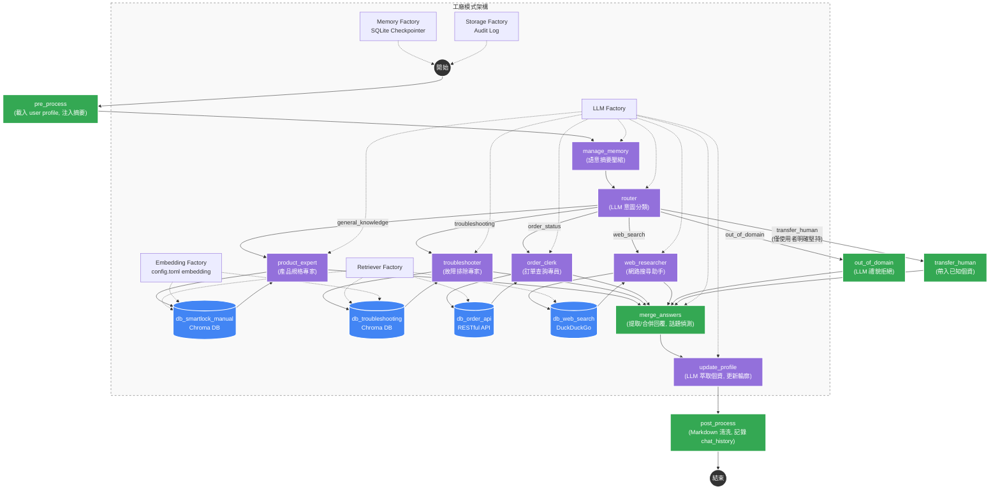
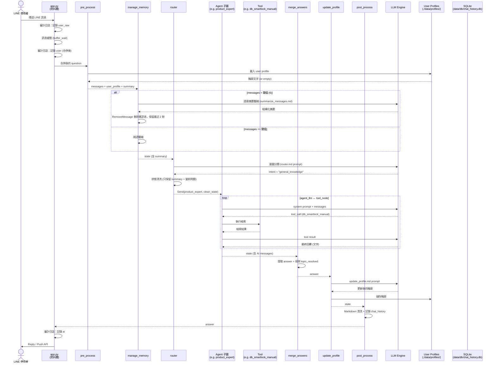
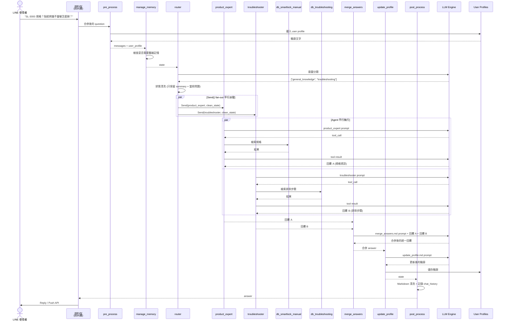
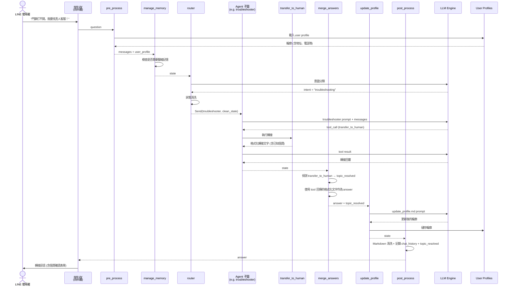

### 1. 系統架構與流程圖 (Mermaid)



---

### 2. 轉接真人策略

Agent 遵循「自主解決優先」原則，資訊不足時的處理順序：

1. 先提供能找到的部分資訊
2. 嘗試用不同關鍵字或角度重新檢索
3. 根據專業知識提供通用建議或常見做法
4. 建議使用者提供更具體的資訊
5. 只有當使用者明確表示以上方式都無法滿足需求時，才詢問是否需要轉接真人客服

`transfer_to_human` 工具僅在以下情況使用：
- 使用者明確堅持要求轉接真人客服
- 涉及安全風險（門鎖無法上鎖、疑似被破壞）

---

### 3. 專案目錄結構樹狀圖 (Directory Tree)

```text
lock_AI_Agent/
│
├── config.toml               # 系統核心設定檔 (驅動所有工廠、路由與 Agent 定義)
├── .env                      # 敏感環境變數 (API Keys 等)
├── main.py                   # CLI 測試入口
├── app.py                    # LINE Bot FastAPI webhook (含防抖層)
│
├── core/                     # 核心設定解析
│   ├── __init__.py
│   ├── config.py             # TOML → Python 變數匯出
│   └── constants.py          # 共用常數（PHONE_REGEX, ADDRESS_REGEX，從 config 動態載入）
│
├── graph/                    # LangGraph 對話流程
│   ├── __init__.py
│   ├── state.py              # GraphState TypedDict（messages, history, summary, chat_history...）
│   ├── nodes.py              # 節點邏輯（pre_process, manage_memory, router, out_of_domain, transfer_human, merge_answers, update_profile, post_process）
│   └── builder.py            # 組裝 StateGraph + Send() fan-out + 動態載入 Agent 子圖
│
├── agents/                   # 多 Agent 架構
│   ├── __init__.py           # build_agent_executor / build_all_agents
│   └── prompts/              # Agent 與 Router 的提示詞模板
│       ├── router.md
│       ├── product_expert.md
│       ├── troubleshooter.md
│       ├── order_clerk.md
│       ├── web_researcher.md
│       ├── merge_answers.md
│       ├── update_profile.md
│       ├── summarize_messages.md
│       └── transfer_human_form.md
│
├── tools/                    # 工具建構
│   └── __init__.py           # build_tools()（Retriever 工具 + transfer_to_human 工具）
│
├── llms/                     # LLM 工廠
│   ├── __init__.py           # LLM_REGISTRY
│   ├── ollama_model.py
│   ├── gemini_model.py
│   └── vertexai_model.py
│
├── memory/                   # 對話記憶工廠
│   └── __init__.py           # get_checkpointer()（MemorySaver / SQLite / Postgres）+ close_checkpointer()
│
├── embeddings/               # Embedding 工廠
│   ├── __init__.py           # REGISTRY
│   └── ollama_embed.py
│
├── retrievers/               # 檢索器工廠
│   ├── __init__.py           # REGISTRY
│   ├── base.py               # BaseRetriever ABC
│   ├── chroma_store.py
│   ├── api_store.py
│   └── web_search.py
│
├── profiles/                 # 使用者輪廓管理
│   └── manager.py            # ProfileManager（持久化至 data/profiles/）
│
├── storage/                  # 審計日誌工廠
│   ├── __init__.py           # STORAGE_REGISTRY + get_storage() / close_storage()
│   ├── sqlite_impl.py        # SqliteAuditStorage（log_message → audit_log 資料表）
│   └── postgres_impl.py      # PostgreSQL 預留（NotImplementedError）
│
├── scripts/                  # 輔助腳本
│   ├── seed_db.py            # 向量資料庫初始化
│   ├── mock_api.py           # Mock 訂單 API
│   └── view_logs.py          # 審計日誌查看工具
│
├── data/                     # 動態資料（gitignore）
│   ├── db/                   # chroma_db_* + chat_history.db + audit_log.db
│   └── profiles/             # 使用者輪廓
│
└── docs/                     # 開發文件
    ├── reports/              # 進度報告
    ├── manuals/              # 系統指南、開發手冊
    └── assets/               # 架構圖 (.mmd, .png)
```

---

### 4. 時序圖 — 單一意圖場景 (Sequence Diagram)



---

### 5. 時序圖 — 多意圖平行場景 (Sequence Diagram)



---

### 6. 時序圖 — 轉接真人場景 (Sequence Diagram)


