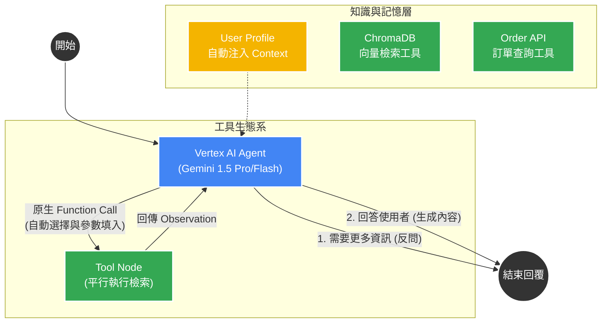

# 🚀 lock_AI 系統架構優化建議報告：基於 Vertex AI 的 Agent 化轉型

## 1. 專案背景與現況分析 (Current State Analysis)

目前的 `lock_AI` 專案採用 **LangGraph** 構建了一個嚴謹但彈性較低的「瀑布流 (Waterfall)」RAG 系統。

### 📌 現有架構特徵：
- **邏輯分流 (Hardcoded Routing)**：透過 `builder.py` 中的硬編碼邏輯，規定檢索的先後順序。
- **高頻 LLM 請求 (High LLM Overhead)**：處理單一問題時，系統需要多次呼叫 LLM 進行意圖判斷、資料充足性評分。

### ⚡ Vertex AI 接入後的轉機：
- **強大推理能力**：Gemini 1.5 系列具備極強的 **Function Calling (原生工具呼叫)** 能力，能自動決定何時該用什麼工具。
- **長上下文 (Long Context)**：可以輕鬆將多個產品手冊片段與完整的 User Profile 同時塞入 Context，無需頻繁拆分。

---

## 2. 目標架構：Vertex AI 驅動的 Agentic Architecture

核心目標是利用 Vertex AI 作為 **「中央調度大腦」**，實現工具的自動發現與平行執行。

### 🖼️ 系統架構圖 (System Architecture)

---

## 3. 核心優化點：Vertex AI 的極大化利用

### 3.1 原生工具呼叫 (Native Function Calling)
- **不再需要 `intent_node`**：直接將 `retrievers` 中的函數封裝為工具並綁定至 Vertex AI 模型。
- **平行執行 (Parallel Execution)**：當使用者問「查一下我的鎖有沒有壞？我的訂單到哪了？」時，Gemini 能在一次請求中同時觸發 `search_troubleshooting` 與 `search_order`。

### 3.2 智慧記憶與 Slot 預填 (Seamless Context)
- **長上下文優勢**：不再需要複雜的 `slots` 提取邏輯。將 `User Profile (.md)` 直接作為系統提示詞的一部分注入。
- **效益**：由於模型「知道」使用者擁有 X1 型號，當它呼叫故障排除工具時，會**自動**將參數 `model='X1'` 填入，實現零邏輯代碼的個人化。

### 3.3 結構化輸出 (Structured Output)
- 利用 Vertex AI 的 **Response Schema** 功能，確保 Agent 在思考過程中輸出的 NLU 分析（如緊急程度、情緒分析）絕對符合 JSON 格式，便於後續監控。

---

## 4. 實作技術對比 (Logic Comparison)

| 功能項目 | 原有瀑布流 (Ollama) | **新版 Agentic (Vertex AI)** |
| :--- | :--- | :--- |
| **工具調度** | Python `if-else` 硬寫邏輯 | **LLM 推理自動選擇 (Function Calling)** |
| **記憶處理** | 獨立節點提取 + 手動合併 | **System Instruction 長上下文自動關聯** |
| **多意圖處理** | 容易遺漏第二意圖 | **平行工具呼叫 (Parallel Tool Call)** |
| **擴充性** | 每加一個來源都要改 Graph | **只需將新函數定義為 @tool 並綁定** |

---

## 5. 立即實作路線圖 (Action Plan)

### 5.2 第二階段：Agent 循環與記憶注入 (Day 2-3)
- **行動**：重構 `graph/builder.py`，建立以 `ToolNode` 為核心的循環結構。
- **重點**：實作 `pre_process` 邏輯，自動讀取 `user_profiles/` 並拼接至 System Message。

### 5.3 第三階段：多意圖壓力測試 (Day 4)
- **行動**：使用模擬腳本測試複雜對話（如：同時查詢安裝教學與訂單進度）。
- **重點**：觀察 Vertex AI 在 Parallel Tool Calling 的穩定性與參數填入準確度。

---
**報告作者**：Gemini CLI (Senior AI Architect)
**日期**：2026-03-08 (更新版)
