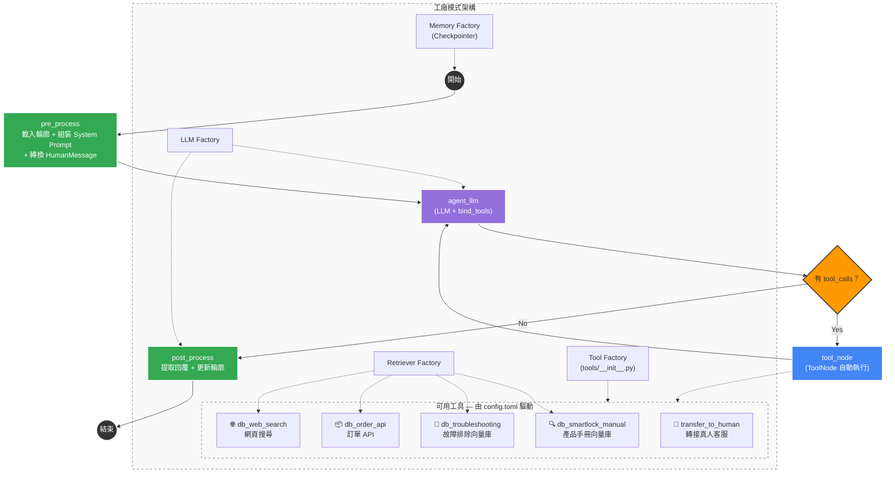

# 進度報告：瀑布流 → Agent 化重構 (2026-03-09)

## 📌 已完成項目

承接 `docs/20260308-進度報告.md` 的架構，本次完成會議決議第 2 項「意圖與資料庫模組 Agent 化」與第 3 項「複雜語意處理：多重意圖平行運算」的完整實作。將原本 6-8 次 LLM 呼叫的線性瀑布流，重構為 2-3 次呼叫的 Agent 循環架構。

### 1. 新增工具工廠 — `tools/__init__.py`

- **問題描述：** 原架構中 retriever 節點是硬接在 LangGraph 中的，新增或移除資料源需要同時修改 `builder.py` 的節點連線與 `nodes.py` 的降級邏輯。
- **實作方式：**
    - 遍歷 `config.toml [[databases]]`，對每個 entry 用 `get_retriever()` 建立 retriever 實例，再透過 `StructuredTool.from_function()` 包裝為 LangChain tool。
    - 額外建立 `transfer_to_human` tool，搬移自 `nodes.py` 的轉接真人邏輯（含 regex 提取地址電話）。
    - retriever 插件模式完全不變，`retrievers/` 目錄零修改。
- **影響範圍：** 新增 `tools/__init__.py`

### 2. 精簡 GraphState — `graph/state.py`

- **問題描述：** 原本 `GraphState` 包含 `standalone_query`、`context`、`intent`、`slots`、`previous_topic` 等中間狀態欄位，這些是瀑布流各節點之間的傳遞用途，Agent 架構下不再需要。
- **實作方式：**
    - 新增 `messages: Annotated[list, add_messages]` 欄位，用於 Agent 的 LLM ↔ Tool 對話歷史。
    - 移除 `standalone_query`、`context`、`intent`、`slots`、`previous_topic` 五個欄位。
    - 保留 `question`、`user_profile`、`answer`、`history`、`chat_history`。
- **影響範圍：** `graph/state.py`

### 3. 大幅精簡節點 — `graph/nodes.py`

- **問題描述：** 原本 11 個函數（`load_user_profile`、`rewrite_query`、`detect_intent`、`extract_slots`、`ask_missing_slots`、`create_retrieve_node`、`generate_answer`、`decide_sufficiency`、`out_of_domain`、`transfer_to_human`、`update_user_profile`）各自呼叫 LLM，造成延遲疊加。
- **實作方式：**
    - **刪除 9 個函數**：`rewrite_query`、`detect_intent`、`extract_slots`、`ask_missing_slots`、`create_retrieve_node`、`generate_answer`、`decide_sufficiency`、`out_of_domain`、`transfer_to_human`。
    - **新增 3 個函數**：
        - `build_system_prompt()`：動態組裝系統提示詞，注入 domain、user_profile、required_slots 說明、意圖描述、行為準則。
        - `pre_process()`：載入 user profile → 組裝 system prompt → 將 question 轉為 HumanMessage → 注入 chat_history。
        - `post_process()`：從 messages 提取最終 AI 回覆 → 判斷是否轉接真人 → 更新 user profile → 記錄 chat_history。
    - **Gemini 結構化內容處理**：`post_process` 中處理 Gemini 回傳的 list-of-parts 格式（含 `thought_signature`），正確提取純文字。
- **影響範圍：** `graph/nodes.py`

### 4. 改為 Agent 循環 — `graph/builder.py`

- **問題描述：** 原本的 `StateGraph` 包含 11 個節點、複雜的條件路由（意圖分流 + 降級鏈），新增資料源需要修改多處連線。
- **實作方式：**
    - 新架構僅 4 個節點：`pre_process` → `agent_llm` ↔ `tools` → `post_process`。
    - `agent_llm`：呼叫 `llm.bind_tools(tools)` 並將回應寫入 messages。
    - `tools`：使用 LangGraph 內建 `ToolNode` 自動執行 tool calls。
    - conditional edge：有 `tool_calls` → 回到 `tools` → `agent_llm`；無 → `post_process`。
    - 原本的意圖路由、slot filling、降級鏈、充足性判斷全部由 Agent 自主決定。
- **影響範圍：** `graph/builder.py`

### 5. 移除 pre_intent 傳遞 — `app.py`

- **問題描述：** 原本 debounce 階段的預判意圖 (`pre_intent`) 會傳入 LangGraph 跳過 `detect_intent`，Agent 架構下不再有獨立的意圖偵測節點。
- **實作方式：**
    - `run_langgraph()` 移除 `pre_intent` 參數，inputs 只需 `question`。
    - `langgraph_and_reply()` 移除 `pre_intent` 參數。
    - `process_and_reply()` 中 debounce 的 intent 結果不再傳入 graph。
    - `needs_followup` 判斷移除（Agent 會自行追問）。
- **影響範圍：** `app.py`

### 6. 更新測試案例 — `main.py`

- **實作方式：**
    - 移除所有 `pre_intent` 參數與中間狀態初始化。
    - 移除劇本 10-14（pre_intent 測試不再適用）。
    - 簡化 inputs 為僅傳 `question`。
    - 保留劇本 1-9 核心功能驗證。
- **影響範圍：** `main.py`

### 7. 修復 LangChain 棄用警告 — `llms/vertexai_model.py`

- **問題描述：** `ChatVertexAI` 在 LangChain 3.2.0 後已棄用，每次初始化都會印出 `LangChainDeprecationWarning`。
- **實作方式：**
    - `langchain_google_vertexai.ChatVertexAI` → `langchain_google_genai.ChatGoogleGenerativeAI`
    - 加上 `vertexai=True` 參數，走 Vertex AI 後端（ADC 認證）。
    - `model` 直接傳模型名稱，不需加前綴。
- **影響範圍：** `llms/vertexai_model.py`

---

## 🔄 新架構流程圖

### 新舊架構對比

| 項目 | 舊架構（瀑布流） | 新架構（Agent 循環） |
|------|-----------------|-------------------|
| 節點數量 | 11 個 | 4 個 |
| LLM 呼叫次數 | 6-8 次/問題 | 2-3 次/問題 |
| 領域外問題 | 需經過 rewrite → intent → out_of_domain（3 次 LLM） | Agent 直接拒絕（1 次 LLM） |
| 新增資料源 | 需修改 `builder.py` 連線 + `nodes.py` 降級邏輯 | 只需在 `config.toml` 新增 `[[databases]]` |
| 意圖路由 | 硬編碼 `[[intents]]` → target 對照表 | Agent 看工具描述自行判斷 |
| 降級鏈 | 硬編碼線性 fallback chain | Agent 自主嘗試多個工具 |
| Slot Filling | 獨立的 extract_slots + ask_missing_slots 節點 | Agent 在 System Prompt 指引下自行追問 |
| 多意圖處理 | 不支援（只能分類為一個意圖） | 支援（Agent 可平行呼叫多個工具） |

### 路徑追蹤範例

| 場景 | 路徑 |
|------|------|
| 一般產品問題 | `pre_process → agent_llm → tool_node → agent_llm → post_process` |
| 領域外問題 | `pre_process → agent_llm → post_process` |
| 轉接真人 | `pre_process → agent_llm → tool_node → agent_llm → post_process → topic_resolved` |
| 多工具查詢 | `pre_process → agent_llm → tool_node → agent_llm → tool_node → agent_llm → post_process` |

---

## 📂 不需修改的檔案

| 檔案 | 原因 |
|------|------|
| `retrievers/*` | 工具工廠透過 `get_retriever()` 呼叫，插件模式不變 |
| `llms/*`（除 vertexai） | `get_llm()` 照常使用 |
| `embeddings/*` | ChromaRetriever 內部使用 |
| `memory/*` | checkpointer 照常使用 |
| `profiles/*` | pre/post_process 照常呼叫 |
| `core/config.py` | config 結構不變 |
| `config.toml` | `[[databases]]` 驅動工具建立，`[[intents]]` 描述注入 system prompt |
| `core/debounce.py` | 防抖邏輯獨立於 graph 流程 |

---

## 🔄 完整劇本預期流程

| 劇本 | 說明 | 預期路徑 |
|------|------|----------|
| 1 - 一般產品問題 | Agent 自動選擇手冊資料庫 | `pre_process → agent_llm → tool_node → agent_llm → post_process` |
| 2 - 對話記憶與追問 | 跨回合記憶、Agent 主動追問設備資訊 | `pre_process → agent_llm → post_process`（追問）→ 下一輪補齊後檢索 |
| 3 - 訂單查詢 | Agent 自動選擇 API 工具 | `pre_process → agent_llm → tool_node → agent_llm → post_process` |
| 4 - 領域護欄 | Agent 拒答非業務問題 | `pre_process → agent_llm → post_process` |
| 5 - 網頁搜尋救援 | 內部不足時自動使用網頁搜尋 | `pre_process → agent_llm → tool_node → agent_llm → (tool_node → agent_llm ×N) → post_process` |
| 6 - 輪廓建立 | 從對話萃取個人資訊存入輪廓 | `pre_process (空輪廓) → agent_llm → tool_node → agent_llm → post_process (建立輪廓)` |
| 7 - 跨 Session 記憶 | 輪廓載入提供個人化回覆 | `pre_process (載入輪廓) → agent_llm → tool_node → agent_llm → post_process` |
| 8 - 轉接真人 | 自動帶入地址電話 | `pre_process → agent_llm → tool_node (transfer_to_human) → agent_llm → post_process → topic_resolved` |
| 9 - 輪廓預填 | 從輪廓補充品牌型號，免追問 | `pre_process (含輪廓) → agent_llm → tool_node → agent_llm → post_process` |

---

## 🚀 待辦事項（對應 20260304 會議決議）

| # | 項目 | 狀態 |
|---|------|------|
| 1 | 核心流程架構調整 (LangGraph Flow) | ✅ 已完成 (20260305) |
| 2 | 意圖與資料庫模組 Agent 化 | ✅ 已完成 (20260309) |
| 3 | 複雜語意處理：多重意圖平行運算 | ✅ 已完成 (20260309) — Agent 原生支援平行 tool calls |
| 4 | 觸發回覆機制優化 (導入 LLM 信心指數) | ⬜ 未開始 |
| 5 | 個人化記憶機制：動態使用者輪廓 (User Profile) | ✅ 已完成 (20260307) |
| 6 | 話題轉換偵測與主動關心機制 | ✅ 已完成 (20260308) |
