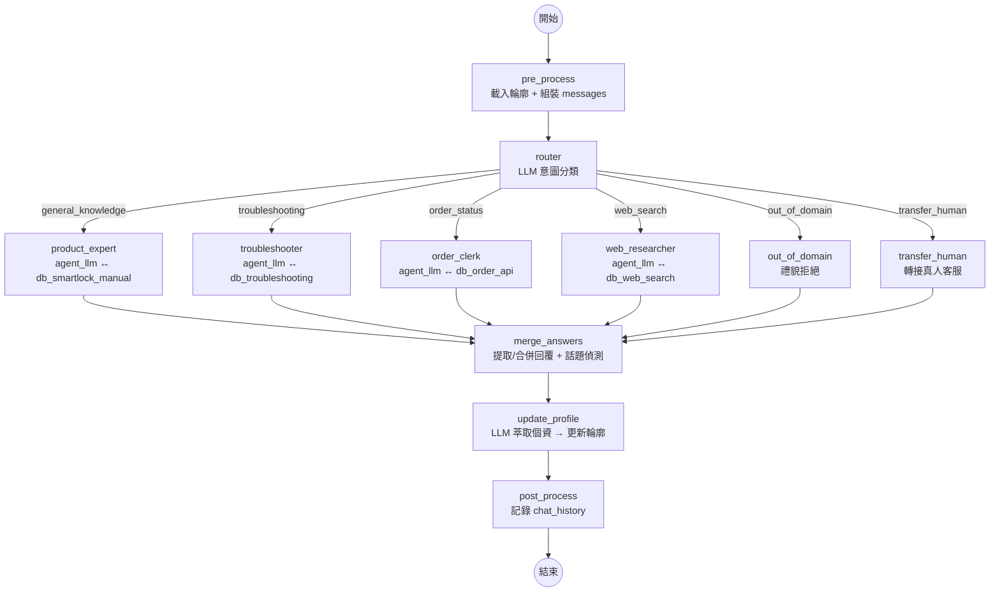

# 進度報告：單 Agent → 多 Agent 架構重構 (2026-03-10)

## 📌 已完成項目

承接 `docs/20260309-進度報告.md` 的單 Agent 架構，本次完成「多 Agent（Supervisor + Specialist Subgraphs）」重構。將原本一個 LLM 配所有工具的架構，拆分為 Router + 4 個專業 Agent，每個 Agent 擁有獨立的系統提示詞與專屬工具。

### 1. 新增 Agent 模組 — `agents/`

- **問題描述：** 原架構中單一 Agent 共用一份 system prompt，無法針對不同任務給予專業指引；所有工具混在一起，缺乏專業分工。
- **實作方式：**
    - `agents/__init__.py`：Agent 子圖建構器
        - `load_prompt_template()` — 讀取 `.md` 並填入模板變數（`{domain}`, `{user_profile}`, `{slots_section}`）
        - `build_agent_executor()` — 為單一 agent 建構 `agent_llm ↔ tool_node` 子圖
        - `build_all_agents()` — 從 `config.toml [[agents]]` 建構所有子圖
    - `agents/prompts/*.md`：5 個獨立提示詞檔案（易編輯、可長篇）
- **影響範圍：** 新增 `agents/__init__.py`、`agents/prompts/` 目錄

### 2. 設定檔新增 `[[agents]]` — `config.toml`

- **問題描述：** 新增 Agent 需要改程式碼，無法透過設定檔配置。
- **實作方式：**
    - 新增 `[[agents]]` 區段，每個 agent 定義 `name`、`label`、`description`、`tools`、`prompt_file`
    - 每個 agent 一對一綁定工具：
        - `product_expert` ↔ `db_smartlock_manual`
        - `troubleshooter` ↔ `db_troubleshooting`
        - `order_clerk` ↔ `db_order_api`
        - `web_researcher` ↔ `db_web_search`
    - `[[intents]]` 的 `target` 從資料庫名稱改為 agent 名稱
- **影響範圍：** `config.toml`、`core/config.py`（新增 `AGENTS_CONFIG`）

### 3. 改為 Supervisor 拓撲 — `graph/builder.py`

- **問題描述：** 原本 `agent_llm ↔ tools` 單迴圈，所有工具由一個 LLM 選擇。
- **實作方式：**
    - 新拓撲：`pre_process → router → agent subgraph → check_result → post_process`
    - `router`：LLM 意圖分類，從 `[[intents]]` 動態建構分類 prompt
    - 各 agent subgraph：獨立的 `agent_llm ↔ tool_node` 迴圈，帶專屬 system prompt
    - `check_result`：評估回覆品質，不足時 fallback 回 router（排除已試 agent）
    - 特殊路由：`out_of_domain` → 禮貌拒絕、`human` → 轉接真人
- **影響範圍：** `graph/builder.py`、`graph/nodes.py`、`graph/state.py`

### 4. 精簡 + 新增節點 — `graph/nodes.py`

- **移除：** `build_system_prompt()`（移至各 agent 的 `.md` 檔案）
- **保留：** `pre_process`（精簡為僅載入 profile + 組裝 messages）
- **新增：**
    - `router()` — LLM 意圖分類，回傳 `next_agent`
    - `handle_out_of_domain()` — 禮貌拒絕非業務問題
    - `handle_transfer_human()` — 轉接真人（搬自 `tools/__init__.py` 的邏輯）
    - `check_agent_result()` — 評估回覆品質，決定 fallback 或完成

### 8. 拆分 post_process — 回覆合併與輪廓更新獨立為節點

- **問題描述：** `post_process` 承擔 4 項職責（提取/合併回覆、偵測 topic_resolved、更新 user profile、記錄 chat_history），其中「多 agent 回覆合併」和「user profile 更新」各有一段硬編碼的 LLM prompt，不符合 prompt 統一放在 `agents/prompts/` 的慣例。
- **實作方式：**
    - 將 `post_process` 拆分為 3 個獨立節點：
        - `merge_answers` — 提取/合併 agent 回覆（多 agent 時用 LLM 合併）+ 偵測 topic_resolved
        - `update_profile` — 用 LLM 從對話萃取個資並更新 user profile
        - `post_process` — 精簡為僅記錄 chat_history + 回傳最終 answer
    - 新增 2 個 prompt 模板檔案：
        - `agents/prompts/merge_answers.md` — 多回覆合併 prompt
        - `agents/prompts/update_profile.md` — 輪廓更新 prompt
    - 兩個 LLM 節點改用 `load_prompt_template()` 讀取 `.md` 檔
    - Graph 連線更新：`agent → merge_answers → update_profile → post_process → END`
- **影響範圍：** `graph/nodes.py`、`graph/builder.py`、`agents/prompts/`、`docs/architecture.mmd`

### 5. 工具工廠改回傳 dict — `tools/__init__.py`

- **實作方式：** `build_tools()` 回傳 `dict[str, StructuredTool]`，方便 agent 按名稱取用工具。

### 6. State 新增路由欄位 — `graph/state.py`

- **實作方式：**
    - `next_agent: str` — router 的分類結果
    - `tried_agents: Annotated[list, operator.add]` — 已嘗試的 agent（fallback 用，防重試）

### 7. 大幅擴充假資料 — `seed_db.py`、`mock_api.py`

- **db_smartlock_manual：** 2 筆 → 11 筆（3 款產品規格、4 篇操作教學、電池更換、藍牙配對、保固條款、2 篇 FAQ）
- **db_troubleshooting：** 3 筆 → 10 筆（指紋故障 ×3、電力故障 ×2、面板故障 ×2、機械故障、連線故障、錯誤代碼表）
- **mock_api：** 簡單 keyword 比對 → 完整模擬資料庫（3 筆訂單 + 3 筆維修單，支援多欄位搜尋）
- 移除 `build_default_db.py`、`build_troubleshoot_db.py`（統一由 `seed_db.py` 管理）

---

## 🔄 新架構流程圖

### 新舊架構對比

| 項目 | 舊架構（單 Agent） | 新架構（多 Agent Supervisor） |
|------|-------------------|------------------------------|
| Agent 數量 | 1 個（共用所有工具） | 4 個專業 Agent + 1 個 Router |
| System Prompt | 1 份共用 | 每個 Agent 獨立 `.md` 檔案 |
| 工具分配 | 全部工具綁定到同一 LLM | 每個 Agent 只綁定專屬工具 |
| 意圖路由 | Agent 自行判斷用哪個工具 | Router LLM 明確分類 → 分派 |
| Fallback | Agent 自行嘗試其他工具 | check_result 評估 → 回 Router 換 Agent |
| 新增 Agent | 需改程式碼 | `config.toml` + `.md` 提示詞即可 |
| LLM 呼叫次數 | 2-3 次 | 2-3 次（router 1 + agent 1-2），fallback 時 +1 |

### 路徑追蹤範例

| 場景 | 路徑 |
|------|------|
| 一般產品問題 | `pre_process → router:product_expert → product_expert:agent_llm → product_expert:tool_node → product_expert:agent_llm → merge_answers → update_profile → post_process` |
| 故障排除 | `pre_process → router:troubleshooter → troubleshooter:agent_llm → troubleshooter:tool_node → troubleshooter:agent_llm → merge_answers → update_profile → post_process` |
| 多意圖平行 | `pre_process → router:product_expert+troubleshooter → [平行] → merge_answers(LLM 合併) → update_profile → post_process` |
| 領域外問題 | `pre_process → router:out_of_domain → out_of_domain → merge_answers → update_profile → post_process` |
| 轉接真人 | `pre_process → router:human → transfer_human → merge_answers → update_profile → post_process` |

---

## 📂 不需修改的檔案

| 檔案 | 原因 |
|------|------|
| `retrievers/*` | 工具工廠透過 `get_retriever()` 呼叫，插件模式不變 |
| `llms/*` | `get_llm()` 照常使用 |
| `embeddings/*` | ChromaRetriever 內部使用 |
| `memory/*` | checkpointer 照常使用 |
| `profiles/*` | pre/post_process 照常呼叫 |
| `core/debounce.py` | 防抖邏輯獨立 |
| `app.py` | 介面不變（`answer`, `history`, `topic_resolved`） |
| `main.py` | 介面不變（`question` 輸入、`answer`/`history` 輸出） |

---

## 🚀 待辦事項（對應 20260304 會議決議）

| # | 項目 | 狀態 |
|---|------|------|
| 1 | 核心流程架構調整 (LangGraph Flow) | ✅ 已完成 (20260305) |
| 2 | 意圖與資料庫模組 Agent 化 | ✅ 已完成 (20260309) |
| 3 | 複雜語意處理：多重意圖平行運算 | ✅ 已完成 (20260309) |
| 4 | 觸發回覆機制優化 (導入 LLM 信心指數) | ⬜ 未開始 |
| 5 | 個人化記憶機制：動態使用者輪廓 (User Profile) | ✅ 已完成 (20260307) |
| 6 | 話題轉換偵測與主動關心機制 | ✅ 已完成 (20260308) |
| 7 | **單 Agent → 多 Agent 架構重構** | ✅ **已完成 (20260310)** |
