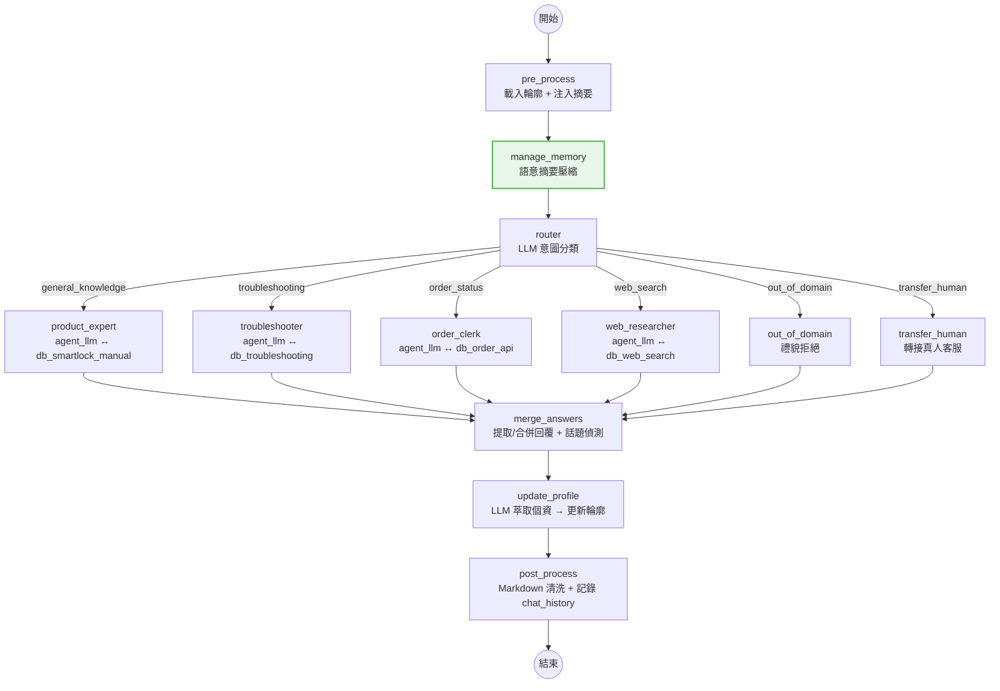

# 進度報告：語意記憶壓縮 + 多輪對話穩定性修復 (2026-03-11)

## 📌 已完成項目

承接 `docs/20260310-進度報告.md` 的多 Agent 架構，本次完成「對話記憶持久化（SQLite）」、「語意摘要壓縮（manage_memory）」，以及三項關鍵 Bug 修復：Send() fan-out 路徑膨脹、舊訊息汙染 agent 決策、agent 跳過工具呼叫。

### 1. 對話記憶持久化 — SQLite Checkpointer

- **問題描述：** 原本使用 `MemorySaver`（純記憶體），伺服器重啟後對話紀錄全部遺失，無法實現跨 session 的多輪對話。
- **實作方式：**
    - `memory/__init__.py`：`get_checkpointer()` 改為 `async`，新增 `sqlite` 類型支援
        - 使用 `aiosqlite` + `AsyncSqliteSaver`（`langgraph-checkpoint-sqlite`）
        - 儲存全域 `_sqlite_conn` 引用，新增 `close_checkpointer()` 供 shutdown 呼叫
    - `config.toml`：`[memory]` 區段新增 `type = "sqlite"`、`path = "./chat_history.db"`
    - `app.py`：thread ID 改為固定格式 `smart_lock_{user_id}`（不再遞增 session），確保同一用戶持續使用同一條 thread
    - `graph/builder.py`：`build_graph()` 改為 `async def`，配合 async checkpointer 初始化
- **影響範圍：** `memory/__init__.py`、`config.toml`、`app.py`、`graph/builder.py`、`requirements.txt`（新增 `langgraph-checkpoint-sqlite`、`aiosqlite`）

### 2. 語意摘要壓縮 — `manage_memory` 節點

- **問題描述：** 多輪對話後 `messages` 持續膨脹，導致 token 消耗增加、LLM 回覆品質下降，且 SQLite 持久化後問題更為顯著。
- **實作方式：**
    - `graph/nodes.py`：新增 `manage_memory()` 節點
        - 當 `messages` 數量超過 `max_messages_threshold`（預設 6）時觸發
        - 呼叫 LLM 將舊訊息壓縮為結構化摘要（使用 `agents/prompts/summarize_messages.md` 模板）
        - 透過 `RemoveMessage` API 刪除已摘要的訊息，保留最近 `context_retention_pair` 對（預設 2 對 = 4 條）
        - 摘要存入 `state.summary`，由 `pre_process` 以 `[前情提要]` SystemMessage 注入
    - `graph/state.py`：新增 `summary: Annotated[str, _keep_last]` 欄位
    - `graph/builder.py`：管線新增 `pre_process → manage_memory → router`
    - `config.toml`：新增 `max_messages_threshold = 6`、`context_retention_pair = 2`
    - 新增 `agents/prompts/summarize_messages.md` 摘要提示詞模板
- **影響範圍：** `graph/nodes.py`、`graph/state.py`、`graph/builder.py`、`config.toml`、`agents/prompts/summarize_messages.md`

### 3. 修復 Send() fan-out 路徑重複膨脹

- **問題描述：** `Send(agent, state)` 將完整 parent state（含累積 `history`）傳給 agent 子圖。子圖的 `operator.add` reducer 繼承 parent 歷史後再追加自己的項目，fan-in 返回時再次 `operator.add`，造成 `history` 每輪倍增。例如 Round 4 的路徑樹中混入 Round 1~3 的所有節點。
- **實作方式：**
    - `graph/builder.py` 的 `route_by_intent()`：Send 時清空 `history`
    ```python
    clean = {**state, "history": [], "messages": agent_msgs}
    return [Send(a, clean) for a in valid]
    ```
- **影響範圍：** `graph/builder.py`

### 4. 修復舊訊息汙染 agent 決策 + merge_answers 多算

- **問題描述：** SQLite checkpointer 保留的舊 AI 回覆透過 `Send()` 傳入 agent 子圖，導致：
    1. **Agent 跳過工具呼叫**：LLM 看到前次 run 的 AI 回覆（直接回文字），跟隨相同模式不呼叫工具（例如 `order_clerk` 不查 `db_order_api`）
    2. **merge_answers 多算**：多 agent 模式下掃描所有 AI messages，把舊保留的回覆也計入合併（出現「合併 4 段」而非預期的 2 段）
- **實作方式：**
    - `graph/builder.py` 的 `route_by_intent()`：Send 時只保留 SystemMessage（summary）+ 最後一個 HumanMessage（當前問題），過濾掉所有舊 AI 回覆
    - `graph/nodes.py` 的 `merge_answers()`：改為從尾端反向掃描，最多取 `num_agents` 個 AI messages，避免舊回覆混入
- **影響範圍：** `graph/builder.py`、`graph/nodes.py`

### 5. 修復 agent 忽略工具呼叫（Prompt 強化）

- **問題描述：** 即使過濾了舊 AI 回覆，`manage_memory` 產生的 summary 以 `[前情提要]` SystemMessage 傳入 agent。LLM 將摘要內容視為已檢索的資料，直接基於摘要回答而跳過 tool call。
- **實作方式：**
    - 四個 agent prompt 的規則 3 統一加入：
    > 「對話摘要（[前情提要]）僅供理解上下文，不可取代工具檢索——每次回覆前都必須先呼叫工具。」
    - 修改檔案：`product_expert.md`、`troubleshooter.md`、`order_clerk.md`、`web_researcher.md`
- **影響範圍：** `agents/prompts/*.md`

### 6. handle_transfer_human 修復 — 從 question 提取個資

- **問題描述：** 原本只從 `user_profile` 提取電話和地址，但首次轉接時 profile 尚未包含當前訊息中的個資，導致「松仁路 100 號 12 樓」和「0912-345-678」無法帶出。
- **實作方式：**
    - `graph/nodes.py` 的 `handle_transfer_human()`：將 `user_profile` + `question` 合併為 `combined_text`，對 `combined_text` 做 regex 提取
- **影響範圍：** `graph/nodes.py`

### 7. 審計日誌模組 — `storage/` 模組新增

- **問題描述：** 系統無對話紀錄持久化機制（Checkpointer 僅保存 LangGraph 狀態，不保存原始對話文字），無法事後審計或分析對話內容。
- **實作方式：**
    - `storage/__init__.py`：Registry 模式工廠，`STORAGE_REGISTRY` 映射 `sqlite` → `build_sqlite_storage`
    - `storage/sqlite_impl.py`：`SqliteAuditStorage` 類別，`log_message(user_id, role, content)` 寫入 `audit_log` 資料表
    - `storage/postgres_impl.py`：預留 PostgreSQL 實作（`NotImplementedError`）
    - `app.py`：startup 事件初始化 `audit_storage`，shutdown 事件 `close_storage()`
    - `langgraph_and_reply()`：記錄 `user`（合併後訊息）+ `ai`（AI 回覆）
    - `config.toml`：新增 `[storage]` 區塊（`type = "sqlite"`、`sqlite_path`）
    - `scripts/view_logs.py`：審計日誌查看工具
- **影響範圍：** `storage/`（新增）、`app.py`、`config.toml`、`core/config.py`、`scripts/view_logs.py`（新增）

### 8. 去硬編碼重構 — Config-Driven 完善

- **問題描述：** `app.py` 中多處硬編碼（timeout、thread_prefix、error templates），`graph/nodes.py` 與 `tools/__init__.py` 中 prompt 路徑與 regex 硬編碼，不利於維護與國際化。
- **實作方式：**
    - `config.toml`：新增 `[system].thread_prefix`、`[system].request_timeout`、`[debounce].buffer_ttl`、`[debounce].cleanup_interval`、`[templates].error_*`、`[prompts]` 區塊
    - `core/config.py`：解構新增 `STORAGE_CONFIG`、`PROMPTS_CONFIG`
    - `app.py`：所有硬編碼值改從 config 讀取
    - `graph/nodes.py`：prompt 路徑改用 `PROMPTS_CONFIG`、regex 改用 `core/constants.py` 共用常數
    - `tools/__init__.py`：同上，regex + prompt 路徑改用共用模組
    - `agents/prompts/transfer_human_form.md`：轉接表單模板化
- **影響範圍：** `config.toml`、`core/config.py`、`app.py`、`graph/nodes.py`、`tools/__init__.py`、`agents/prompts/transfer_human_form.md`（新增）

### 9. Webhook 即時審計日誌 — `user_raw` 記錄

- **問題描述：** 原本審計日誌只在 debounce 合併後記錄，遺失使用者的原始碎裂訊息。LINE 使用者連發 3 條短訊息，只記錄到 1 筆合併後的 `user` 紀錄。
- **實作方式：**
    - `app.py`：webhook `for event in events:` 迴圈內，`print` 之後立即記錄 `user_raw` 角色
    - 使用 `"user_raw"` role 區分於 `langgraph_and_reply` 中的 `"user"`（合併後訊息）
    - 兩處日誌均保留，確保完整審計軌跡
- **影響範圍：** `app.py`

### 10. Regex 配置化 — `[user_profile.extraction]`

- **問題描述：** `core/constants.py` 的電話/地址 regex 硬編碼在 Python 中，不利於國際化擴充（例如不同國家的電話格式）。
- **實作方式：**
    - `config.toml`：`[user_profile]` 下方新增 `[user_profile.extraction]` 子表，包含 `phone_regex` 和 `address_regex`
    - `core/config.py`：新增 `EXTRACTION_CONFIG = USER_PROFILE_CONFIG.get("extraction", {})`
    - `core/constants.py`：改為從 `EXTRACTION_CONFIG` 動態讀取 regex，保留 fallback default
    - `graph/nodes.py` 與 `tools/__init__.py` 無需改動（已 import `PHONE_REGEX`/`ADDRESS_REGEX`）
- **影響範圍：** `config.toml`、`core/config.py`、`core/constants.py`

### 11. LINE 平台適配 — 移除 Markdown 格式回覆

- **問題描述：** LLM 回覆常帶有 `**`、`#`、`- ` 等 Markdown 符號，LINE 平台不支援 Markdown 渲染，導致使用者看到原始標記，影響閱讀體驗。
- **實作方式：** 採用「源頭規範（prompt）+ 結尾清洗（post_process regex）」雙管齊下策略：
    - **Prompt 規範（源頭）：** 四個面向使用者的 Agent prompt（`product_expert.md`、`troubleshooter.md`、`order_clerk.md`、`web_researcher.md`）新增行為準則：「回覆格式必須是純文字，禁止使用任何 Markdown 語法」。`merge_answers.md` 同步新增格式規範。`product_expert.md` 移除原本「適當使用編號或分點說明」的指引。
    - **Regex 清洗（結尾防線）：** `graph/nodes.py` 新增 `_strip_markdown()` 模組級私有函數，處理殘留的 Markdown 標記（`#` 標題、`**` 粗體、`__` 粗體、`*` 斜體、`_` 斜體、`~~` 刪除線、`` ` `` 行內程式碼、`- / *` 無序列表、`[]()` 連結）。在 `post_process` 節點中呼叫，清洗後回傳 `answer`。
    - 保留數字編號（`1. 2. 3.`）與換行符號（`\n`），不影響純文字排版。
- **不修改的檔案：** `router.md`（輸出為意圖名稱）、`summarize_messages.md`（內部摘要）、`update_profile.md`（需 Markdown 格式）、`transfer_human_form.md`（已是純文字）。
- **影響範圍：** `agents/prompts/product_expert.md`、`agents/prompts/troubleshooter.md`、`agents/prompts/order_clerk.md`、`agents/prompts/web_researcher.md`、`agents/prompts/merge_answers.md`、`graph/nodes.py`

---

## 🔄 更新後架構流程圖



### Send() 狀態清洗流程

```
parent state.messages = [舊msg1, 舊msg2, 舊msg3, 舊msg4, summary, current_human]
                                    ↓ route_by_intent 過濾
agent state.messages  = [summary, current_human]    ← 只保留摘要 + 當前問題
agent state.history   = []                          ← 清空避免 operator.add 重複
```

---

## ✅ 驗證結果

### Demo 場景全通過

| 場景 | Agent | 工具呼叫 | 結果 |
|------|-------|---------|------|
| Round 1：指紋設定 | product_expert | `db_smartlock_manual` ✅ | 回傳 Philips Alpha 設定步驟 |
| Round 2：辨識不靈敏 | troubleshooter | `db_troubleshooting` ✅ | 回傳排查建議 |
| Round 3：清潔還是一樣 | troubleshooter | `db_troubleshooting` ✅ | 繼續排查（摘要壓縮觸發） |
| Round 4：電池提示 | product_expert | `db_smartlock_manual` ✅ | 回傳語音提示資訊 |
| 領域外：天氣 | out_of_domain | — | 禮貌拒絕 ✅ |
| 多意圖：訂單+HomeKey | order_clerk + web_researcher | `db_order_api` + `db_web_search` ✅ | 訂單資訊 + HomeKey 搜尋，合併 2 段 |
| 轉接真人 | transfer_human | — | 地址 + 電話正確帶出 ✅ |

### 記憶管理驗證

| 檢查項 | 結果 |
|--------|------|
| `manage_memory` 在 messages > 6 時觸發 | ✅ Round 3 起每輪觸發 |
| 保留 4 條（pair=2）| ✅ 「刪除 N 條舊訊息，保留 4 條」 |
| 摘要內容包含設備型號 + 問題狀態 | ✅ 結構化摘要 |
| 路徑樹只顯示當輪節點 | ✅ 無前輪殘留 |
| SQLite DB 大小合理 | ✅ 4,096 bytes（vs 修復前 154MB） |

---

## 📂 異動檔案清單

| 檔案 | 異動類型 | 說明 |
|------|---------|------|
| `memory/__init__.py` | 修改 | async + SQLite 支援 + close 函數 |
| `config.toml` | 修改 | memory type=sqlite + 壓縮參數 + storage/prompts/extraction 區塊 |
| `app.py` | 修改 | async build_graph + 固定 thread ID + 審計日誌 + 去硬編碼 + user_raw 即時記錄 |
| `graph/builder.py` | 修改 | async + manage_memory 節點 + Send 狀態清洗 |
| `graph/nodes.py` | 修改 | 新增 manage_memory + 修復 transfer_human + 修復 merge_answers + PROMPTS_CONFIG + 共用 regex + `_strip_markdown` 清洗 |
| `graph/state.py` | 修改 | 新增 summary 欄位 |
| `main.py` | 修改 | 多輪測試 + 記憶狀態顯示 |
| `requirements.txt` | 修改 | 新增 langgraph-checkpoint-sqlite、aiosqlite |
| `agents/prompts/*.md` (×4) | 修改 | 強化工具呼叫指令（摘要不可取代檢索）+ 純文字格式規範 |
| `agents/prompts/merge_answers.md` | 修改 | 新增純文字格式規範 |
| `agents/prompts/summarize_messages.md` | 新增 | 語意摘要壓縮 prompt 模板 |
| `agents/prompts/transfer_human_form.md` | 新增 | 轉接真人表單模板 |
| `core/config.py` | 修改 | 新增 STORAGE_CONFIG、PROMPTS_CONFIG、EXTRACTION_CONFIG |
| `core/constants.py` | 新增 | PHONE_REGEX、ADDRESS_REGEX 從 config 動態讀取 |
| `storage/__init__.py` | 新增 | 審計日誌工廠（STORAGE_REGISTRY） |
| `storage/sqlite_impl.py` | 新增 | SQLite 審計日誌實作 |
| `storage/postgres_impl.py` | 新增 | PostgreSQL 預留（NotImplementedError） |
| `tools/__init__.py` | 修改 | 改用共用 regex + PROMPTS_CONFIG |
| `scripts/view_logs.py` | 新增 | 審計日誌查看工具 |

---

## 🚀 待辦事項（對應 20260304 會議決議）

| # | 項目 | 狀態 |
|---|------|------|
| 1 | 核心流程架構調整 (LangGraph Flow) | ✅ 已完成 (20260305) |
| 2 | 意圖與資料庫模組 Agent 化 | ✅ 已完成 (20260309) |
| 3 | 複雜語意處理：多重意圖平行運算 | ✅ 已完成 (20260309) |
| 4 | 觸發回覆機制優化 (導入 LLM 信心指數) | ⬜ 未開始 |
| 5 | 個人化記憶機制：動態使用者輪廓 (User Profile) | ✅ 已完成 (20260307) |
| 6 | 話題轉換偵測與主動關心機制 | ✅ 已完成 (20260308) |
| 7 | 單 Agent → 多 Agent 架構重構 | ✅ 已完成 (20260310) |
| 8 | **對話記憶持久化 + 語意摘要壓縮** | ✅ **已完成 (20260311)** |
| 9 | **審計日誌模組 + 去硬編碼重構** | ✅ **已完成 (20260311)** |
| 10 | **審計日誌即時化 + Regex 配置化** | ✅ **已完成 (20260311)** |
| 11 | **LINE 平台適配 — 移除 Markdown 格式回覆** | ✅ **已完成 (20260311)** |
