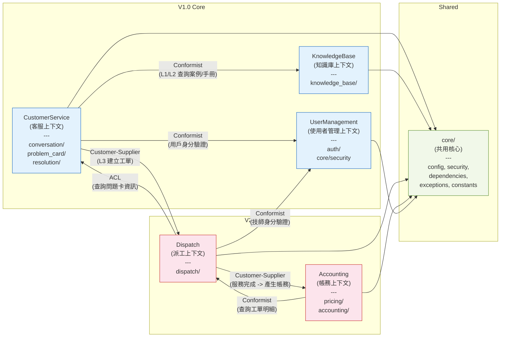
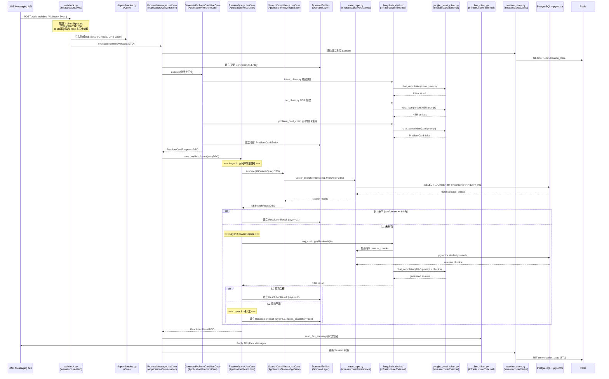
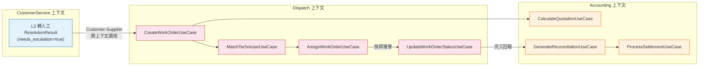

# 模組依賴關係分析 (Module Dependency Analysis) - 電子鎖智能客服與派工平台

---

**文件版本 (Document Version):** `v1.0`

**最後更新 (Last Updated):** `2026-02-25`

**主要作者 (Lead Author):** `技術架構師`

**審核者 (Reviewers):** `架構委員會, 核心開發團隊`

**狀態 (Status):** `草稿 (Draft)`

---

## 目錄 (Table of Contents)

1.  [概述 (Overview)](#1-概述-overview)
2.  [核心依賴原則 (Core Dependency Principles)](#2-核心依賴原則-core-dependency-principles)
3.  [高層級模組依賴 (High-Level Module Dependencies)](#3-高層級模組依賴-high-level-module-dependencies)
4.  [模組/層級職責定義 (Module/Layer Responsibility Definition)](#4-模組層級職責定義-modulelayer-responsibility-definition)
5.  [關鍵依賴路徑分析 (Key Dependency Path Analysis)](#5-關鍵依賴路徑分析-key-dependency-path-analysis)
6.  [依賴風險與管理 (Dependency Risks and Management)](#6-依賴風險與管理-dependency-risks-and-management)
7.  [外部依賴管理 (External Dependency Management)](#7-外部依賴管理-external-dependency-management)

---

## 1. 概述 (Overview)

### 1.1 文檔目的 (Document Purpose)

*   本文檔旨在分析和定義「電子鎖智能客服與派工 SaaS 平台 (Smart Lock AI Support & Service Dispatch SaaS Platform)」的內部模組與外部套件之間的依賴關係。
*   系統採用 **Modular Monolith + Clean Architecture** 架構，以五個 DDD 限界上下文 (Bounded Contexts) 為核心組織單元。本文檔的目的不僅是記錄現狀，更是為了指導開發，確保專案遵循健康的依賴結構，以提升代碼的可維護性、可測試性和可擴展性。
*   本文檔是程式碼審查 (Code Review) 和架構決策的重要參考依據，特別在 V1.0 到 V2.0 演進過程中，確保新增的派工 (Dispatch) 與帳務 (Accounting) 模組不會引入不良的依賴關係。

### 1.2 分析範圍 (Analysis Scope)

*   **分析層級**: 套件級 (Package-level) 與模組級 (Module-level)。套件級聚焦五個限界上下文與 `core/` 共用模組之間的依賴；模組級深入每個上下文內部的 Domain / Application / Infrastructure 三層依賴。
*   **包含範圍**:
    *   應用程式原始碼內部依賴（`backend/src/smart_lock/` 內所有模組）
    *   限界上下文之間的跨上下文依賴
    *   Clean Architecture 各層之間的依賴
    *   對外部函式庫（FastAPI、SQLAlchemy、LangChain、line-bot-sdk-python 等）的依賴
*   **排除項目**: Python 標準庫、開發工具（Black、Ruff、mypy）、純測試專用依賴（pytest fixtures、factory-boy）、前端 (Next.js) 依賴（將在 V2.0 前端模組依賴文檔中另行分析）

---

## 2. 核心依賴原則 (Core Dependency Principles)

本專案遵循以下核心原則來管理依賴關係，確保系統的長期健康。

### 2.1 依賴倒置原則 (Dependency Inversion Principle - DIP)

*   **定義:** 高層模組不應依賴於低層模組，兩者都應依賴於抽象（例如 Protocol 或抽象類別）。抽象不應依賴於細節，細節應依賴於抽象。
*   **本專案實踐:**
    *   Application Layer 中的每個 Use Case 透過 `interfaces.py` 定義的 Python `Protocol` 來宣告對外部資源的需求，而非直接引用具體實作。
    *   Infrastructure Layer 中的 Repository 實作和 External Client 實現這些 Protocol。
    *   **具體範例:** `application/resolution/use_cases.py` 中的 `ResolveQueryUseCase` 依賴於 `CaseRepository`（Protocol）和 `LLMService`（Protocol），而非直接依賴 `persistence/repositories/case_repo.py` 或 `external/google_genai_client.py`。透過 FastAPI 的 Dependency Injection（`core/dependencies.py`）在執行期注入具體實作。

    ```
    # 依賴方向（原始碼層面）
    infrastructure/persistence/repositories/case_repo.py
        --> implements --> application/knowledge_base/interfaces.py::CaseRepository (Protocol)

    application/resolution/use_cases.py
        --> depends on --> application/knowledge_base/interfaces.py::CaseRepository (Protocol)

    # 結果：Application Layer 完全不知道 SQLAlchemy 或 pgvector 的存在
    ```

### 2.2 無循環依賴原則 (Acyclic Dependencies Principle - ADP)

*   **定義:** 在模組依賴關係圖中，不應存在任何循環。依賴關係必須是單向的，形成一個有向無環圖 (DAG)。
*   **本專案實踐:**
    *   **層內規則:** Domain Layer 中的各領域模組（conversation、problem_card、knowledge_base、resolution、dispatch、pricing、accounting）彼此獨立，不互相引用。
    *   **跨上下文規則:** 限界上下文之間的依賴嚴格遵循上下文地圖 (Context Map) 定義的方向：
        *   `CustomerService` --> `KnowledgeBase`（查詢案例/手冊，Conformist）
        *   `CustomerService` --> `Dispatch`（L3 建立工單，Customer-Supplier）
        *   `Dispatch` --> `Accounting`（服務完成產生帳務，Customer-Supplier）
        *   `Dispatch` --> `CustomerService`（查詢問題卡資訊，透過 Anti-Corruption Layer）
    *   **潛在循環風險:** `CustomerService <-> Dispatch` 之間存在雙向語義需求。解決策略是 Dispatch 上下文透過 Anti-Corruption Layer (ACL) 轉譯 CustomerService 的 ProblemCard 資料結構，而非直接引用其 Domain 物件，確保原始碼層面的依賴不形成循環（詳見第 6 節）。

### 2.3 穩定依賴原則 (Stable Dependencies Principle - SDP)

*   **定義:** 依賴關係應朝著更穩定的方向進行。一個模組不應該依賴於比自己更不穩定的模組。
*   **本專案實踐:**
    *   **穩定度排序（由高至低）:**
        1.  `domains/` — 純業務規則，變更頻率最低（最穩定）
        2.  `application/` — 業務流程編排，偶爾因需求調整而變更
        3.  `core/` — 跨領域共用基礎，相對穩定
        4.  `infrastructure/` — 與外部技術耦合，變更頻率最高（最不穩定）
    *   **規則執行:** 依賴方向嚴格由不穩定層指向穩定層（Infrastructure --> Application --> Domain），確保核心業務規則不被外部技術變遷影響。
    *   **具體範例:** 當 LLM 供應商從 OpenAI GPT-4o 遷移至 Google Gemini 3 Pro（已發生，參見 `docs/adrs/ADR-003`），只需修改 `infrastructure/external/google_genai_client.py` 和 `infrastructure/external/langchain_chains/`，Application Layer 和 Domain Layer 完全不受影響，因為它們依賴的是穩定的 `LLMService` Protocol 抽象。

---

## 3. 高層級模組依賴 (High-Level Module Dependencies)

### 3.1 Clean Architecture 分層依賴圖 (Layered Architecture Dependency Diagram)

此圖展示系統的 Clean Architecture 三層結構及其單向依賴關係，對應本專案在 `backend/src/smart_lock/` 下的實際目錄組織。

```mermaid
graph TD
    subgraph "外部系統 (External Systems)"
        direction LR
        LINE_API["LINE Messaging API"]
        GOOGLE_AI["Google Gemini 3 Pro API"]
        PG[(PostgreSQL 16 + pgvector)]
        REDIS[(Redis 7+)]
    end

    subgraph "backend/src/smart_lock/"
        direction BT

        subgraph "Infrastructure Layer (基礎設施層)"
            direction LR
            WEB["web/routers/<br/>Webhook, REST API Controllers"]
            PERSIST["persistence/<br/>ORM Models, Repository Impls"]
            EXTERNAL["external/<br/>LINE Client, Google AI Client,<br/>LangChain Chains"]
            CACHE["cache/<br/>Redis Client, Session Store"]
        end

        subgraph "Application Layer (應用層)"
            direction LR
            UC["use_cases.py<br/>各限界上下文的<br/>Application Services"]
            DTO["dtos.py<br/>Pydantic Request/Response"]
            IFACE["interfaces.py<br/>Repository & Service Protocols"]
        end

        subgraph "Domain Layer (領域層)"
            direction LR
            ENT["entities.py<br/>Aggregates & Entities"]
            VO["value_objects.py<br/>Value Objects & Enums"]
            EVT["events.py<br/>Domain Events"]
            STRAT["strategies.py<br/>Domain Services & Policies"]
        end

        CORE["core/<br/>config, security, dependencies,<br/>exceptions, middleware, constants"]
    end

    WEB -- "調用 (invokes)" --> UC
    UC -- "使用 (uses)" --> ENT
    UC -- "使用 (uses)" --> VO
    UC -- "使用 (uses)" --> DTO
    UC -- "依賴介面 (depends on)" --> IFACE
    PERSIST -.->|"實現介面 (implements)"| IFACE
    EXTERNAL -.->|"實現介面 (implements)"| IFACE
    CACHE -.->|"實現介面 (implements)"| IFACE
    ENT -- "包含 (contains)" --> VO
    STRAT -- "使用 (uses)" --> ENT
    STRAT -- "使用 (uses)" --> VO
    UC -- "發布 (publishes)" --> EVT

    PERSIST -- "訪問 (accesses)" --> PG
    EXTERNAL -- "請求 (requests)" --> LINE_API
    EXTERNAL -- "請求 (requests)" --> GOOGLE_AI
    CACHE -- "讀寫 (R/W)" --> REDIS

    WEB -- "使用 (uses)" --> CORE
    UC -- "使用 (uses)" --> CORE
    PERSIST -- "使用 (uses)" --> CORE
    EXTERNAL -- "使用 (uses)" --> CORE

    classDef infrastructure fill:#e8f5e9,stroke:#2e7d32
    classDef application fill:#f3e5f5,stroke:#7b1fa2
    classDef domain fill:#fff3e0,stroke:#e65100
    classDef core fill:#e3f2fd,stroke:#1565c0
    classDef external fill:#f1f8e9,stroke:#558b2f

    class WEB,PERSIST,EXTERNAL,CACHE infrastructure
    class UC,DTO,IFACE application
    class ENT,VO,EVT,STRAT domain
    class CORE core
    class LINE_API,GOOGLE_AI,PG,REDIS external
```



### 3.2 限界上下文依賴圖 (Bounded Context Dependency Diagram)

此圖展示五個限界上下文之間的跨上下文依賴關係，對應 DDD 上下文地圖。



### 3.3 依賴規則說明 (Dependency Rule Explanation)

*   **Clean Architecture 單向性:** 所有依賴關係嚴格從外層指向內層（Infrastructure --> Application --> Domain）。Domain Layer 不依賴任何其他層。
*   **依賴倒置:** Infrastructure Layer 實現由 Application Layer 定義的 Protocol 介面，從而反轉了控制流，但原始碼層面的依賴仍然是 Infrastructure 指向 Application（因為 Infrastructure 需要 import Protocol 定義才能實現它）。
*   **跨上下文通信:** 限界上下文之間僅透過 Application Layer 的公開介面（Application Service / Use Case）進行交互，嚴格禁止跨上下文直接存取 Domain Layer 或 Infrastructure Layer。
*   **共用核心 (`core/`):** 是所有上下文共享的基礎設施模組，位於依賴圖的底層，所有上下文都可依賴它，但它不依賴任何特定上下文。

---

## 4. 模組/層級職責定義 (Module/Layer Responsibility Definition)

### 4.1 架構層級職責

| 層級/模組 | 主要職責 | 程式碼路徑 | 依賴規則 |
| :--- | :--- | :--- | :--- |
| **Domain Layer (領域層)** | 純業務規則與邏輯，包含 Entities、Value Objects、Domain Events、Domain Services（如 Resolution Strategies）。完全不依賴任何外部框架。 | `backend/src/smart_lock/domains/{conversation,problem_card,knowledge_base,resolution,dispatch,pricing,accounting}/` | 不依賴任何其他層 |
| **Application Layer (應用層)** | 編排業務用例流程，定義 Port 抽象介面 (Protocol)，處理 DTO 轉換。每個 Use Case 只有一個 `execute()` 方法。 | `backend/src/smart_lock/application/{conversation,problem_card,knowledge_base,resolution,auth,dashboard,dispatch,pricing,accounting}/` | 僅依賴 Domain Layer |
| **Infrastructure Layer (基礎設施層)** | 實現所有外部整合的具體細節：HTTP 路由、資料庫存取、外部 API 客戶端、快取操作。 | `backend/src/smart_lock/infrastructure/{web,persistence,external,cache}/` | 依賴 Application Layer（實現 Port Interfaces） |
| **Core (共用核心)** | 跨領域共用設定、安全、DI、例外、中介層、常數。 | `backend/src/smart_lock/core/` | 不依賴任何特定限界上下文 |

### 4.2 Domain Layer 各領域模組

| 領域模組 | 核心實體 | 業務規則 | 程式碼路徑 |
| :--- | :--- | :--- | :--- |
| `conversation/` | `Conversation`, `Message`, `ConversationContext` | 多輪對話狀態機、上下文視窗管理、轉接判斷邏輯 | `backend/src/smart_lock/domains/conversation/` |
| `problem_card/` | `ProblemCard`, `ProblemCardHistory` | 問題卡欄位完整度計算、信心分數邏輯、狀態流轉 | `backend/src/smart_lock/domains/problem_card/` |
| `knowledge_base/` | `CaseEntry`, `ManualChunk`, `FAQEntry`, `SOPDraft` | 案例匹配分數計算、SOP 草稿生命週期管理 | `backend/src/smart_lock/domains/knowledge_base/` |
| `resolution/` | `ResolutionAttempt`, `ResolutionResult` | 三層引擎策略選擇、信心閾值判斷（>=0.85）、降級邏輯 | `backend/src/smart_lock/domains/resolution/` |
| `dispatch/` (V2.0) | `WorkOrder`, `Technician`, `DispatchMatch` | 技師匹配演算法（技能 + 距離 + 可用性 + 評分）、工單狀態機 | `backend/src/smart_lock/domains/dispatch/` |
| `pricing/` (V2.0) | `PriceRule`, `Quotation` | 報價計算規則引擎、急件加成、距離附加費 | `backend/src/smart_lock/domains/pricing/` |
| `accounting/` (V2.0) | `Reconciliation`, `Settlement`, `Voucher` | 對帳期間彙總、結算金額計算、複式記帳憑證 | `backend/src/smart_lock/domains/accounting/` |

### 4.3 Application Layer 各模組

| 應用模組 | 核心 Use Cases | 依賴的 Protocol 介面 | 程式碼路徑 |
| :--- | :--- | :--- | :--- |
| `conversation/` | `StartConversationUseCase`, `ProcessMessageUseCase`, `EscalateToHumanUseCase`, `CloseConversationUseCase` | `ConversationRepository`, `MessageBroker` | `backend/src/smart_lock/application/conversation/` |
| `problem_card/` | `GenerateProblemCardUseCase`, `UpdateProblemCardUseCase`, `GetProblemCardUseCase` | `ProblemCardRepository` | `backend/src/smart_lock/application/problem_card/` |
| `knowledge_base/` | `SearchCaseLibraryUseCase`, `IngestManualUseCase`, `DraftSOPUseCase`, `ReviewSOPDraftUseCase`, `AdoptSOPAsCaseUseCase` | `CaseRepository`, `ManualChunkRepository`, `VectorSearchService` | `backend/src/smart_lock/application/knowledge_base/` |
| `resolution/` | `ResolveQueryUseCase`, `GetResolutionHistoryUseCase` | `ResolutionStrategyPort`, `CaseRepository`, `ManualChunkRepository`, `LLMService` | `backend/src/smart_lock/application/resolution/` |
| `auth/` | `LoginUseCase`, `RefreshTokenUseCase`, `ChangePasswordUseCase` | `UserRepository` | `backend/src/smart_lock/application/auth/` |
| `dashboard/` | `GetDashboardStatsUseCase`, `GetRecentConversationsUseCase`, `GetSystemHealthUseCase` | 聚合多個 Repository | `backend/src/smart_lock/application/dashboard/` |
| `dispatch/` (V2.0) | `CreateWorkOrderUseCase`, `MatchTechnicianUseCase`, `AssignWorkOrderUseCase`, `UpdateWorkOrderStatusUseCase` | `WorkOrderRepository`, `TechnicianRepository`, `GeocodingService` | `backend/src/smart_lock/application/dispatch/` |
| `pricing/` (V2.0) | `CalculateQuotationUseCase`, `ManagePriceRuleUseCase`, `AcceptQuotationUseCase` | `PriceRuleRepository` | `backend/src/smart_lock/application/pricing/` |
| `accounting/` (V2.0) | `GenerateReconciliationUseCase`, `ConfirmReconciliationUseCase`, `ProcessSettlementUseCase`, `GenerateVoucherUseCase` | `ReconciliationRepository`, `SettlementRepository`, `PaymentGateway` | `backend/src/smart_lock/application/accounting/` |

### 4.4 Infrastructure Layer 各區塊

| 區塊 | 主要職責 | 依賴的外部技術 | 程式碼路徑 |
| :--- | :--- | :--- | :--- |
| `web/routers/` | HTTP API 端點定義、請求/回應處理、LINE Webhook 接收 | FastAPI, Pydantic | `backend/src/smart_lock/infrastructure/web/routers/` |
| `persistence/orm_models/` | SQLAlchemy ORM 模型定義（對應 DB tables） | SQLAlchemy 2.0, asyncpg | `backend/src/smart_lock/infrastructure/persistence/orm_models/` |
| `persistence/repositories/` | Repository Protocol 的具體實作（含 pgvector 向量搜尋） | SQLAlchemy 2.0, pgvector | `backend/src/smart_lock/infrastructure/persistence/repositories/` |
| `external/` | LINE API 客戶端、Google AI 客戶端、LangChain Chain 定義 | line-bot-sdk-python, LangChain, Google AI SDK | `backend/src/smart_lock/infrastructure/external/` |
| `external/langchain_chains/` | LLM Chain 定義（意圖辨識、NER、RAG、SOP 生成等） | LangChain 0.3.x | `backend/src/smart_lock/infrastructure/external/langchain_chains/` |
| `cache/` | Redis 連線管理、Session 狀態快取、Rate Limiting | Redis (aioredis) | `backend/src/smart_lock/infrastructure/cache/` |

### 4.5 Core 共用模組

| 檔案 | 職責 | 關鍵類別/函式 | 被依賴者 |
| :--- | :--- | :--- | :--- |
| `core/config.py` | 從環境變數 + `settings.toml` 載入設定 | `Settings(BaseSettings)` | 全部模組 |
| `core/security.py` | 認證授權與安全防護 | `verify_line_signature()`, `create_jwt()`, `verify_jwt()`, `detect_prompt_injection()` | web/routers, application/auth |
| `core/dependencies.py` | FastAPI Dependency Injection 提供者 | `get_db_session()`, `get_redis_client()`, `get_current_user()`, `get_google_genai_client()`, `get_line_client()` | web/routers |
| `core/exceptions.py` | 全域例外定義階層 | `AppException`, `NotFoundError`, `ValidationError`, `AuthenticationError`, `ExternalServiceError` | 全部模組 |
| `core/middleware.py` | HTTP 中介層 | `RequestLoggingMiddleware`, `ErrorHandlingMiddleware`, `RateLimitMiddleware` | main.py |
| `core/constants.py` | 全域列舉值與常數 | `SessionState`, `ProblemCardStatus`, `ResolutionLayer`, `WorkOrderStatus` | domains/, application/ |

---

## 5. 關鍵依賴路徑分析 (Key Dependency Path Analysis)

### 5.1 核心場景：LINE 訊息 --> 對話 --> ProblemCard --> 三層解決 --> 回覆

此場景是 V1.0 的核心業務流程，涵蓋 LINE Webhook 接收訊息、建立/更新對話與問題卡、執行三層解決機制（L1 知識庫搜尋 / L2 RAG / L3 轉人工）、並透過 LINE 回覆用戶。



**依賴路徑調用鏈:**

| 步驟 | 模組 | 層級 | 程式碼路徑 |
| :--- | :--- | :--- | :--- |
| 1 | LINE Webhook 接收 | Infrastructure (Web) | `infrastructure/web/routers/webhook.py` |
| 2 | DI 注入依賴 | Core | `core/dependencies.py` |
| 3 | 對話處理 Use Case | Application | `application/conversation/use_cases.py::ProcessMessageUseCase` |
| 4 | Session 狀態讀寫 | Infrastructure (Cache) | `infrastructure/cache/session_store.py` |
| 5 | 對話 Domain Entity | Domain | `domains/conversation/entities.py::Conversation` |
| 6 | 問題卡生成 Use Case | Application | `application/problem_card/use_cases.py::GenerateProblemCardUseCase` |
| 7 | LLM Chain 調用 | Infrastructure (External) | `infrastructure/external/langchain_chains/{intent,ner,problem_card}_chain.py` |
| 8 | 問題卡 Domain Entity | Domain | `domains/problem_card/entities.py::ProblemCard` |
| 9 | 三層解析 Use Case | Application | `application/resolution/use_cases.py::ResolveQueryUseCase` |
| 10 | L1 向量搜尋 | Infrastructure (Persistence) | `infrastructure/persistence/repositories/case_repo.py` |
| 11 | L2 RAG Pipeline | Infrastructure (External) | `infrastructure/external/langchain_chains/rag_chain.py` |
| 12 | L3 轉人工 | Domain | `domains/resolution/strategies.py::HumanHandoffStrategy` |
| 13 | 解析結果 Domain Entity | Domain | `domains/resolution/entities.py::ResolutionResult` |
| 14 | LINE 回覆訊息 | Infrastructure (External) | `infrastructure/external/line_client.py` |

**結論:** 此路徑完全符合 Clean Architecture 的單向依賴原則和依賴倒置原則。Web Router (Infrastructure) 調用 Use Case (Application)，Use Case 透過 Protocol 介面使用 Repository 和 External Client (Infrastructure)，所有業務判斷（如 L1/L2/L3 降級邏輯、信心閾值比較）均在 Domain Layer 完成。

### 5.2 V2.0 場景：L3 轉人工 --> 建立工單 --> 技師匹配 --> 報價 --> 完工 --> 對帳



**跨上下文依賴路徑:**

| 步驟 | 來源上下文 | 目標上下文 | 通信模式 | 說明 |
| :--- | :--- | :--- | :--- | :--- |
| 1 | CustomerService | Dispatch | Customer-Supplier | L3 解析結果觸發 `CreateWorkOrderUseCase`，傳遞 ProblemCard ID 與客戶資訊 |
| 2 | Dispatch | Accounting | Customer-Supplier | 工單建立時觸發 `CalculateQuotationUseCase` 計算報價 |
| 3 | Dispatch | Accounting | Customer-Supplier | 工單完成時觸發 `GenerateReconciliationUseCase` 產生對帳記錄 |
| 4 | Dispatch | CustomerService | ACL | 派工上下文需查詢 ProblemCard 詳情，透過 Anti-Corruption Layer 轉譯 |

---

## 6. 依賴風險與管理 (Dependency Risks and Management)

### 6.1 循環依賴 (Circular Dependencies)

#### 6.1.1 已識別的潛在循環風險

| 風險編號 | 相關模組 | 描述 | 風險等級 |
| :--- | :--- | :--- | :--- |
| CD-001 | CustomerService <-> Dispatch | 客服上下文在 L3 時需要建立工單（CS -> DP），派工上下文需要查詢問題卡資訊（DP -> CS），形成語義上的雙向依賴。 | 高 |
| CD-002 | Dispatch <-> Accounting | 派工上下文觸發帳務計算（DP -> AC），帳務上下文需要查詢工單明細（AC -> DP），形成語義上的雙向依賴。 | 中 |
| CD-003 | Resolution -> KnowledgeBase -> Resolution | 三層解析引擎的 L1 搜尋需要知識庫（Resolution -> KB），而 SOP 自動生成需要成功的解析結果（KB -> Resolution）。 | 中 |

#### 6.1.2 解決策略

*   **CD-001 解決方案 — Anti-Corruption Layer (ACL):**
    *   Dispatch 上下文不直接引用 CustomerService 的 `ProblemCard` Domain Entity，而是在自己的 Application Layer 定義一個 `ProblemCardInfoDTO`（僅包含派工所需的欄位子集）。
    *   透過 Infrastructure Layer 的 `ProblemCardQueryAdapter`（ACL 實作）將 CustomerService 的 `ProblemCardResponseDTO` 轉譯為 Dispatch 內部的 DTO。
    *   原始碼層面，Dispatch 模組只依賴自己定義的介面，不 import CustomerService 的任何程式碼。

    ```python
    # backend/src/smart_lock/application/dispatch/interfaces.py
    class ProblemCardInfoPort(Protocol):
        """派工上下文對問題卡資訊的需求定義（ACL 介面）"""
        async def get_problem_card_info(self, card_id: UUID) -> ProblemCardInfoDTO: ...

    # backend/src/smart_lock/infrastructure/acl/problem_card_adapter.py
    class ProblemCardAdapter(ProblemCardInfoPort):
        """ACL 實作：轉譯 CustomerService 的資料為 Dispatch 的 DTO"""
        def __init__(self, problem_card_use_case: GetProblemCardUseCase):
            self._pc_uc = problem_card_use_case

        async def get_problem_card_info(self, card_id: UUID) -> ProblemCardInfoDTO:
            pc = await self._pc_uc.execute(card_id)
            return ProblemCardInfoDTO(
                card_id=pc.id,
                lock_model=pc.lock_model,
                fault_symptom=pc.fault_symptom,
                customer_description=pc.user_description,
            )
    ```

*   **CD-002 解決方案 — 單向依賴 + DTO 投影:**
    *   Accounting 上下文需要工單明細時，透過 Dispatch 上下文公開的 Application Service（`GetWorkOrderUseCase`）取得資料，而非直接存取 Dispatch 的 Repository。
    *   依賴方向為 Accounting --> Dispatch（單向），Dispatch 不依賴 Accounting。
    *   Dispatch 觸發帳務計算是透過 Application Layer 直接調用 Accounting 的 Use Case（因為是 Modular Monolith，同一程序內調用）。

*   **CD-003 解決方案 — 事件驅動解耦:**
    *   三層解析引擎成功解決問題後，發布 `ResolutionSucceeded` Domain Event。
    *   SOP 自動生成模組訂閱此事件，異步觸發 `DraftSOPUseCase`。
    *   這樣 Resolution 模組不需要 import KnowledgeBase 的 SOP 邏輯，KnowledgeBase 也不需要 import Resolution。

#### 6.1.3 檢測工具與流程

*   **靜態分析工具:** 使用 `pydeps` 或 `import-linter` 定期掃描模組間的循環依賴。
*   **CI 整合:** 在 GitHub Actions CI pipeline 中加入依賴分析步驟，當偵測到新的循環依賴時自動失敗。
*   **規則配置範例 (`import-linter`):**

    ```ini
    [importlinter]
    root_package = smart_lock

    [importlinter:contract:clean-arch-domain]
    name = Domain layer has no external dependencies
    type = forbidden
    source_modules =
        smart_lock.domains
    forbidden_modules =
        smart_lock.infrastructure
        smart_lock.application

    [importlinter:contract:clean-arch-application]
    name = Application layer does not depend on Infrastructure
    type = forbidden
    source_modules =
        smart_lock.application
    forbidden_modules =
        smart_lock.infrastructure

    [importlinter:contract:no-cross-context-domain]
    name = No direct cross-context domain access
    type = independence
    modules =
        smart_lock.domains.conversation
        smart_lock.domains.problem_card
        smart_lock.domains.knowledge_base
        smart_lock.domains.resolution
        smart_lock.domains.dispatch
        smart_lock.domains.pricing
        smart_lock.domains.accounting
    ```

### 6.2 外部 API 耦合風險 (External API Coupling)

| 風險編號 | 外部服務 | 耦合模組 | 風險描述 | 緩解策略 |
| :--- | :--- | :--- | :--- | :--- |
| EC-001 | LINE Messaging API | `infrastructure/external/line_client.py` | LINE API 版本升級或規格變更可能影響訊息收發功能 | 透過 `ILineMessenger` Protocol 隔離；`line_client.py` 作為 Adapter 封裝所有 LINE SDK 調用 |
| EC-002 | Google Gemini 3 Pro API | `infrastructure/external/google_genai_client.py` | LLM 模型更換（已發生過 OpenAI -> Gemini 遷移）或 API 變更 | 透過 `ILLMGateway` Protocol 隔離；使用 LangChain 抽象層進一步解耦 |
| EC-003 | Google text-embedding-004 | `infrastructure/external/google_genai_client.py` | Embedding 模型升級可能改變向量維度（目前 768 維） | 透過 `IEmbeddingService` Protocol 隔離；維度定義於 `core/constants.py` 集中管理 |
| EC-004 | LINE Webhook 1 秒限制 | `infrastructure/web/routers/webhook.py` | LINE Webhook 必須在 1 秒內回傳 HTTP 200，但 LLM 調用需 2-10 秒 | 使用 FastAPI `BackgroundTasks` 異步處理；Webhook Handler 立即回傳 200 |

### 6.3 不穩定依賴 (Unstable Dependencies)

| 依賴 | 不穩定原因 | 隔離策略 |
| :--- | :--- | :--- |
| LangChain 0.3.x | 版本迭代頻繁，API 破壞性變更歷史紀錄多 | 所有 LangChain 使用集中在 `infrastructure/external/langchain_chains/` 目錄，透過 Protocol 與 Application Layer 解耦 |
| pgvector 0.7+ | 相對年輕的 PostgreSQL 擴展，API 可能演進 | 向量搜尋邏輯封裝在 `infrastructure/persistence/repositories/` 的特定 repo 中，Application Layer 透過 `VectorSearchService` Protocol 存取 |
| line-bot-sdk-python 3+ | LINE Platform SDK，版本更新與 LINE API 同步 | 封裝在 `infrastructure/external/line_client.py` 單一 Adapter 中 |

---

## 7. 外部依賴管理 (External Dependency Management)

### 7.1 外部依賴清單 (External Dependencies List)

#### 7.1.1 核心框架依賴

| 外部依賴 (函式庫) | 版本 | 用途說明 | 風險評估 |
| :--- | :--- | :--- | :--- |
| `fastapi` | `^0.110` | Web 框架，提供 REST API、WebSocket、Dependency Injection | 低 — 主流 Python Web 框架，社群活躍，API 穩定 |
| `uvicorn` | `^0.29` | ASGI Server，高效能非同步 HTTP 伺服器 | 低 — FastAPI 官方推薦，成熟穩定 |
| `pydantic` | `^2.0` | 資料驗證與序列化，用於 DTO、API Schema、Settings | 低 — Python 生態系核心套件，v2.0 已穩定 |
| `sqlalchemy` | `^2.0` | ORM 與資料庫工具組，支援 async（asyncpg） | 低 — Python 最成熟的 ORM，20+ 年歷史 |
| `alembic` | `^1.13` | 資料庫 Schema 遷移工具 | 低 — SQLAlchemy 官方遷移工具，與 SQLAlchemy 同步更新 |

#### 7.1.2 AI / LLM 依賴

| 外部依賴 (函式庫) | 版本 | 用途說明 | 風險評估 |
| :--- | :--- | :--- | :--- |
| `langchain` | `^0.3` | LLM 調用抽象、Chain 編排、Prompt 管理、RAG Pipeline | 中 — 版本迭代快，API 破壞性變更頻繁；已透過 Adapter Pattern 隔離 |
| `langchain-google-genai` | `^2.0` | LangChain 的 Google Gemini 整合套件 | 中 — 依賴 LangChain 版本同步更新；封裝在 Infrastructure Layer |
| `google-generativeai` | `^0.8` | Google AI SDK，Gemini 3 Pro API 客戶端 | 中 — Google 官方 SDK，但仍在快速演進中 |

#### 7.1.3 資料庫與快取依賴

| 外部依賴 (函式庫) | 版本 | 用途說明 | 風險評估 |
| :--- | :--- | :--- | :--- |
| `asyncpg` | `^0.29` | PostgreSQL async driver（SQLAlchemy async 後端） | 低 — 高效能 async PostgreSQL driver，API 穩定 |
| `pgvector` | `^0.3` | pgvector Python 整合套件（SQLAlchemy 支援） | 中 — 套件相對年輕，但功能範圍小且穩定 |
| `redis[hiredis]` | `^5.0` | Redis async 客戶端（Session 快取、Rate Limiting） | 低 — 官方 Python Redis 客戶端，API 穩定 |

#### 7.1.4 LINE 整合依賴

| 外部依賴 (函式庫) | 版本 | 用途說明 | 風險評估 |
| :--- | :--- | :--- | :--- |
| `line-bot-sdk` | `^3.0` | LINE Messaging API Python SDK | 低 — LINE 官方維護，與 LINE Platform API 同步 |

#### 7.1.5 工具與輔助依賴

| 外部依賴 (函式庫) | 版本 | 用途說明 | 風險評估 |
| :--- | :--- | :--- | :--- |
| `pymupdf` (fitz) | `^1.24` | PDF 解析，用於電子鎖手冊切片與文字擷取 | 低 — 成熟的 PDF 處理套件，功能穩定 |
| `python-jose[cryptography]` | `^3.3` | JWT Token 生成與驗證 | 低 — 成熟套件，API 穩定 |
| `bcrypt` | `^4.1` | 密碼雜湊 | 低 — 標準密碼學套件 |
| `httpx` | `^0.27` | Async HTTP 客戶端（外部 API 呼叫） | 低 — 現代 Python HTTP 客戶端，API 穩定 |

#### 7.1.6 測試依賴（參考）

| 外部依賴 (函式庫) | 版本 | 用途說明 | 風險評估 |
| :--- | :--- | :--- | :--- |
| `pytest` | `^8.0` | 測試框架 | 低 — Python 生態系標準測試框架 |
| `pytest-asyncio` | `^0.23` | pytest async 支援 | 低 — pytest 官方插件 |
| `factory-boy` | `^3.3` | 測試資料工廠 | 低 — 成熟測試輔助工具 |
| `httpx` | `^0.27` | FastAPI TestClient 後端 | 低 — 同上 |

### 7.2 依賴更新策略 (Dependency Update Strategy)

*   **版本鎖定工具:** 使用 `poetry.lock` 鎖定所有直接與間接依賴的精確版本，確保所有環境的依賴版本一致。
*   **自動掃描工具:** 使用 Dependabot 或 Renovate Bot 自動掃描和建議依賴更新，配置為每週掃描一次。
*   **安全漏洞掃描:** 使用 `pip-audit` 或 Snyk 定期掃描已知安全漏洞。
*   **更新流程:**
    1.  Dependabot 自動建立 Pull Request
    2.  CI Pipeline 自動執行完整測試套件（unit + integration + feature tests）
    3.  通過所有測試後，由開發者人工審核變更日誌 (CHANGELOG)
    4.  特別關注 LangChain 與 Google AI SDK 的破壞性變更
    5.  合併至主分支
*   **高風險依賴升級流程:** 對於 LangChain、Google AI SDK 等高風險依賴的主版本升級，需：
    1.  在獨立分支進行升級測試
    2.  更新 `infrastructure/external/` 目錄下的 Adapter 程式碼
    3.  確保 Application Layer 的 Protocol 介面無需變更
    4.  執行完整的端對端測試（特別是 LLM 呼叫相關的 feature tests）
    5.  更新本文檔的版本號與風險評估

---

## 附錄：模組依賴矩陣 (Module Dependency Matrix)

下表以矩陣形式呈現模組間的依賴關係。行標題為「依賴者」，列標題為「被依賴者」，符號說明如下：

| 符號 | 含義 |
| :--- | :--- |
| `D` | 直接依賴 (Direct Dependency) |
| `P` | 透過 Protocol 介面依賴 (Protocol-mediated) |
| `A` | 透過 Anti-Corruption Layer 依賴 (ACL-mediated) |
| `E` | 透過 Domain Event 異步依賴 (Event-driven) |
| `-` | 無依賴 |

| 依賴者 \ 被依賴者 | core/ | domains/ conversation | domains/ problem_card | domains/ knowledge_base | domains/ resolution | domains/ dispatch | domains/ pricing | domains/ accounting | application/ conversation | application/ problem_card | application/ knowledge_base | application/ resolution | application/ dispatch | application/ pricing | application/ accounting |
| :--- | :--- | :--- | :--- | :--- | :--- | :--- | :--- | :--- | :--- | :--- | :--- | :--- | :--- | :--- | :--- |
| **app/ conversation** | D | D | D | - | - | - | - | - | - | P | P | P | P | - | - |
| **app/ problem_card** | D | - | D | - | - | - | - | - | - | - | - | - | - | - | - |
| **app/ knowledge_base** | D | - | - | D | - | - | - | - | - | - | - | - | - | - | - |
| **app/ resolution** | D | - | - | D | D | - | - | - | - | - | P | - | - | - | - |
| **app/ dispatch** | D | - | - | - | - | D | - | - | A | A | - | - | - | P | - |
| **app/ pricing** | D | - | - | - | - | - | D | - | - | - | - | - | - | - | - |
| **app/ accounting** | D | - | - | - | - | - | - | D | - | - | - | - | P | - | - |
| **infra/ web** | D | - | - | - | - | - | - | - | D | D | D | D | D | D | D |
| **infra/ persistence** | D | - | - | - | - | - | - | - | P | P | P | P | P | P | P |
| **infra/ external** | D | - | - | - | - | - | - | - | P | P | P | P | - | - | - |
| **infra/ cache** | D | - | - | - | - | - | - | - | P | - | - | - | - | - | - |

---

> **維護指引:** 本文檔應與程式碼庫同步更新。任何重大的架構或依賴關係變更（如新增限界上下文、引入新的外部依賴、或修改跨上下文通信模式）都應在此處反映。在進行程式碼審查時，請參考本文檔中的原則和圖表，以評估變更是否引入了不良的依賴關係。
