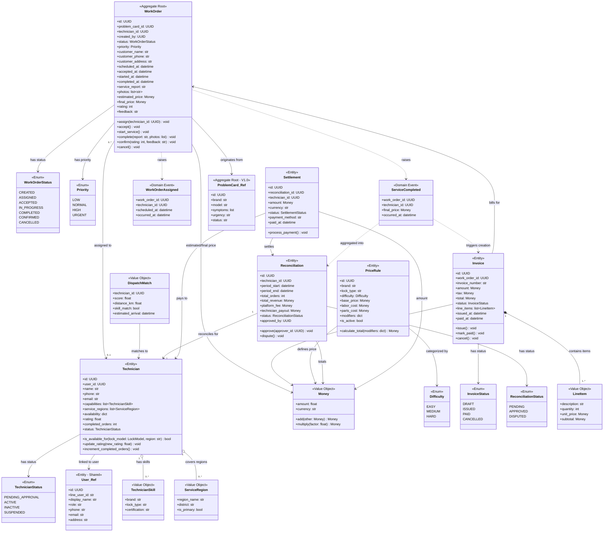

# 類別/組件關係文檔 (Class/Component Relationships Document) - 電子鎖智能客服與派工平台

---

**文件版本 (Document Version):** `v1.0`

**最後更新 (Last Updated):** `2026-02-25`

**主要作者 (Lead Author):** `技術架構師`

**審核者 (Reviewers):** `架構委員會, 核心開發團隊`

**狀態 (Status):** `草稿 (Draft)`

**相關設計文檔 (Related Design Documents):**
*   整合性架構與設計文件: [`docs/05_architecture_and_design_document.md`](../docs/05_architecture_and_design_document.md)
*   專案結構指南: [`docs/08_project_structure_guide.md`](../docs/08_project_structure_guide.md)
*   API 設計規範: [`docs/06_api_design_specification.md`](../docs/06_api_design_specification.md)
*   資料庫 Schema: [`SQL/Schema.sql`](../SQL/Schema.sql)

---

## 目錄 (Table of Contents)

1.  [概述 (Overview)](#1-概述-overview)
2.  [核心類別圖 (Core Class Diagram)](#2-核心類別圖-core-class-diagram)
3.  [主要類別/組件職責 (Key Class/Component Responsibilities)](#3-主要類別組件職責-key-classcomponent-responsibilities)
4.  [關係詳解 (Relationship Details)](#4-關係詳解-relationship-details)
5.  [設計模式應用 (Design Pattern Applications)](#5-設計模式應用-design-pattern-applications)
6.  [SOLID 原則遵循情況 (SOLID Principles Adherence)](#6-solid-原則遵循情況-solid-principles-adherence)
7.  [接口契約 (Interface Contracts)](#7-接口契約-interface-contracts)
8.  [技術選型與依賴 (Technical Choices & Dependencies)](#8-技術選型與依賴-technical-choices--dependencies)
9.  [附錄 (Appendix)](#9-附錄-appendix)

---

## 1. 概述 (Overview)

### 1.1 文檔目的 (Document Purpose)

本文檔旨在通過 UML 類別圖（以 Mermaid 語法呈現）和詳細描述，清晰地呈現「電子鎖智能客服與派工 SaaS 平台」中主要類別、組件和接口之間的靜態結構關係。本文檔覆蓋 V1.0（AI 智能客服）與 V2.0（技師派工與帳務）兩個階段的完整領域模型，作為開發團隊理解和維護系統結構的關鍵參考。

### 1.2 建模範圍 (Modeling Scope)

*   **包含範圍**: Domain Layer 實體 (Entities)、值物件 (Value Objects)、領域事件 (Domain Events)、領域服務 (Domain Services)；Application Layer 用例 (Use Cases)、DTOs、接口定義 (Protocol)；Infrastructure Layer 的 Repository 實作與外部服務客戶端。
*   **排除範圍**: FastAPI Router 的具體路由定義、前端 Next.js 組件、第三方函式庫內部類別（LangChain Chain 細節、SQLAlchemy ORM 映射欄位）、測試專用類別、Docker/CI 配置。
*   **抽象層級**: 專注於公開的屬性 (public properties) 和核心方法 (methods)，忽略基礎設施層的具體實現細節。Domain Layer 呈現完整結構，Application/Infrastructure Layer 呈現關鍵接口與協作關係。

### 1.3 UML 符號說明 (UML Notation Conventions)

*   **繼承 (Inheritance):** `--|>` (is-a) - 子類別繼承父類別。
*   **實現 (Implementation):** `..|>` (implements) - 類別實現接口 (Protocol)。
*   **組合 (Composition):** `*--` (has-a, strong ownership) - 組件的生命週期依賴於容器。
*   **聚合 (Aggregation):** `o--` (has-a, weak ownership) - 組件的生命週期獨立於容器。
*   **依賴 (Dependency):** `..>` (uses-a) - 一個類別的方法使用了另一個類別。
*   **關聯 (Association):** `-->` (has-a) - 類別之間的一般關係。

---

## 2. 核心類別圖 (Core Class Diagram)

### 2.1 V1.0 領域模型 — AI 智能客服核心

此圖展示 V1.0 階段的核心領域實體、值物件、領域事件以及它們之間的關係。涵蓋客服上下文 (CustomerService)、知識庫上下文 (KnowledgeBase) 與三層解決引擎 (Resolution) 三個限界上下文。

```mermaid
classDiagram
    direction TB

    %% ============================
    %% 客服上下文 (CustomerService)
    %% ============================

    class Conversation {
        <<Aggregate Root>>
        +id: UUID
        +user_id: UUID
        +session_id: SessionId
        +status: ConversationStatus
        +channel: ChannelType
        +context: dict~JSONB~
        +resolution_layer: ResolutionLayer
        +user_feedback: str
        +message_count: int
        +started_at: datetime
        +resolved_at: datetime
        +add_message(message: Message) void
        +escalate() void
        +resolve(layer: ResolutionLayer) void
        +expire() void
    }

    class Message {
        +id: UUID
        +conversation_id: UUID
        +role: MessageRole
        +content_type: ContentType
        +content: str
        +metadata: dict~JSONB~
        +created_at: datetime
    }

    class ProblemCard {
        <<Aggregate Root>>
        +id: UUID
        +conversation_id: UUID
        +brand: str
        +model: str
        +category: str
        +location: str
        +door_status: DoorStatus
        +network_status: NetworkStatus
        +symptoms: list~FaultSymptom~
        +urgency: UrgencyLevel
        +media_urls: list~str~
        +intent: Intent
        +status: ProblemCardStatus
        +completeness_score: float
        +resolution_layer: ResolutionLayer
        +extracted_fields: dict~JSONB~
        +calculate_completeness() float
        +confirm() void
        +is_ready_for_resolution() bool
    }

    %% 客服 Value Objects
    class SessionId {
        <<Value Object>>
        +value: str
        +validate() bool
    }

    class MessageRole {
        <<Value Object / Enum>>
        USER
        ASSISTANT
        SYSTEM
    }

    class ChannelType {
        <<Value Object / Enum>>
        LINE
        WEB
        API
    }

    class LockModel {
        <<Value Object>>
        +brand: str
        +model: str
        +display_name() str
    }

    class FaultSymptom {
        <<Value Object>>
        +code: str
        +description: str
        +severity: str
    }

    class ConversationStatus {
        <<Enum>>
        ACTIVE
        COLLECTING
        RESOLVING
        RESOLVED
        ESCALATED
        EXPIRED
    }

    class ProblemCardStatus {
        <<Enum>>
        INCOMPLETE
        CONFIRMED
        RESOLVED
        ESCALATED
    }

    %% ============================
    %% 知識庫上下文 (KnowledgeBase)
    %% ============================

    class CaseEntry {
        <<Entity>>
        +id: UUID
        +title: str
        +problem_description: str
        +solution: str
        +brand: str
        +lock_type: str
        +difficulty: Difficulty
        +embedding: Vector~768~
        +source: CaseSource
        +is_active: bool
        +hit_count: int
        +increment_hit_count() void
        +deactivate() void
    }

    class ManualChunk {
        <<Entity>>
        +id: UUID
        +manual_id: UUID
        +chunk_index: int
        +source_pdf: str
        +page_number: int
        +chapter_title: str
        +content: str
        +token_count: int
        +embedding: Vector~768~
    }

    class Manual {
        <<Entity>>
        +id: UUID
        +filename: str
        +brand: str
        +model: str
        +total_pages: int
        +total_chunks: int
        +status: ManualStatus
        +error_message: str
        +start_processing() void
        +complete_indexing(chunk_count: int) void
        +fail(error: str) void
    }

    class SOPDraft {
        <<Entity>>
        +id: UUID
        +source_conversation_id: UUID
        +source_problem_card_id: UUID
        +title: str
        +applicable_conditions: str
        +steps: list~dict~
        +notes: str
        +status: SOPStatus
        +reviewed_by: UUID
        +review_comment: str
        +published_as_case_entry_id: UUID
        +approve(reviewer_id: UUID, comment: str) void
        +reject(reviewer_id: UUID, comment: str) void
        +publish(case_entry_id: UUID) void
    }

    class EmbeddingVector {
        <<Value Object>>
        +values: list~float~
        +dimension: int
        +cosine_similarity(other: EmbeddingVector) float
    }

    class SOPStatus {
        <<Enum>>
        PENDING_REVIEW
        APPROVED
        REJECTED
        PUBLISHED
    }

    %% ============================
    %% 三層解決引擎 (Resolution)
    %% ============================

    class ResolutionLayer {
        <<Value Object / Enum>>
        L1_CASE_LIBRARY
        L2_RAG
        L3_HUMAN
    }

    class ResolutionResult {
        <<Entity>>
        +answer: str
        +source_references: list~SourceReference~
        +confidence: float
        +resolution_layer: ResolutionLayer
        +needs_escalation: bool
    }

    class SourceReference {
        <<Value Object>>
        +source_type: str
        +source_id: UUID
        +title: str
        +relevance_score: float
    }

    class ResolutionStrategy {
        <<Protocol / Interface>>
        +resolve(problem_card: ProblemCard, context: dict) ResolutionResult*
    }

    class CaseLibraryStrategy {
        +resolve(problem_card: ProblemCard, context: dict) ResolutionResult
    }

    class RAGStrategy {
        +resolve(problem_card: ProblemCard, context: dict) ResolutionResult
    }

    class HumanHandoffStrategy {
        +resolve(problem_card: ProblemCard, context: dict) ResolutionResult
    }

    %% ============================
    %% 領域事件 (Domain Events)
    %% ============================

    class ProblemCardCompleted {
        <<Domain Event>>
        +problem_card_id: UUID
        +conversation_id: UUID
        +completeness_score: float
        +occurred_at: datetime
    }

    class ResolutionFound {
        <<Domain Event>>
        +conversation_id: UUID
        +resolution_layer: ResolutionLayer
        +confidence: float
        +occurred_at: datetime
    }

    class EscalatedToHuman {
        <<Domain Event>>
        +conversation_id: UUID
        +problem_card_id: UUID
        +reason: str
        +occurred_at: datetime
    }

    %% ============================
    %% 關係定義
    %% ============================

    Conversation "1" *-- "0..*" Message : contains
    Conversation "1" -- "0..1" ProblemCard : generates
    Conversation --> SessionId : identified by
    Conversation --> ConversationStatus : has status
    Conversation --> ChannelType : via channel
    Conversation --> ResolutionLayer : resolved at

    Message --> MessageRole : has role

    ProblemCard --> LockModel : describes lock
    ProblemCard --> ProblemCardStatus : has status
    ProblemCard "1" o-- "0..*" FaultSymptom : reports symptoms

    ProblemCard ..> ProblemCardCompleted : raises
    Conversation ..> EscalatedToHuman : raises
    Conversation ..> ResolutionFound : raises

    Manual "1" *-- "0..*" ManualChunk : split into
    ManualChunk --> EmbeddingVector : has embedding
    CaseEntry --> EmbeddingVector : has embedding

    SOPDraft --> SOPStatus : has status
    SOPDraft ..> CaseEntry : published as

    CaseLibraryStrategy ..|> ResolutionStrategy : implements
    RAGStrategy ..|> ResolutionStrategy : implements
    HumanHandoffStrategy ..|> ResolutionStrategy : implements

    ResolutionResult --> ResolutionLayer : at layer
    ResolutionResult "1" o-- "0..*" SourceReference : cites

    CaseLibraryStrategy ..> CaseEntry : searches
    RAGStrategy ..> ManualChunk : retrieves
```



**圖表說明：**

此圖呈現 V1.0 的三個核心限界上下文之間的靜態結構：

- **客服上下文：** `Conversation` 作為聚合根，組合多個 `Message`，並與 `ProblemCard` 形成 1:1 關聯（UNIQUE FK）。`ProblemCard` 是另一個聚合根，從多輪對話中漸進式收集電子鎖故障資訊。
- **知識庫上下文：** `CaseEntry` 與 `ManualChunk` 各自攜帶 768 維向量 (`EmbeddingVector`)，分別支援 L1 案例庫搜尋與 L2 RAG 檢索。`SOPDraft` 代表自演化知識庫的產出，經審核後可發布為 `CaseEntry`。
- **三層解決引擎：** 採用策略模式 (Strategy Pattern)，`ResolutionStrategy` 定義統一接口，三個具體策略（CaseLibraryStrategy、RAGStrategy、HumanHandoffStrategy）分別實作 L1/L2/L3 邏輯。

### 2.2 V2.0 領域模型 — 派工與帳務擴展

此圖展示 V2.0 階段新增的派工上下文 (Dispatch) 與帳務上下文 (Accounting) 領域實體，以及它們與 V1.0 實體的銜接。



**圖表說明：**

此圖展示 V2.0 擴展的兩個核心限界上下文：

- **派工上下文：** `WorkOrder` 作為聚合根，由 V1.0 的 `ProblemCard` 觸發建立（L3 升級）。`Technician` 實體包含技能矩陣 (`TechnicianSkill`) 與服務區域 (`ServiceRegion`)，`DispatchMatch` 值物件封裝智能匹配的計算結果。工單狀態機包含 7 個狀態（Created -> Assigned -> Accepted -> InProgress -> Completed -> Confirmed -> Cancelled）。
- **帳務上下文：** 從 `PriceRule`（品牌 x 鎖型 x 難度）計算報價，`Invoice` 對應每張完工的 `WorkOrder`，`Reconciliation` 按期間彙總技師的服務收入，`Settlement` 執行實際撥款。`Money` 值物件封裝金額與幣別運算。

### 2.3 應用層與基礎設施層 — 依賴反轉架構

此圖展示 Clean Architecture 的分層依賴關係：Application Layer 定義 Protocol 接口，Infrastructure Layer 提供具體實作。

```mermaid
classDiagram
    direction LR

    %% ============================
    %% Application Layer - Interfaces (Protocol)
    %% ============================

    class ConversationRepository {
        <<Protocol>>
        +get_by_id(id: UUID) Conversation*
        +get_by_session_id(session_id: str) Conversation*
        +get_by_user_id(user_id: UUID, status: str) list~Conversation~*
        +save(conversation: Conversation) void*
        +update_status(id: UUID, status: str) void*
    }

    class ProblemCardRepository {
        <<Protocol>>
        +get_by_id(id: UUID) ProblemCard*
        +get_by_conversation_id(conv_id: UUID) ProblemCard*
        +save(card: ProblemCard) void*
        +update(card: ProblemCard) void*
        +list_by_status(status: str, cursor: str, limit: int) list~ProblemCard~*
    }

    class CaseRepository {
        <<Protocol>>
        +get_by_id(id: UUID) CaseEntry*
        +save(entry: CaseEntry) void*
        +update(entry: CaseEntry) void*
        +search_by_vector(embedding: list, threshold: float, limit: int) list~CaseEntry~*
        +list_active(cursor: str, limit: int) list~CaseEntry~*
    }

    class ManualChunkRepository {
        <<Protocol>>
        +get_by_manual_id(manual_id: UUID) list~ManualChunk~*
        +save_batch(chunks: list~ManualChunk~) void*
        +search_by_vector(embedding: list, limit: int) list~ManualChunk~*
    }

    class VectorSearchService {
        <<Protocol>>
        +search_cases(query_embedding: list, threshold: float, limit: int) list~CaseEntry~*
        +search_manual_chunks(query_embedding: list, limit: int) list~ManualChunk~*
    }

    class ILLMGateway {
        <<Protocol>>
        +chat_completion(messages: list, system_prompt: str) str*
        +create_embedding(text: str) list~float~*
        +structured_output(messages: list, schema: type) dict*
        +vision_analysis(image_url: str, prompt: str) str*
    }

    class ILineMessenger {
        <<Protocol>>
        +send_text_message(user_id: str, text: str) void*
        +send_flex_message(user_id: str, flex: dict) void*
        +send_quick_reply(user_id: str, text: str, items: list) void*
        +get_user_profile(user_id: str) dict*
    }

    class ISessionStore {
        <<Protocol>>
        +get_session(user_id: str) dict*
        +save_session(user_id: str, data: dict, ttl: int) void*
        +delete_session(user_id: str) void*
    }

    %% ============================
    %% Application Layer - Use Cases
    %% ============================

    class ProcessMessageUseCase {
        -conversation_repo: ConversationRepository
        -problem_card_repo: ProblemCardRepository
        -llm_gateway: ILLMGateway
        -session_store: ISessionStore
        -line_messenger: ILineMessenger
        +execute(dto: IncomingMessageDTO) ConversationResponseDTO
    }

    class ResolveQueryUseCase {
        -case_repo: CaseRepository
        -chunk_repo: ManualChunkRepository
        -llm_gateway: ILLMGateway
        -vector_search: VectorSearchService
        +execute(query: ResolutionQueryDTO) ResolutionResultDTO
    }

    class IngestManualUseCase {
        -chunk_repo: ManualChunkRepository
        -llm_gateway: ILLMGateway
        +execute(dto: ManualIngestDTO) ManualResponseDTO
    }

    class DraftSOPUseCase {
        -conversation_repo: ConversationRepository
        -llm_gateway: ILLMGateway
        +execute(conversation_id: UUID) SOPDraftDTO
    }

    %% ============================
    %% Infrastructure Layer - Implementations
    %% ============================

    class PgConversationRepository {
        -session: AsyncSession
        +get_by_id(id: UUID) Conversation
        +get_by_session_id(session_id: str) Conversation
        +get_by_user_id(user_id: UUID, status: str) list~Conversation~
        +save(conversation: Conversation) void
        +update_status(id: UUID, status: str) void
    }

    class PgCaseRepository {
        -session: AsyncSession
        +get_by_id(id: UUID) CaseEntry
        +save(entry: CaseEntry) void
        +update(entry: CaseEntry) void
        +search_by_vector(embedding: list, threshold: float, limit: int) list~CaseEntry~
        +list_active(cursor: str, limit: int) list~CaseEntry~
    }

    class PgVectorSearchService {
        -session: AsyncSession
        +search_cases(query_embedding: list, threshold: float, limit: int) list~CaseEntry~
        +search_manual_chunks(query_embedding: list, limit: int) list~ManualChunk~
    }

    class LangChainLLMGateway {
        -model: ChatGoogleGenerativeAI
        -embeddings: GoogleGenerativeAIEmbeddings
        +chat_completion(messages: list, system_prompt: str) str
        +create_embedding(text: str) list~float~
        +structured_output(messages: list, schema: type) dict
        +vision_analysis(image_url: str, prompt: str) str
    }

    class LineBotMessenger {
        -line_bot_api: AsyncLineBotApi
        +send_text_message(user_id: str, text: str) void
        +send_flex_message(user_id: str, flex: dict) void
        +send_quick_reply(user_id: str, text: str, items: list) void
        +get_user_profile(user_id: str) dict
    }

    class RedisSessionStore {
        -redis: Redis
        -default_ttl: int
        +get_session(user_id: str) dict
        +save_session(user_id: str, data: dict, ttl: int) void
        +delete_session(user_id: str) void
    }

    %% ============================
    %% 關係定義
    %% ============================

    PgConversationRepository ..|> ConversationRepository : implements
    PgCaseRepository ..|> CaseRepository : implements
    PgVectorSearchService ..|> VectorSearchService : implements
    LangChainLLMGateway ..|> ILLMGateway : implements
    LineBotMessenger ..|> ILineMessenger : implements
    RedisSessionStore ..|> ISessionStore : implements

    ProcessMessageUseCase ..> ConversationRepository : depends on
    ProcessMessageUseCase ..> ProblemCardRepository : depends on
    ProcessMessageUseCase ..> ILLMGateway : depends on
    ProcessMessageUseCase ..> ISessionStore : depends on
    ProcessMessageUseCase ..> ILineMessenger : depends on

    ResolveQueryUseCase ..> CaseRepository : depends on
    ResolveQueryUseCase ..> ManualChunkRepository : depends on
    ResolveQueryUseCase ..> ILLMGateway : depends on
    ResolveQueryUseCase ..> VectorSearchService : depends on

    IngestManualUseCase ..> ManualChunkRepository : depends on
    IngestManualUseCase ..> ILLMGateway : depends on

    DraftSOPUseCase ..> ConversationRepository : depends on
    DraftSOPUseCase ..> ILLMGateway : depends on
```



**圖表說明：**

此圖呈現 Clean Architecture 的依賴反轉 (Dependency Inversion) 結構：

- **Application Layer** 定義了 7 個 Protocol 接口（`ConversationRepository`、`CaseRepository`、`VectorSearchService`、`ILLMGateway`、`ILineMessenger`、`ISessionStore` 等），Use Case 僅依賴這些抽象。
- **Infrastructure Layer** 提供具體實作：`PgConversationRepository`（SQLAlchemy Async）、`PgVectorSearchService`（pgvector HNSW）、`LangChainLLMGateway`（LangChain + Gemini 3 Pro）、`LineBotMessenger`（line-bot-sdk-python）、`RedisSessionStore`（redis.asyncio）。
- 所有依賴方向皆由外層指向內層，符合 Clean Architecture 的核心規則。Use Case 透過 FastAPI 的 `Depends()` 機制注入具體實作。

---

## 3. 主要類別/組件職責 (Key Class/Component Responsibilities)

### 3.1 Domain Layer 實體

| 類別/組件 | 核心職責 | 主要協作者 | 所屬限界上下文 |
| :-- | :-- | :-- | :-- |
| `Conversation` (Aggregate Root) | 管理一次完整客服對話的生命週期：狀態流轉（active -> collecting -> resolving -> resolved/escalated/expired）、訊息聚合、多輪上下文維護 | `Message`, `ProblemCard`, `SessionId`, `ConversationStatus` | `customer_service` |
| `Message` | 表示對話中的單則訊息，記錄角色（user/assistant/system）、內容類型（text/image/location/flex）、元資訊（token 用量、延遲） | `MessageRole`, `ContentType` | `customer_service` |
| `ProblemCard` (Aggregate Root) | 結構化問題診斷卡：AI 從對話中漸進式提取電子鎖故障資訊，計算欄位完整度，當完整度足夠時觸發三層解決引擎 | `LockModel`, `FaultSymptom`, `ProblemCardStatus` | `customer_service` |
| `CaseEntry` | 知識庫案例條目：包含問題描述、解決方案、適用品牌/鎖型、768 維向量嵌入。支援 L1 向量相似度搜尋（閾值 >= 0.85） | `EmbeddingVector`, `Difficulty` | `knowledge_base` |
| `ManualChunk` | PDF 手冊切片：電子鎖操作手冊經 PyMuPDF 解析後的文本段落，含 768 維向量嵌入。供 L2 RAG 管線檢索使用 | `Manual`, `EmbeddingVector` | `knowledge_base` |
| `Manual` | 手冊主體記錄：管理 PDF 上傳、解析進度（processing -> indexing -> completed/failed）、與切片的 1:N 關係 | `ManualChunk` | `knowledge_base` |
| `SOPDraft` | SOP 草稿：系統從成功對話中自動生成的標準作業程序，需經管理員審核後發布至案例庫，實現知識庫自演化 | `CaseEntry`, `SOPStatus` | `knowledge_base` |
| `ResolutionResult` | 三層解決引擎的輸出：包含答案文本、引用來源、信心分數、解決層級（L1/L2/L3）、是否需要升級 | `ResolutionLayer`, `SourceReference` | `resolution` |
| `WorkOrder` (Aggregate Root, V2.0) | 派工單：由 ProblemCard L3 升級觸發建立，管理工單完整生命週期（建立 -> 指派 -> 接受 -> 進行中 -> 完成 -> 確認/取消） | `Technician`, `ProblemCard`, `WorkOrderStatus`, `Money` | `dispatch` |
| `Technician` (V2.0) | 技師實體：包含技能矩陣（品牌 x 鎖型）、服務區域、可用時段、評分，供智能派工匹配算法使用 | `TechnicianSkill`, `ServiceRegion`, `User` | `dispatch` |
| `PriceRule` (V2.0) | 計價規則：以品牌 x 鎖型 x 難度為維度定義基礎價格、人工費、零件費，支援特殊加價修飾器（夜間、偏遠） | `Money`, `Difficulty` | `accounting` |
| `Invoice` (V2.0) | 發票/請款單：對應完工的 WorkOrder，包含報價明細 (LineItem)、金額、稅額、付款狀態 | `WorkOrder`, `Money`, `LineItem` | `accounting` |
| `Reconciliation` (V2.0) | 對帳記錄：按期間彙總技師的服務訂單、總營收、平台費用、技師應付款 | `Technician`, `Money` | `accounting` |
| `Settlement` (V2.0) | 結算記錄：對帳審核通過後執行實際撥款，記錄付款方式與狀態 | `Reconciliation`, `Money` | `accounting` |

### 3.2 Application Layer 用例

| 用例 | 核心職責 | 依賴的 Protocol | 所屬模組 |
| :-- | :-- | :-- | :-- |
| `ProcessMessageUseCase` | 核心對話處理流程：接收 LINE 訊息 -> 讀取 Session -> 意圖辨識 -> NER 擷取 -> 更新 ProblemCard -> 觸發解決引擎 -> 回覆用戶 | `ConversationRepository`, `ProblemCardRepository`, `ILLMGateway`, `ISessionStore`, `ILineMessenger` | `conversation` |
| `ResolveQueryUseCase` | 三層解決引擎編排：L1 案例庫向量搜尋 (>= 0.85) -> L2 RAG 管線 -> L3 人工轉接 | `CaseRepository`, `ManualChunkRepository`, `ILLMGateway`, `VectorSearchService` | `resolution` |
| `GenerateProblemCardUseCase` | LLM 輔助問題卡生成：從對話歷史中提取結構化欄位，填充 ProblemCard，計算完整度 | `ProblemCardRepository`, `ILLMGateway` | `problem_card` |
| `IngestManualUseCase` | PDF 手冊處理管線：解析 PDF -> 文本切片 -> 生成 768 維向量 -> 批次儲存 | `ManualChunkRepository`, `ILLMGateway` | `knowledge_base` |
| `DraftSOPUseCase` | SOP 自動生成：從成功對話中提取解決模式，使用 LLM 生成結構化 SOP 草稿 | `ConversationRepository`, `ILLMGateway` | `knowledge_base` |
| `CreateWorkOrderUseCase` (V2.0) | 建立派工單：從 ProblemCard 資訊建立 WorkOrder，觸發技師匹配 | `WorkOrderRepository`, `ProblemCardRepository` | `dispatch` |
| `MatchTechnicianUseCase` (V2.0) | 智能技師匹配：根據技能、地區、可用時段、評分計算最佳匹配 | `TechnicianRepository`, `GeocodingService` | `dispatch` |
| `CalculateQuotationUseCase` (V2.0) | 報價計算：根據 PriceRule 計算服務費用，含急件加成、夜間附加費 | `PriceRuleRepository` | `pricing` |
| `GenerateReconciliationUseCase` (V2.0) | 對帳生成：按期間彙總技師已完成工單的費用，計算平台費與技師應付 | `ReconciliationRepository`, `WorkOrderRepository` | `accounting` |

### 3.3 Infrastructure Layer 實作

| 類別/組件 | 核心職責 | 實作的 Protocol | 依賴技術 |
| :-- | :-- | :-- | :-- |
| `PgConversationRepository` | Conversation 的 PostgreSQL 持久化：含 JSONB context 欄位的讀寫、cursor-based 分頁 | `ConversationRepository` | SQLAlchemy 2.0 Async, asyncpg |
| `PgCaseRepository` | CaseEntry 的持久化與 pgvector cosine similarity 搜尋 | `CaseRepository` | SQLAlchemy 2.0, pgvector |
| `PgVectorSearchService` | 統一向量搜尋服務：封裝 pgvector HNSW 索引查詢，支援 case_entries 與 manual_chunks 表 | `VectorSearchService` | pgvector, SQLAlchemy |
| `LangChainLLMGateway` | Google Gemini 3 Pro 的 LangChain 封裝：chat completion、embedding (768-dim)、structured output、vision | `ILLMGateway` | LangChain 0.3.x, langchain-google-genai |
| `LineBotMessenger` | LINE Messaging API 封裝：文字/Flex Message/Quick Reply 發送、用戶 Profile 查詢 | `ILineMessenger` | line-bot-sdk-python 3+ |
| `RedisSessionStore` | Redis 對話 Session 管理：TTL 30 分鐘自動過期、ProblemCard 暫存狀態讀寫 | `ISessionStore` | redis.asyncio |

---

## 4. 關係詳解 (Relationship Details)

### 4.1 繼承/實現 (Inheritance/Implementation)

#### 策略模式 — 三層解決引擎

- **`CaseLibraryStrategy` implements `ResolutionStrategy`:** L1 實作——對 `case_entries` 表執行 pgvector cosine similarity 搜尋，閾值 >= 0.85 視為命中，取 Top-3 結果。
- **`RAGStrategy` implements `ResolutionStrategy`:** L2 實作——檢索 `manual_chunks` 表相關段落，組合上下文後調用 Gemini 3 Pro 生成答案。
- **`HumanHandoffStrategy` implements `ResolutionStrategy`:** L3 實作——AI 無法解決時，收集客戶進階資訊（電話、地址），建立支援工單或派工單。

這是策略模式和依賴反轉的經典應用。`ResolveQueryUseCase` 不直接依賴具體策略類別，而是依賴抽象的 `ResolutionStrategy` Protocol，依序嘗試三層策略直到找到解答。

#### Repository Pattern — 依賴反轉

- **`PgConversationRepository` implements `ConversationRepository`:** 所有 Application Layer 用例透過 `ConversationRepository` Protocol 存取對話資料，具體的 SQLAlchemy 實作完全封裝在 Infrastructure Layer。
- **`PgCaseRepository` implements `CaseRepository`:** 案例庫的 CRUD 與向量搜尋邏輯封裝於 `PgCaseRepository`，包含 pgvector 的 HNSW 索引查詢。
- **`LangChainLLMGateway` implements `ILLMGateway`:** LLM 呼叫（chat completion、embedding、structured output、vision）透過 Protocol 抽象，確保 LangChain 框架可被替換。
- **`LineBotMessenger` implements `ILineMessenger`:** LINE SDK 的具體操作封裝於 Infrastructure Layer，Application Layer 僅呼叫抽象接口發送訊息。
- **`RedisSessionStore` implements `ISessionStore`:** Redis 的 Session 管理細節（TTL、序列化、連線池）封裝於 Infrastructure Layer。

### 4.2 組合/聚合 (Composition/Aggregation)

| 關係 | 類型 | 說明 |
| :-- | :-- | :-- |
| `Conversation` *-- `Message` | 組合 (Composition) | `Message` 的生命週期完全依賴 `Conversation`。刪除對話時，所有訊息隨之刪除（`ON DELETE CASCADE`）。一個 Conversation 包含 0 到多個 Message。 |
| `Manual` *-- `ManualChunk` | 組合 (Composition) | `ManualChunk` 的生命週期完全依賴 `Manual`。刪除手冊時，所有切片隨之刪除（`ON DELETE CASCADE`）。一本手冊切分為多個段落。 |
| `Invoice` *-- `LineItem` | 組合 (Composition) | `LineItem` 作為 JSONB 欄位嵌入 `Invoice`，不獨立存在，完全由發票管理。 |
| `Conversation` -- `ProblemCard` | 1:1 關聯 | 每個 Conversation 對應至多一張 ProblemCard（`UNIQUE FK`）。ProblemCard 可獨立查詢但業務上由 Conversation 觸發建立。 |
| `ProblemCard` o-- `FaultSymptom` | 聚合 (Aggregation) | `FaultSymptom` 作為值物件以 JSONB 陣列形式存放於 `symptoms` 欄位，概念上是 ProblemCard 的組成部分但可獨立定義。 |
| `Technician` o-- `TechnicianSkill` | 聚合 (Aggregation) | `TechnicianSkill` 以 JSONB 形式存放，代表技師的品牌與鎖型技能認證。 |
| `Technician` o-- `ServiceRegion` | 聚合 (Aggregation) | `ServiceRegion` 以 JSONB 形式存放，代表技師可服務的地區範圍。 |

### 4.3 依賴 (Dependency)

| 來源 | 目標 | 關係說明 |
| :-- | :-- | :-- |
| `ProcessMessageUseCase` | `ConversationRepository`, `ILLMGateway`, `ISessionStore`, `ILineMessenger` | 核心對話處理流程依賴四個 Protocol：讀取/寫入對話、調用 LLM、管理 Session、回覆 LINE 訊息。所有依賴透過 FastAPI `Depends()` 注入。 |
| `ResolveQueryUseCase` | `CaseRepository`, `ManualChunkRepository`, `ILLMGateway`, `VectorSearchService` | 三層解決引擎需要存取案例庫與手冊切片（向量搜尋）以及 LLM 推理能力。 |
| `WorkOrder` | `ProblemCard` | V2.0 派工單由 ProblemCard L3 升級觸發建立（`FK: problem_card_id REFERENCES problem_cards(id)`）。跨限界上下文引用，透過 Anti-Corruption Layer 轉譯。 |
| `Invoice` | `WorkOrder` | 帳務上下文的發票對應派工上下文的完工工單（`FK: work_order_id REFERENCES work_orders(id)`）。 |
| `SOPDraft` | `Conversation`, `ProblemCard`, `CaseEntry` | SOP 草稿追溯來源對話與問題卡，發布後關聯至新建的案例條目。 |
| `Reconciliation` | `Technician` | 對帳記錄按技師 + 期間彙總（`FK: technician_id REFERENCES technicians(id)`）。 |
| `Settlement` | `Reconciliation` | 結算記錄基於已審核的對帳記錄執行撥款。 |

### 4.4 跨限界上下文關係

根據架構文件的上下文地圖 (Context Map)，限界上下文之間的關係模式如下：

| 上游 | 下游 | 模式 | 交互方式 |
| :-- | :-- | :-- | :-- |
| `KnowledgeBase` | `CustomerService` | Published Language | 知識庫透過公開的 `CaseEntry`/`ManualChunk` 結構提供搜尋結果 |
| `CustomerService` | `KnowledgeBase` | Conformist | 客服上下文遵循知識庫定義的資料結構進行案例查詢 |
| `CustomerService` | `Dispatch` | Customer-Supplier | L3 觸發時，客服上下文向派工上下文提交工單建立請求 |
| `Dispatch` | `CustomerService` | Anti-Corruption Layer | 派工上下文透過防腐層轉譯 ProblemCard，避免領域模型耦合 |
| `Dispatch` | `Accounting` | Customer-Supplier | 派工完成後觸發帳務上下文進行費用計算與請款 |
| 所有上下文 | `UserManagement` | Conformist | 所有上下文遵循 UserManagement 定義的身分與權限模型 |

---

## 5. 設計模式應用 (Design Pattern Applications)

| 設計模式 | 應用場景 / 涉及類別 | 設計目的 / 解決的問題 |
| :-- | :-- | :-- |
| **策略模式 (Strategy)** | `ResolveQueryUseCase` 使用 `ResolutionStrategy` Protocol，具體策略為 `CaseLibraryStrategy`（L1）、`RAGStrategy`（L2）、`HumanHandoffStrategy`（L3） | 將三層解決引擎的各層邏輯解耦為獨立策略，可在運行時按順序嘗試。新增解決層級（如 L1.5 FAQ 匹配）時，只需新增策略類別，無需修改編排邏輯。 |
| **Repository 模式 (Repository)** | `ConversationRepository`、`CaseRepository`、`ProblemCardRepository`、`WorkOrderRepository` 等 Protocol 及其 `Pg*` 實作 | 將資料存取邏輯從業務邏輯中分離。Use Case 僅依賴 Protocol 抽象，不直接操作 SQLAlchemy Session 或 SQL 語句，提高可測試性（可 mock Repository）。 |
| **依賴注入 (DI)** | FastAPI 的 `Depends()` 機制注入 `AsyncSession`、`Redis`、Repository 實作、LLM Client、LINE Client 到 Use Case | 降低組件之間的耦合度。Use Case 構造時接收 Protocol 實例而非自行建立，測試時可注入 mock 物件，生產環境注入真實實作。 |
| **工廠模式 (Factory)** | ProblemCard 的建立邏輯（從 LLM 結構化輸出建立 ProblemCard）、WorkOrder 的建立（從 ProblemCard + 客戶資訊組裝）、FlexMessage 模板建構 | 封裝複雜物件的創建過程。ProblemCard 需要解析 LLM 輸出的 JSON、驗證欄位、計算完整度分數，這些邏輯集中在工廠方法中。 |
| **狀態機模式 (State Machine)** | `Conversation.status` 狀態流轉（active -> collecting -> resolving -> resolved/escalated/expired）、`WorkOrder.status` 狀態流轉（created -> assigned -> accepted -> in_progress -> completed -> confirmed/cancelled） | 確保實體狀態轉換的合法性。例如，只有 `assigned` 狀態的工單才能轉為 `accepted`，防止非法狀態跳躍。 |
| **觀察者模式 (Observer / Domain Events)** | `ProblemCardCompleted` 觸發三層解決引擎、`ResolutionFound` 觸發 LINE 回覆、`EscalatedToHuman` 觸發工單建立、`ServiceCompleted` 觸發帳務計算 | 實現限界上下文之間的鬆耦合通信。客服上下文不直接呼叫派工上下文的方法，而是發布領域事件，由事件處理器決定後續動作。 |
| **防腐層 (Anti-Corruption Layer)** | `Dispatch` 上下文讀取 `CustomerService` 上下文的 ProblemCard 時，透過 DTO 轉譯而非直接引用 Domain Entity | 避免不同限界上下文的領域模型直接耦合。派工上下文有自己對「問題描述」的理解（以工單維度），不應被客服上下文的 ProblemCard 結構綁定。 |
| **值物件模式 (Value Object)** | `Money`（金額+幣別）、`LockModel`（品牌+型號）、`FaultSymptom`（代碼+描述+嚴重度）、`SessionId`、`EmbeddingVector`（768 維向量+相似度計算） | 以不可變物件封裝領域概念，提供語義化的比較與運算方法。`Money.add()` 確保幣別一致，`EmbeddingVector.cosine_similarity()` 封裝向量距離計算。 |

---

## 6. SOLID 原則遵循情況 (SOLID Principles Adherence)

*   `[x]` **S - 單一職責原則 (Single Responsibility Principle):**
    *   **評估：遵循。** 每個類別有明確且唯一的職責邊界：
        - `Conversation` 僅負責對話狀態管理，不涉及 LLM 呼叫或資料庫操作。
        - `ProblemCard` 僅負責結構化問題描述與完整度計算，不負責實際解決問題。
        - `ResolveQueryUseCase` 僅編排三層解決流程，具體搜尋與推理邏輯委託給各策略類別。
        - Repository 僅負責資料持久化，不包含業務規則。
    *   **注意事項：** `ProcessMessageUseCase` 作為核心對話處理入口，協調多個子流程（意圖識別、NER、ProblemCard 更新、解決引擎觸發），需確保其僅扮演「編排者」角色，不內嵌具體邏輯。

*   `[x]` **O - 開放/封閉原則 (Open/Closed Principle):**
    *   **評估：遵循。** 系統在多處體現對擴展開放、對修改封閉：
        - 三層解決引擎使用策略模式，新增解決層級只需新增 `ResolutionStrategy` 實作，不修改 `ResolveQueryUseCase`。
        - 新增資料庫支持（如測試用 SQLite）只需新增 Repository 實作，不修改 Use Case。
        - V2.0 的派工/帳務模組作為新的 Python package 加入，不修改 V1.0 的客服/知識庫模組。
        - LLM Provider 變更（如從 Gemini 切換至 Claude）只需新增 `ILLMGateway` 實作。

*   `[x]` **L - 里氏替換原則 (Liskov Substitution Principle):**
    *   **評估：遵循。** 所有 Protocol 的實作類別可以互相替換而不影響系統行為：
        - `PgCaseRepository` 可被 `InMemoryCaseRepository`（測試用）替換，`ResolveQueryUseCase` 的行為不受影響。
        - `LangChainLLMGateway` 可被 `MockLLMGateway`（測試用）或 `DirectGoogleAIGateway`（繞過 LangChain）替換。
        - 三個 `ResolutionStrategy` 實作都符合相同的輸入/輸出契約。

*   `[x]` **I - 介面隔離原則 (Interface Segregation Principle):**
    *   **評估：遵循。** Protocol 介面保持小而專一：
        - `ConversationRepository` 僅定義對話相關操作，不包含案例庫或手冊操作。
        - `ILLMGateway` 與 `ILineMessenger` 是兩個獨立 Protocol，LINE SDK 不需要知道 LLM 介面，反之亦然。
        - `VectorSearchService` 專注於向量搜尋，與一般 CRUD 操作的 Repository 分離。
        - `ISessionStore` 專注於 Session 管理，與持久化 Repository 分離。

*   `[x]` **D - 依賴反轉原則 (Dependency Inversion Principle):**
    *   **評估：完全遵循。** 這是本系統 Clean Architecture 的核心支柱：
        - **Domain Layer（最內層）** 不依賴任何外部框架（不 import FastAPI、SQLAlchemy、Redis、LangChain）。
        - **Application Layer（中間層）** 僅依賴 Domain Layer，透過 Protocol 定義所需的基礎設施能力。
        - **Infrastructure Layer（最外層）** 依賴 Application Layer，實作其定義的 Protocol。
        - 依賴方向嚴格由外而內：Infrastructure -> Application -> Domain，高層模組（Use Case）不依賴低層模組（PostgreSQL/Redis/LangChain），兩者都依賴抽象（Protocol）。

---

## 7. 接口契約 (Interface Contracts)

### 7.1 `ConversationRepository`

*   **目的:** 定義對話實體的持久化與查詢操作契約。
*   **所屬模組:** `backend/src/smart_lock/application/conversation/interfaces.py`
*   **方法 (Methods):**
    *   `async get_by_id(id: UUID) -> Conversation | None`
        *   **描述:** 根據 UUID 查詢單一對話實體。
        *   **前置條件:** `id` 為有效的 UUID。
        *   **後置條件:** 若找到返回 `Conversation` 實體（含最近 N 筆 Message）；若未找到返回 `None`。
    *   `async get_by_session_id(session_id: str) -> Conversation | None`
        *   **描述:** 根據 Session ID 查詢活躍對話。此為 LINE Webhook 處理時的主要查詢路徑。
        *   **前置條件:** `session_id` 為非空字串。
        *   **後置條件:** 若找到返回對應的 `Conversation`；若未找到返回 `None`。
    *   `async get_by_user_id(user_id: UUID, status: str | None = None) -> list[Conversation]`
        *   **描述:** 查詢特定用戶的對話列表，可選按狀態篩選。
        *   **前置條件:** `user_id` 為有效 UUID。
        *   **後置條件:** 返回該用戶的對話列表，按 `created_at` 降序排列。
    *   `async save(conversation: Conversation) -> None`
        *   **描述:** 持久化新建的 Conversation 實體及其 Message。
        *   **前置條件:** `conversation` 為有效的 Conversation 實例，含必填欄位。
        *   **後置條件:** 對話已寫入資料庫，包含所有關聯的 Message。
    *   `async update_status(id: UUID, status: str) -> None`
        *   **描述:** 更新對話狀態。
        *   **前置條件:** `id` 對應存在的對話；`status` 為合法的 `ConversationStatus` 值。
        *   **後置條件:** 對話狀態已更新，`updated_at` 自動刷新。

### 7.2 `CaseRepository`

*   **目的:** 定義案例庫的 CRUD 與向量搜尋操作契約。
*   **所屬模組:** `backend/src/smart_lock/application/knowledge_base/interfaces.py`
*   **方法 (Methods):**
    *   `async get_by_id(id: UUID) -> CaseEntry | None`
        *   **描述:** 根據 UUID 查詢單一案例。
        *   **後置條件:** 若找到返回 `CaseEntry`；若未找到返回 `None`。
    *   `async save(entry: CaseEntry) -> None`
        *   **描述:** 持久化新建的案例條目（含 768 維向量嵌入）。
        *   **前置條件:** `entry.embedding` 為 768 維浮點數列表。
        *   **後置條件:** 案例已寫入 `case_entries` 表，HNSW 索引自動更新。
    *   `async search_by_vector(embedding: list[float], threshold: float = 0.85, limit: int = 3) -> list[CaseEntry]`
        *   **描述:** 對案例庫執行 pgvector cosine similarity 搜尋，用於 L1 三層解決引擎。
        *   **前置條件:** `embedding` 為 768 維浮點數列表；`threshold` 為 0.0~1.0 的相似度閾值。
        *   **後置條件:** 返回相似度 >= `threshold` 的案例列表，按相似度降序排列，最多 `limit` 筆。命中的案例 `hit_count` 自動 +1。
    *   `async list_active(cursor: str | None = None, limit: int = 20) -> list[CaseEntry]`
        *   **描述:** 分頁查詢所有啟用中的案例（`is_active = True`），使用 cursor-based 分頁。
        *   **後置條件:** 返回案例列表，按 `created_at` 降序排列。

### 7.3 `VectorSearchService`

*   **目的:** 統一封裝向量相似度搜尋邏輯，處理 pgvector HNSW 查詢與距離閾值轉換。
*   **所屬模組:** `backend/src/smart_lock/application/knowledge_base/interfaces.py`
*   **方法 (Methods):**
    *   `async search_cases(query_embedding: list[float], threshold: float = 0.85, limit: int = 3) -> list[CaseEntry]`
        *   **描述:** 搜尋案例庫（L1 引擎）。內部將 cosine similarity 閾值轉換為 cosine distance（`distance < 1 - threshold`）。
        *   **後置條件:** 返回符合閾值的案例列表，附帶 `relevance_score`。
    *   `async search_manual_chunks(query_embedding: list[float], limit: int = 5) -> list[ManualChunk]`
        *   **描述:** 搜尋手冊切片（L2 RAG 引擎的 Retrieval 階段）。
        *   **後置條件:** 返回最相關的手冊段落列表，按相似度降序排列。

### 7.4 `ILLMGateway`

*   **目的:** 定義 LLM（Google Gemini 3 Pro）相關操作的抽象接口，隔離 LangChain 框架依賴。
*   **所屬模組:** `backend/src/smart_lock/application/resolution/interfaces.py` 或 `shared/interfaces.py`
*   **方法 (Methods):**
    *   `async chat_completion(messages: list[dict], system_prompt: str) -> str`
        *   **描述:** 調用 LLM 進行對話生成。用於意圖識別、回應生成、SOP 草稿撰寫。
        *   **前置條件:** `messages` 為 `[{"role": "user"|"assistant", "content": "..."}]` 格式列表。
        *   **後置條件:** 返回 LLM 生成的文本回應。
    *   `async create_embedding(text: str) -> list[float]`
        *   **描述:** 將文本轉換為 768 維向量（使用 text-embedding-004 模型）。
        *   **前置條件:** `text` 為非空字串。
        *   **後置條件:** 返回 768 個浮點數的列表。
    *   `async structured_output(messages: list[dict], schema: type) -> dict`
        *   **描述:** 調用 LLM 並將輸出解析為結構化 JSON，符合指定的 Pydantic schema。用於 ProblemCard 欄位提取。
        *   **前置條件:** `schema` 為 Pydantic BaseModel 子類別。
        *   **後置條件:** 返回符合 schema 的字典。
    *   `async vision_analysis(image_url: str, prompt: str) -> str`
        *   **描述:** 使用 Gemini 3 Pro Vision 分析用戶上傳的圖片（電子鎖故障照片、錯誤代碼截圖）。
        *   **前置條件:** `image_url` 為可存取的圖片 URL。
        *   **後置條件:** 返回 Vision 分析結果文本。

### 7.5 `ILineMessenger`

*   **目的:** 定義 LINE Messaging API 操作的抽象接口。
*   **所屬模組:** `backend/src/smart_lock/application/conversation/interfaces.py`
*   **方法 (Methods):**
    *   `async send_text_message(user_id: str, text: str) -> None`
        *   **描述:** 向指定 LINE 用戶發送純文字訊息。
        *   **前置條件:** `user_id` 為有效的 LINE User ID（U + 32 hex）。
    *   `async send_flex_message(user_id: str, flex: dict) -> None`
        *   **描述:** 發送 Flex Message（用於呈現 ProblemCard 摘要、解決方案步驟、報價單等結構化內容）。
    *   `async send_quick_reply(user_id: str, text: str, items: list[dict]) -> None`
        *   **描述:** 發送附帶 Quick Reply 選項的訊息（用於引導用戶選擇電子鎖品牌、故障類型等常見選項）。
    *   `async get_user_profile(user_id: str) -> dict`
        *   **描述:** 呼叫 LINE Get Profile API 取得用戶資料（displayName、pictureUrl、statusMessage）。
        *   **後置條件:** 返回用戶 Profile 字典。

### 7.6 `ISessionStore`

*   **目的:** 定義對話 Session 狀態的快取管理接口。
*   **所屬模組:** `backend/src/smart_lock/application/conversation/interfaces.py`
*   **方法 (Methods):**
    *   `async get_session(user_id: str) -> dict | None`
        *   **描述:** 根據 LINE User ID 取得活躍的對話 Session 資料（ProblemCard 暫存狀態、對話階段、最近 N 輪歷史）。
        *   **後置條件:** 若 Session 存在且未過期，返回 Session 字典；若不存在或已過期，返回 `None`。
    *   `async save_session(user_id: str, data: dict, ttl: int = 1800) -> None`
        *   **描述:** 儲存或更新 Session 資料，重置 TTL（預設 30 分鐘）。
        *   **前置條件:** `data` 為可序列化的字典。
        *   **後置條件:** Session 已寫入 Redis，TTL 已設定。
    *   `async delete_session(user_id: str) -> None`
        *   **描述:** 刪除指定用戶的 Session（對話結束或手動清除時使用）。

---

## 8. 技術選型與依賴 (Technical Choices & Dependencies)

### 8.1 核心技術選型

| 類別/組件 | 語言/框架 | 關鍵庫/工具 | 版本/約束 | 適用範圍 | 選擇理由 | 備選方案 | 風險/成熟度 | 關聯 ADR |
| :-- | :-- | :-- | :-- | :-- | :-- | :-- | :-- | :-- |
| Use Cases / API 層 | Python / FastAPI | Pydantic v2, Uvicorn | Python 3.11+, FastAPI 0.110+ | 全系統後端 | 原生 async/await 支援 LLM 非同步呼叫；Pydantic 嚴格驗證 ProblemCard 欄位；自動生成 OpenAPI 文檔 | Flask, Django | 成熟，社群活躍 | [ADR-001](../docs/adrs/adr-001-backend-framework.md) |
| Repository 實作 | Python | SQLAlchemy 2.0 Async, asyncpg | SQLAlchemy 2.0+, asyncpg | 資料存取層 | ORM + async session 支援 pgvector 向量型別；同一 transaction 內保證 Entity + Embedding 一致性 | Tortoise ORM, psycopg3 | 成熟 | [ADR-002](../docs/adrs/adr-002-database-selection.md) |
| 向量搜尋 | SQL | pgvector (PostgreSQL extension) | pgvector 0.7+, PostgreSQL 16 | L1/L2 向量搜尋 | 單一資料庫方案，向量與關聯式資料可 JOIN 查詢；HNSW 索引在 10 萬級資料量下查詢延遲 < 10ms | Pinecone, Milvus | 成熟，資料量 < 50 萬筆安全 | [ADR-002](../docs/adrs/adr-002-database-selection.md) |
| LLM 整合 | Python | LangChain 0.3.x, langchain-google-genai | LangChain >= 0.3, < 0.4 | AI Pipeline | LCEL 宣告式 pipeline 編排；Structured Output 直接解析為 Pydantic model；LangSmith 追蹤 | LlamaIndex, 自行實作 | 活躍但 API 變動頻繁 | [ADR-003](../docs/adrs/adr-003-llm-integration-framework.md) |
| LLM 模型 | - | Google Gemini 3 Pro | via langchain-google-genai | 意圖識別、對話生成、SOP 生成、Vision | 多模態支援（文字 + 圖片），Structured Output 品質高 | Claude, GPT-4o | 成熟 | [ADR-003](../docs/adrs/adr-003-llm-integration-framework.md) |
| Embedding 模型 | - | Google text-embedding-004 | 768 維 | 文本向量化 | 768 維平衡效能與精度；搭配 pgvector HNSW (m=16, ef_construction=64) | OpenAI ada-002 (1536-dim) | 成熟 | [ADR-002](../docs/adrs/adr-002-database-selection.md) |
| LINE 整合 | Python | line-bot-sdk-python | 3+ | LINE Bot Webhook、訊息發送 | 官方 SDK，支援 Flex Message、Quick Reply、Webhook 簽章驗證 | 自行封裝 HTTP Client | 成熟，官方維護 | [ADR-004](../docs/adrs/adr-004-line-bot-architecture.md) |
| Session 管理 | Python | redis.asyncio | Redis 7+ | 對話 Session 快取 | 讀取延遲 < 1ms，TTL 自動過期（30 分鐘），搭配 FastAPI async 架構 | 僅 PostgreSQL | 成熟 | [ADR-004](../docs/adrs/adr-004-line-bot-architecture.md) |
| 前端 (V2.0) | TypeScript / React | Next.js 15+, shadcn/ui, Zustand | Next.js 15+, React 19+, TS 5+ | 管理後台、技師工作台 | App Router + Server Components 減少客戶端 JS；API Routes 作為 BFF 層；PWA 支援技師離線使用 | Nuxt.js, Plain React SPA | 成熟 | [ADR-005](../docs/adrs/adr-005-frontend-framework-v2.md) |
| Domain Entities | Python | dataclasses / Pydantic BaseModel | Python 3.11+ | Domain Layer | 型別安全、不可變性、內建驗證；Value Object 使用 `frozen=True` 確保不可變 | attrs, 自定義 class | 成熟 | - |

### 8.2 外部依賴（基礎設施/服務）

| 依賴 | 用途 | 關鍵配置 |
| :-- | :-- | :-- |
| **PostgreSQL 16 + pgvector 0.7+** | 主要關聯式資料庫 + 向量搜尋引擎 | Docker image: `pgvector/pgvector:pg16`；連線池: asyncpg + PgBouncer；HNSW 索引: `m=16, ef_construction=64`；每日 `pg_dump` 備份 |
| **Redis 7+** | Session 快取（TTL 30 分鐘）、Rate Limiting Counter | Docker 部署搭配 AOF 持久化；`maxmemory-policy: allkeys-lru`；Key 格式: `session:line:{user_id}` |
| **Google Gemini 3 Pro API** | LLM 推理（意圖識別、對話生成、NER、SOP 撰寫、Vision 分析） | 透過 LangChain langchain-google-genai 呼叫；重試策略: 3 次指數退避；Token 用量追蹤 |
| **Google text-embedding-004** | 文本向量化（768 維） | 批次處理支援；向量正規化後存入 pgvector |
| **LINE Messaging API** | Webhook 接收、訊息回覆/推送、用戶 Profile 查詢 | Webhook 簽章驗證（HMAC-SHA256）；Channel Access Token 管理；1 秒內回應 HTTP 200 |

### 8.3 非功能約束 (NFR)

| NFR 分類 | 最低要求 | 對應支持 |
| :-- | :-- | :-- |
| **效能** | LINE Webhook 1 秒內回應 200；REST API P95 < 2 秒；LLM P95 < 10 秒 | FastAPI async + Background Task；Redis Session < 1ms 讀取 |
| **並發** | V1.0: 50 concurrent / V2.0: 100 concurrent | Uvicorn async worker；asyncpg 連線池 |
| **可用性** | >= 99.5%（月度） | Docker Compose 編排；Redis AOF 持久化；pg_dump 每日備份 |
| **安全性** | HTTPS；LINE Webhook HMAC-SHA256；JWT Token 認證 | `core/security.py` 統一處理 |
| **可測試性** | 核心業務邏輯覆蓋率 >= 70% | Protocol 抽象支援 Mock；pytest + pytest-asyncio |
| **可觀測性** | 結構化日誌；LLM 呼叫追蹤 | `core/middleware.py` RequestLogging；LangSmith Tracing |

---

## 9. 附錄 (Appendix)

### 9.1 限界上下文與 Python Package 對應表

| 限界上下文 | Domain Layer | Application Layer | Infrastructure Layer | 階段 |
| :-- | :-- | :-- | :-- | :-- |
| CustomerService | `domains/conversation/`, `domains/problem_card/` | `application/conversation/`, `application/problem_card/` | `infrastructure/web/routers/webhook.py`, `infrastructure/external/line_client.py`, `infrastructure/cache/session_store.py` | V1.0 |
| KnowledgeBase | `domains/knowledge_base/` | `application/knowledge_base/` | `infrastructure/persistence/repositories/case_repo.py`, `infrastructure/persistence/repositories/manual_chunk_repo.py`, `infrastructure/external/langchain_chains/` | V1.0 |
| Resolution | `domains/resolution/` | `application/resolution/` | `infrastructure/persistence/repositories/case_repo.py` (向量搜尋), `infrastructure/external/google_genai_client.py` | V1.0 |
| Dispatch | `domains/dispatch/` | `application/dispatch/` | `infrastructure/persistence/repositories/work_order_repo.py`, `infrastructure/persistence/repositories/technician_repo.py`, `infrastructure/external/geocoding_client.py` | V2.0 |
| Accounting | `domains/pricing/`, `domains/accounting/` | `application/pricing/`, `application/accounting/` | `infrastructure/persistence/repositories/price_rule_repo.py`, `infrastructure/persistence/repositories/accounting_repo.py` | V2.0 |
| UserManagement | (shared via `core/`) | `application/auth/` | `infrastructure/web/routers/auth.py`, `infrastructure/persistence/repositories/user_repo.py` | V1.0 + V2.0 |

### 9.2 資料庫表與 Domain Entity 對應表

| 資料庫表 | Domain Entity | Aggregate Root | 備註 |
| :-- | :-- | :-- | :-- |
| `users` | `User` | - | 共享實體，跨上下文使用 |
| `conversations` | `Conversation` | `Conversation` | 聚合根，含 1:N `messages` |
| `messages` | `Message` | - | 隸屬 `Conversation` 聚合 |
| `problem_cards` | `ProblemCard` | `ProblemCard` | 聚合根，與 `Conversation` 1:1 |
| `manuals` | `Manual` | `Manual` | 含 1:N `manual_chunks` |
| `manual_chunks` | `ManualChunk` | - | 隸屬 `Manual` 聚合，含 768 維向量 |
| `case_entries` | `CaseEntry` | - | 獨立實體，含 768 維向量 |
| `sop_drafts` | `SOPDraft` | - | 獨立實體，可發布為 `CaseEntry` |
| `technicians` | `Technician` | - | V2.0，與 `users` 1:1 關聯 |
| `work_orders` | `WorkOrder` | `WorkOrder` | V2.0 聚合根 |
| `price_rules` | `PriceRule` | - | V2.0，定價規則 |
| `invoices` | `Invoice` | - | V2.0，與 `WorkOrder` 1:1 |
| `reconciliations` | `Reconciliation` | - | V2.0，對帳記錄 |
| `settlements` | `Settlement` | - | V2.0，結算記錄 |

### 9.3 領域事件流轉圖

以下描述核心領域事件的觸發與處理關係：

```
[Conversation] ─ MessageReceived ──> ProcessMessageUseCase
                                          │
                                          v
[ProblemCard] ─ ProblemCardCompleted ──> ResolveQueryUseCase
                                          │
                           ┌──────────────┼──────────────┐
                           v              v              v
                    ResolutionFound  ResolutionFound  EscalatedToHuman
                      (L1 命中)       (L2 RAG)        (L3 轉人工)
                           │              │              │
                           v              v              v
                    LINE 回覆方案   LINE 回覆方案   CreateWorkOrderUseCase
                                                         │
                                                         v
                                               WorkOrderAssigned ──> LINE 推播通知技師
                                                         │
                                                         v
                                               ServiceCompleted ──> 觸發帳務流程
                                                         │
                                                    ┌────┴────┐
                                                    v         v
                                              Invoice    Reconciliation
```

---

**文件審核記錄 (Review History):**

| 日期 | 審核人 | 版本 | 變更摘要/主要反饋 |
| :-- | :-- | :-- | :-- |
| 2026-02-25 | 技術架構師 | v1.0 | 初稿提交：涵蓋 V1.0/V2.0 完整領域模型、Clean Architecture 分層、7 個 Protocol 接口契約、8 項設計模式、SOLID 評估 |
