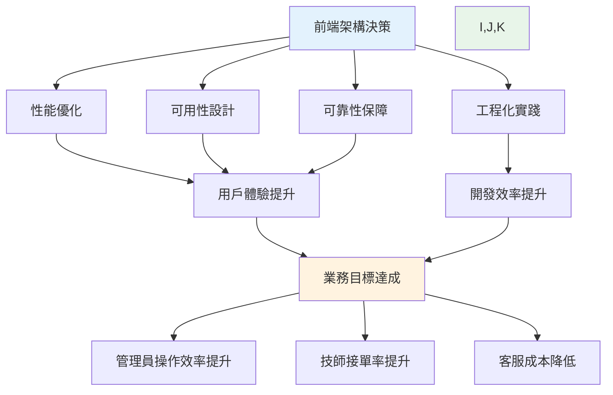
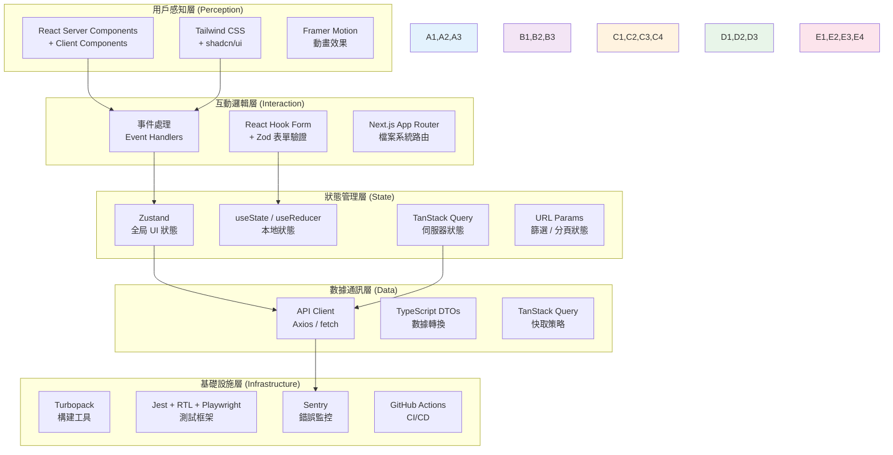
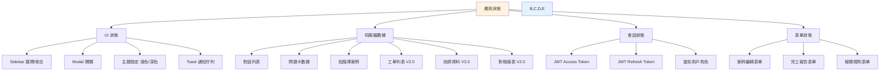
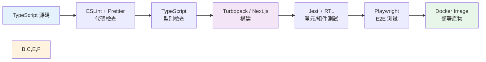

# 前端架構與開發規範 (Frontend Architecture Specification) - 電子鎖智能客服與派工平台

---

**文件版本 (Document Version):** `v1.0`
**最後更新 (Last Updated):** `2026-02-25`
**主要作者 (Lead Author):** `前端架構師, 前端技術負責人`
**審核者 (Reviewers):** `UX 設計師, 後端技術負責人, 架構委員會`
**狀態 (Status):** `草稿 (Draft)`

**相關文檔 (Related Documents):**
- 專案 PRD: `docs/02_project_brief_and_prd.md`
- 系統架構文檔: `docs/05_architecture_and_design_document.md`
- API 設計規範: `docs/06_api_design_specification.md`
- BDD 情境: `docs/03_behavior_driven_development.md`
- 專案結構指南: `docs/08_project_structure_guide.md`

---

## 目錄 (Table of Contents)

- [第一部分：前端架構的第一性原理](#第一部分前端架構的第一性原理)
  - [1.1 根本目的：超越介面實現](#11-根本目的超越介面實現)
  - [1.2 前端架構的終極目標](#12-前端架構的終極目標)
  - [1.3 前端決策的因果鏈](#13-前端決策的因果鏈)
- [第二部分：前端架構的系統化分層](#第二部分前端架構的系統化分層)
  - [2.1 用戶感知層 (Perception Layer)](#21-用戶感知層-perception-layer)
  - [2.2 互動邏輯層 (Interaction Layer)](#22-互動邏輯層-interaction-layer)
  - [2.3 狀態管理層 (State Management Layer)](#23-狀態管理層-state-management-layer)
  - [2.4 數據通訊層 (Data Communication Layer)](#24-數據通訊層-data-communication-layer)
  - [2.5 基礎設施層 (Infrastructure Layer)](#25-基礎設施層-infrastructure-layer)
- [第三部分：前端設計系統 (Design System)](#第三部分前端設計系統-design-system)
  - [3.1 設計原則 (Design Principles)](#31-設計原則-design-principles)
  - [3.2 視覺語言系統](#32-視覺語言系統)
  - [3.3 組件庫架構](#33-組件庫架構)
  - [3.4 設計令牌 (Design Tokens)](#34-設計令牌-design-tokens)
- [第四部分：技術選型與架構決策](#第四部分技術選型與架構決策)
  - [4.1 前端框架選擇](#41-前端框架選擇)
  - [4.2 狀態管理方案](#42-狀態管理方案)
  - [4.3 構建與工具鏈](#43-構建與工具鏈)
  - [4.4 樣式方案選擇](#44-樣式方案選擇)
- [第五部分：效能與優化策略](#第五部分效能與優化策略)
  - [5.1 核心網頁指標 (Core Web Vitals)](#51-核心網頁指標-core-web-vitals)
  - [5.2 載入效能優化](#52-載入效能優化)
  - [5.3 運行時效能優化](#53-運行時效能優化)
  - [5.4 資源優化策略](#54-資源優化策略)
- [第六部分：可用性與無障礙設計](#第六部分可用性與無障礙設計)
  - [6.1 響應式設計策略](#61-響應式設計策略)
  - [6.2 無障礙性 (Accessibility, A11y)](#62-無障礙性-accessibility-a11y)
  - [6.3 國際化 (i18n) 與本地化 (l10n)](#63-國際化-i18n-與本地化-l10n)
- [第七部分：前端工程化實踐](#第七部分前端工程化實踐)
  - [7.1 項目結構與代碼組織](#71-項目結構與代碼組織)
  - [7.2 代碼質量保證](#72-代碼質量保證)
  - [7.3 測試策略](#73-測試策略)
  - [7.4 CI/CD 集成](#74-cicd-集成)
- [第八部分：前後端協作契約](#第八部分前後端協作契約)
  - [8.1 API 通訊規範](#81-api-通訊規範)
  - [8.2 錯誤處理策略](#82-錯誤處理策略)
  - [8.3 認證與授權](#83-認證與授權)
- [第九部分：監控、日誌與安全](#第九部分監控日誌與安全)
  - [9.1 前端監控策略](#91-前端監控策略)
  - [9.2 錯誤追蹤與報告](#92-錯誤追蹤與報告)
  - [9.3 前端安全實踐](#93-前端安全實踐)
- [第十部分：前端開發檢查清單](#第十部分前端開發檢查清單)
- [附錄](#附錄)

---

## 第一部分：前端架構的第一性原理

> **核心理念：** 本平台前端架構不是技術框架的堆砌，而是以「工具效率」為首要目標、以用戶價值與營運效率為導向的系統工程。管理員需要快速監控與操作，技師需要在手機上一鍵接單與回報 -- 這兩個核心場景驅動了所有架構決策。

### 1.1 根本目的：超越介面實現

本平台前端服務兩大核心使用者群體，對應兩個獨立的 Web 應用，各有其根本目的：

| 應用 | 使用者 | 目的類別 | 核心目標 | 可衡量指標 (KPIs) |
|:-----|:-------|:---------|:---------|:------------------|
| **Admin Panel** | 總部管理員 / SOP 審核員 | 工具效率 (Productivity) | 提升知識庫管理、對話監控、派工調度、帳務對帳的操作效率 | 任務完成時間、操作步驟數、頁面載入時間 < 2 秒 |
| **Technician Web App** | 簽約維修技師 | 工具效率 (Productivity) + 商業轉換 (Conversion) | 簡化接單、回報、帳務流程；最大化技師接單率與完工回報率 | 接單響應時間 < 30 秒、完工報告提交率 > 95% |

**因果邏輯：**
```
明確的業務場景 → 前端架構決策 → 用戶體驗指標 → 營運效率提升 (客服成本降低 / 派工週轉加速)
```

### 1.2 前端架構的終極目標

前端架構的成功衡量標準定義為四個核心維度的最佳平衡：

#### 1.2.1 性能 (Performance)
- **定義：** 應用載入速度與響應速度
- **衡量：** Core Web Vitals (LCP, INP, CLS), TTI, FCP
- **業務影響：** Admin Panel 頁面載入超過 2 秒將降低管理員操作效率；技師端載入過慢將直接影響接單速度

#### 1.2.2 可用性 (Usability)
- **定義：** 用戶完成目標任務的難易度
- **衡量：** 任務成功率、完成時間、錯誤率
- **業務影響：** 技師對新系統的接受度直接取決於 Mobile-First UI 的易用性（PRD 風險 R-006）

#### 1.2.3 可維護性 (Maintainability)
- **定義：** 開發團隊迭代功能的效率與品質
- **衡量：** 代碼複雜度、測試覆蓋率、技術債務指數
- **業務影響：** V1.0 到 V2.0 的平滑過渡需要良好的模組化架構支撐

#### 1.2.4 可靠性 (Reliability)
- **定義：** 系統在各種環境下穩定運行的能力
- **衡量：** 錯誤率、崩潰率、可用性 SLA >= 99.5%
- **業務影響：** 技師外勤場景下網路不穩定，需要優雅的離線降級與錯誤恢復



### 1.3 前端決策的因果鏈

每一個前端技術決策都應能追溯到其對業務目標的貢獻。以下是本專案關鍵決策的因果鏈：

#### 決策 1：選擇 Next.js 14+ App Router
```
決策：採用 Next.js 14+ (App Router, React Server Components)
  |
原因：Admin Panel 大量數據表格適合 SSR 提升首屏速度；App Router 的 Layout 機制完美匹配
     管理後台側邊欄 + 內容區的佈局需求；RSC 減少客戶端 JavaScript 體積
  |
結果：LCP < 2 秒達標、SEO 非必要但 SSR 提供更好的首屏體驗、
     Layout 嵌套減少重複渲染
  |
業務影響：管理員打開頁面即見數據、無空白等待；V2.0 技師端同樣受益
```

#### 決策 2：採用 Tailwind CSS + shadcn/ui
```
決策：Tailwind CSS 作為樣式基礎 + shadcn/ui 作為組件庫
  |
原因：Tailwind 提供一致的設計令牌系統且零運行時開銷；shadcn/ui 提供可客製化的
     高品質 Headless 元件，原始碼直接納入專案可完全掌控
  |
結果：開發速度提升 40%、視覺一致性保證、組件可依需求深度客製化、
     打包體積小於純 CSS-in-JS 方案
  |
業務影響：V2.0 開發週期 14 週內可完成前端建設
```

#### 決策 3：React Query (TanStack Query) 管理伺服器狀態
```
決策：使用 TanStack Query 管理所有 API 數據
  |
原因：Admin Panel 核心操作為 CRUD，需要自動快取、背景重新驗證、
     cursor-based 分頁支援；技師端需要即時更新案件池
  |
結果：減少 60% 的手動 loading/error 狀態管理代碼、自動快取失效、
     Optimistic Update 提升操作反饋速度
  |
業務影響：管理員操作即時反饋、技師接單零延遲感
```

---

## 第二部分：前端架構的系統化分層

> **設計原則：** 將前端系統解構為清晰的職責層次，確保關注點分離與依賴倒置，同時映射後端的 DDD Bounded Contexts。



### 2.1 用戶感知層 (Perception Layer)

#### 職責範圍
- 渲染 UI 組件並呈現給用戶（Admin Panel 桌面端 / Technician App 行動端）
- 應用視覺設計系統（品牌色彩、字體、間距）
- 實現動畫與過渡效果（頁面切換、Modal 開關、Toast 通知）
- 確保視覺一致性與品牌識別

#### 核心原則
1. **Server Components 優先：** 所有不需要互動的 UI（數據表格、詳情展示、靜態佈局）使用 React Server Components，減少客戶端 JS 體積
2. **組件化 (Componentization)：** 所有 UI 元素拆解為 `ui/`（基礎）、`layout/`（佈局）、`features/`（業務）三層可複用組件
3. **無狀態優先：** 盡可能將組件設計為純展示型，狀態由上層注入或透過 TanStack Query 管理

#### 技術選型

| 方案類別 | 選用技術 | 選用原因 |
|:---------|:---------|:---------|
| **組件框架** | React 18+ (RSC) via Next.js 14+ | Server Components 減少 JS 體積、App Router Layout 機制、生態系統最豐富 |
| **樣式方案** | Tailwind CSS 3.4+ | 零運行時開銷、設計令牌一致性、Utility-First 加速開發、完美支援 RSC |
| **組件庫** | shadcn/ui | Headless + Radix UI 基礎、原始碼可控、A11y 內建、與 Tailwind 完美整合 |
| **動畫庫** | Framer Motion | React 生態最佳動畫庫、Layout Animation、手勢支援（技師端滑動操作） |

#### 設計模式：組件分層架構

```
components/
├── ui/              # 基礎 UI 元件（Button, Input, Modal, DataTable, Badge, Card, Toast）
│                    # 來源：shadcn/ui 客製化，無業務邏輯，可跨專案複用
├── layout/          # 佈局元件（Sidebar, TopNav, Breadcrumb, PageHeader）
│                    # 定義 Admin Panel / Technician App 的頁面骨架
├── features/        # 業務功能元件（ConversationTimeline, ProblemCardViewer, WorkOrderKanban）
│                    # 包含特定業務邏輯，與後端 API 型別緊密耦合
└── providers/       # Context Providers（AuthProvider, ThemeProvider, ToastProvider）
                     # 全局狀態與配置注入
```

### 2.2 互動邏輯層 (Interaction Layer)

#### 職責範圍
- 處理用戶輸入（點擊、輸入、滾動、拖放、手勢）
- 執行客戶端表單驗證與業務邏輯
- 管理路由導航與頁面切換
- 實現鍵盤快捷鍵（Admin Panel 進階操作）

#### 核心原則
1. **防抖與節流 (Debounce & Throttle)：** 搜尋框輸入防抖 300ms、技師案件池滾動節流
2. **可訪問性優先 (A11y First)：** 所有互動元素支援鍵盤導航與 ARIA 屬性
3. **Optimistic UI：** 接單、審核等操作立即更新 UI，背景等待 API 確認

#### 表單驗證策略

本平台涉及大量表單操作（案例新增、SOP 審核、完工報告、報價規則設定），採用 React Hook Form + Zod 雙層驗證：

```typescript
// 以「技師完工報告」表單為例
import { z } from 'zod';

export const completionReportSchema = z.object({
  work_description: z.string()
    .min(10, '施工內容至少需要 10 個字')
    .max(500, '施工內容不得超過 500 個字'),
  materials_used: z.array(z.object({
    name: z.string().min(1, '材料名稱為必填'),
    quantity: z.number().positive('數量必須為正數'),
    unit_price: z.number().nonnegative('單價不得為負數'),
  })).optional(),
  actual_hours: z.number()
    .positive('工時必須為正數')
    .max(24, '單次工時不得超過 24 小時'),
  before_photos: z.array(z.string().url()).min(1, '至少上傳一張維修前照片'),
  after_photos: z.array(z.string().url()).min(1, '至少上傳一張維修後照片'),
  advance_payment: z.number().nonnegative('墊付金額不得為負數').optional(),
});

export type CompletionReportInput = z.infer<typeof completionReportSchema>;
```

#### 路由設計

Next.js App Router 的檔案系統路由直接映射業務領域：

```
app/
├── (auth)/                    # 認證路由群組 -- 無側邊欄佈局
│   ├── login/page.tsx         # 管理員登入
│   └── forgot-password/page.tsx
│
├── (dashboard)/               # Admin Panel 路由群組 -- 側邊欄 + 頂部導航佈局
│   ├── dashboard/page.tsx     # 儀表板首頁
│   ├── conversations/         # 對話管理 (customer_service context)
│   ├── problem-cards/         # 問題卡管理 (customer_service context)
│   ├── knowledge-base/        # 知識庫管理 (knowledge_base context)
│   │   ├── cases/             #   案例庫
│   │   ├── manuals/           #   手冊管理
│   │   ├── faq/               #   FAQ 管理
│   │   └── sop-drafts/        #   SOP 草稿審核
│   ├── work-orders/           # 派工管理 (dispatch context, V2.0)
│   ├── technicians/           # 技師管理 (dispatch context, V2.0)
│   ├── accounting/            # 帳務管理 (accounting context, V2.0)
│   └── settings/              # 系統設定 (user_management context)
│
└── (technician)/              # 技師工作台路由群組 -- Mobile-First 佈局
    ├── tech-login/page.tsx    # 技師登入
    ├── pool/page.tsx          # 案件池瀏覽
    ├── my-orders/             # 我的工單
    │   ├── page.tsx           #   工單列表
    │   └── [id]/page.tsx      #   工單詳情 / 完工回報
    └── account/page.tsx       # 帳戶中心（收入、歷史）
```

### 2.3 狀態管理層 (State Management Layer)

#### 狀態分類架構



#### 狀態存儲決策

| 狀態類型 | 存儲位置 | 持久化 | 選用技術 | 具體範例 |
|:---------|:---------|:-------|:---------|:---------|
| **組件內部 UI 狀態** | 組件 Local State | 否 | `useState` / `useReducer` | Modal 開關、表格排序方向、展開/收合 |
| **跨組件共享 UI 狀態** | Global Store | 選擇性 | Zustand | Sidebar 狀態、主題偏好、全域通知佇列 |
| **伺服器數據** | Query Cache | 自動 | TanStack Query | 對話列表、問題卡、工單、技師資料 |
| **表單狀態** | 表單庫內部 | 否 | React Hook Form | 案例編輯、完工報告、報價規則設定 |
| **URL 狀態** | URL 參數 | 自動 | Next.js `useSearchParams` | 列表篩選條件、分頁 cursor、排序欄位 |
| **認證狀態** | httpOnly Cookie | 是 | Next.js Middleware + Cookie | JWT Token (不存於 localStorage) |

#### 伺服器狀態管理 -- TanStack Query 核心配置

```typescript
// lib/query-client.ts
import { QueryClient } from '@tanstack/react-query';

export const queryClient = new QueryClient({
  defaultOptions: {
    queries: {
      staleTime: 5 * 60 * 1000,      // 5 分鐘內數據視為新鮮
      gcTime: 10 * 60 * 1000,         // 快取保留 10 分鐘
      retry: 2,                        // 失敗自動重試 2 次
      refetchOnWindowFocus: true,      // 視窗聚焦時重新驗證
      refetchOnReconnect: true,        // 網路恢復時重新驗證
    },
    mutations: {
      retry: 1,
    },
  },
});
```

```typescript
// 範例：工單列表的 Query Hook
// lib/hooks/useWorkOrders.ts
import { useQuery } from '@tanstack/react-query';
import { workOrderApi } from '@/lib/api/work-orders';
import type { WorkOrderListParams, PaginatedResponse, WorkOrder } from '@/lib/types/entities';

export function useWorkOrders(params: WorkOrderListParams) {
  return useQuery({
    queryKey: ['work-orders', params],
    queryFn: () => workOrderApi.getList(params),
    staleTime: 30 * 1000,  // 工單數據 30 秒刷新（即時性要求較高）
  });
}
```

#### 全域 UI 狀態管理 -- Zustand

```typescript
// lib/stores/ui-store.ts
import { create } from 'zustand';
import { persist } from 'zustand/middleware';

interface UIState {
  sidebarCollapsed: boolean;
  theme: 'light' | 'dark';
  toggleSidebar: () => void;
  setTheme: (theme: 'light' | 'dark') => void;
}

export const useUIStore = create<UIState>()(
  persist(
    (set) => ({
      sidebarCollapsed: false,
      theme: 'light',
      toggleSidebar: () => set((state) => ({ sidebarCollapsed: !state.sidebarCollapsed })),
      setTheme: (theme) => set({ theme }),
    }),
    {
      name: 'smartlock-ui-preferences',
      partialize: (state) => ({ sidebarCollapsed: state.sidebarCollapsed, theme: state.theme }),
    }
  )
);
```

### 2.4 數據通訊層 (Data Communication Layer)

#### 職責範圍
- 與後端 FastAPI REST API (`/api/v1/`) 進行通訊
- 處理數據的請求、轉換與錯誤
- 實現請求快取（TanStack Query）與重試策略
- 管理即時更新連接（技師案件池 Polling / WebSocket）

#### API 客戶端架構

**分層設計：**
```
API 配置 (baseURL, timeout) → HTTP 客戶端 (Axios interceptors) → 業務 API 模組 → TanStack Query Hooks
```

**HTTP 客戶端封裝：**

```typescript
// lib/api/client.ts
import axios, { type AxiosInstance, type InternalAxiosRequestConfig } from 'axios';

const apiClient: AxiosInstance = axios.create({
  baseURL: process.env.NEXT_PUBLIC_API_BASE_URL || 'http://localhost:8000/api/v1',
  timeout: 15000,
  headers: {
    'Content-Type': 'application/json',
    'Accept': 'application/json',
  },
});

// 請求攔截器：自動注入 JWT Token
apiClient.interceptors.request.use((config: InternalAxiosRequestConfig) => {
  // Token 從 httpOnly cookie 由 Next.js middleware 轉發
  // 或從 server-side 注入 Authorization header
  return config;
});

// 響應攔截器：統一錯誤處理
apiClient.interceptors.response.use(
  (response) => response.data,
  async (error) => {
    if (error.response?.status === 401) {
      // 嘗試 refresh token
      try {
        await refreshAccessToken();
        return apiClient(error.config);
      } catch {
        // Refresh 失敗，重導向登入
        if (typeof window !== 'undefined') {
          window.location.href = '/login';
        }
      }
    }
    return Promise.reject(error);
  }
);

export default apiClient;
```

**業務 API 模組（每個對應後端一個 Bounded Context）：**

```typescript
// lib/api/conversations.ts
import apiClient from './client';
import type {
  PaginatedResponse,
  Conversation,
  ConversationDetail,
  CursorPaginationParams
} from '@/lib/types/api';

export const conversationApi = {
  getList: (params: CursorPaginationParams & { status?: string }) =>
    apiClient.get<PaginatedResponse<Conversation>>('/conversations', { params }),

  getById: (id: string) =>
    apiClient.get<ConversationDetail>(`/conversations/${id}`),

  escalate: (id: string, reason: string) =>
    apiClient.post(`/conversations/${id}/escalate`, { reason }),

  close: (id: string) =>
    apiClient.post(`/conversations/${id}/close`),
};
```

**API 模組與後端 Bounded Context 對應表：**

| 前端 API 模組 | 後端 Bounded Context | 檔案路徑 |
|:-------------|:--------------------|:---------|
| `auth.ts` | `user_management` | `lib/api/auth.ts` |
| `conversations.ts` | `customer_service` | `lib/api/conversations.ts` |
| `problem-cards.ts` | `customer_service` | `lib/api/problem-cards.ts` |
| `knowledge-base.ts` | `knowledge_base` | `lib/api/knowledge-base.ts` |
| `work-orders.ts` | `dispatch` (V2.0) | `lib/api/work-orders.ts` |
| `technicians.ts` | `dispatch` (V2.0) | `lib/api/technicians.ts` |
| `pricing.ts` | `accounting` (V2.0) | `lib/api/pricing.ts` |
| `accounting.ts` | `accounting` (V2.0) | `lib/api/accounting.ts` |

#### Cursor-Based 分頁處理

後端 API 使用 cursor-based 分頁（非 offset-based），前端需統一處理：

```typescript
// lib/types/api.ts
export interface CursorPaginationParams {
  cursor?: string;        // 上一頁最後一筆的 cursor 值
  limit?: number;         // 每頁筆數，預設 20
  sort_by?: string;       // 排序欄位
  sort_order?: 'asc' | 'desc';
}

export interface PaginatedResponse<T> {
  items: T[];
  next_cursor: string | null;  // null 表示無下一頁
  has_more: boolean;
  total_count?: number;        // 部分端點提供總數
}
```

```typescript
// 搭配 TanStack Query 的 useInfiniteQuery（技師案件池無限滾動）
import { useInfiniteQuery } from '@tanstack/react-query';

export function useWorkOrderPool() {
  return useInfiniteQuery({
    queryKey: ['work-order-pool'],
    queryFn: ({ pageParam }) =>
      workOrderApi.getPool({ cursor: pageParam, limit: 10 }),
    initialPageParam: undefined as string | undefined,
    getNextPageParam: (lastPage) =>
      lastPage.has_more ? lastPage.next_cursor : undefined,
    refetchInterval: 15 * 1000,  // 每 15 秒自動刷新案件池
  });
}
```

#### 即時更新策略

| 場景 | 方案 | 更新頻率 | 說明 |
|:-----|:-----|:---------|:-----|
| 技師案件池 | TanStack Query `refetchInterval` | 15 秒 | Polling 方式，簡單可靠 |
| Admin 儀表板統計 | TanStack Query `refetchInterval` | 60 秒 | 數據 5 分鐘自動更新（PRD US-017） |
| 工單狀態變更 | WebSocket (未來) | 即時 | V2.0 進階需求，初期以 Polling 替代 |

### 2.5 基礎設施層 (Infrastructure Layer)

#### 職責範圍
- 前端構建與打包流程
- 代碼品質保證工具鏈
- 測試自動化框架
- CI/CD 集成與部署
- 效能監控與錯誤追蹤

**前端工程化工具鏈：**



---

## 第三部分：前端設計系統 (Design System)

> **核心理念：** 設計系統是設計與開發之間的共享語言。本平台以 shadcn/ui 為基礎，建立統一的視覺規範與組件庫，確保 Admin Panel 與 Technician App 的視覺一致性。

### 3.1 設計原則 (Design Principles)

| 原則名稱 | 定義 | 實踐指南 | 可衡量指標 |
|:---------|:-----|:---------|:-----------|
| **清晰優於炫技** | 功能性與可理解性優先於視覺複雜度 | - 避免不必要的動畫<br/>- 使用標準 UI 模式（表格、看板、表單）<br/>- 確保高對比度 | 任務完成時間、用戶錯誤率 |
| **一致性** | 相同功能在 Admin Panel 與 Technician App 中表現一致 | - 統一按鈕樣式與狀態色<br/>- 統一圖標語言 (Lucide Icons)<br/>- 統一互動模式 | 視覺審計通過率、組件複用率 |
| **效率至上** | 管理員與技師的操作步驟應最少化 | - 常用操作一鍵可達<br/>- 表格支援批量操作<br/>- 技師端大按鈕、大字體 | 操作步驟數、任務完成時間 |
| **可訪問性** | 所有用戶都能使用產品 | - WCAG 2.1 AA 合規<br/>- 鍵盤導航支援<br/>- 螢幕閱讀器相容 | A11y 審計得分 |
| **Mobile-First（技師端）** | 技師端以手機體驗為最高優先 | - 觸控友善的點擊區域 (>= 44px)<br/>- 單手操作可完成核心流程<br/>- 弱網環境下優雅降級 | 行動端 Lighthouse 分數 |

### 3.2 視覺語言系統

#### 3.2.1 色彩系統

**Tailwind CSS 語義化色彩配置：**

```typescript
// tailwind.config.ts
import type { Config } from 'tailwindcss';

const config: Config = {
  darkMode: 'class',
  content: ['./src/**/*.{ts,tsx}'],
  theme: {
    extend: {
      colors: {
        // 品牌色 (Brand Colors)
        brand: {
          50:  '#eff6ff',
          100: '#dbeafe',
          200: '#bfdbfe',
          500: '#3b82f6',  // 主色調 -- 專業可信賴的藍色
          600: '#2563eb',
          700: '#1d4ed8',
          900: '#1e3a5f',
        },
        // 語義色 (Semantic Colors)
        success: {
          light: '#dcfce7',
          DEFAULT: '#22c55e',
          dark: '#15803d',
        },
        warning: {
          light: '#fef9c3',
          DEFAULT: '#eab308',
          dark: '#a16207',
        },
        danger: {
          light: '#fee2e2',
          DEFAULT: '#ef4444',
          dark: '#b91c1c',
        },
        // 工單狀態色 (Work Order Status Colors)
        status: {
          pending:     '#f59e0b',  // 待處理 -- 黃色
          assigned:    '#3b82f6',  // 已派工 -- 藍色
          in_progress: '#8b5cf6',  // 維修中 -- 紫色
          completed:   '#22c55e',  // 已完成 -- 綠色
          cancelled:   '#6b7280',  // 已取消 -- 灰色
        },
        // 解析層級色 (Resolution Layer Colors)
        resolution: {
          l1_case:  '#22c55e',  // 案例庫命中 -- 綠色
          l2_rag:   '#3b82f6',  // RAG 生成 -- 藍色
          l3_human: '#f59e0b',  // 人工轉接 -- 黃色
        },
      },
    },
  },
};

export default config;
```

#### 3.2.2 字體排印系統

```css
/* globals.css */
@tailwind base;
@tailwind components;
@tailwind utilities;

@layer base {
  :root {
    /* 字體家族 -- 優先使用系統字體，確保中文顯示品質 */
    --font-family-sans: 'Inter', -apple-system, BlinkMacSystemFont,
                        'Segoe UI', 'Noto Sans TC', 'Microsoft JhengHei',
                        sans-serif;
    --font-family-mono: 'JetBrains Mono', 'Fira Code', 'Consolas', monospace;
  }
}
```

**字體大小規範（基於 Tailwind 預設）：**

| 用途 | Tailwind Class | 大小 | 場景 |
|:-----|:--------------|:-----|:-----|
| 頁面標題 | `text-2xl` / `text-3xl` | 24px / 30px | 頁面 H1 標題 |
| 區塊標題 | `text-xl` | 20px | Card 標題、Section 標題 |
| 正文 | `text-base` | 16px | 表格內容、描述文字 |
| 輔助文字 | `text-sm` | 14px | 標籤、時間戳、提示文字 |
| 極小文字 | `text-xs` | 12px | Badge 內文字、Footer 資訊 |
| **技師端正文** | `text-lg` | 18px | 技師端行動裝置的主要文字加大 |

#### 3.2.3 間距系統

遵循 Tailwind CSS 的 4px 基準間距系統。關鍵約定：

| 用途 | 間距值 | Tailwind Class |
|:-----|:-------|:--------------|
| 組件內部緊密間距 | 4px | `p-1`, `gap-1` |
| 組件內部標準間距 | 8px | `p-2`, `gap-2` |
| 卡片內邊距 | 16px - 24px | `p-4` ~ `p-6` |
| 區塊間距 | 24px - 32px | `space-y-6` ~ `space-y-8` |
| 頁面邊距 | 24px (手機) / 32px (桌面) | `px-6` / `lg:px-8` |

### 3.3 組件庫架構

基於 shadcn/ui 建立組件庫。shadcn/ui 的特色是將組件原始碼複製到專案中，而非作為 npm 依賴安裝，因此可完全客製化。

#### 基礎 UI 元件 (components/ui/)

| 元件 | 來源 | 用途 | 關鍵 Props |
|:-----|:-----|:-----|:-----------|
| `Button` | shadcn/ui | 所有按鈕操作 | `variant`, `size`, `loading`, `disabled` |
| `Input` | shadcn/ui | 文字輸入欄位 | `type`, `error`, `placeholder` |
| `Select` | shadcn/ui | 下拉選單 | `options`, `value`, `onChange` |
| `Modal` / `Dialog` | shadcn/ui | 彈出對話框 | `open`, `onClose`, `title` |
| `DataTable` | shadcn/ui + TanStack Table | 通用資料表格 | `columns`, `data`, `sorting`, `pagination` |
| `Badge` | shadcn/ui | 狀態標籤 | `variant` (status colors) |
| `Card` | shadcn/ui | 內容容器 | `title`, `description`, `footer` |
| `Toast` | shadcn/ui (Sonner) | 全域通知 | `type` (success/error/info), `message` |
| `Skeleton` | shadcn/ui | 載入佔位符 | `width`, `height` |
| `Tabs` | shadcn/ui | 分頁標籤 | `tabs`, `activeTab`, `onChange` |

#### 業務功能元件 (components/features/)

| 元件 | 所屬 Context | 用途 |
|:-----|:------------|:-----|
| `ConversationTimeline` | customer_service | 對話訊息時間軸展示（含文字、圖片、AI 回覆標記） |
| `ProblemCardViewer` | customer_service | 問題卡結構化檢視（品牌、型號、故障現象、信心分數） |
| `KnowledgeSearch` | knowledge_base | 知識庫全文搜尋元件 |
| `SOPReviewPanel` | knowledge_base | SOP 草稿審核面板（核准/駁回/採納，含原始對話對照） |
| `WorkOrderKanban` | dispatch (V2.0) | 工單看板（待派工 / 已派工 / 維修中 / 已完成 四欄拖放） |
| `TechnicianMap` | dispatch (V2.0) | 技師地圖標記（Google Maps API，含即時狀態） |
| `QuotationBuilder` | accounting (V2.0) | 報價單建構器（品牌 x 鎖型 x 工項矩陣選擇） |
| `ReconciliationTable` | accounting (V2.0) | 對帳明細表（技師 x 月份，含墊付/結算明細） |
| `CompletionReportForm` | dispatch (V2.0) | 技師完工報告表單（照片上傳、材料清單、工時） |
| `CasePoolCard` | dispatch (V2.0) | 技師端案件卡片（地址、品牌、報酬、一鍵接單） |

### 3.4 設計令牌 (Design Tokens)

設計令牌透過 Tailwind CSS 的 `tailwind.config.ts` 統一管理，作為設計系統的原子單位：

```json
{
  "color": {
    "brand": {
      "primary": { "value": "#3b82f6", "description": "主品牌色 -- 專業藍" },
      "primary-dark": { "value": "#1d4ed8", "description": "主品牌色深色" }
    },
    "semantic": {
      "success": { "value": "#22c55e", "description": "成功/已完成" },
      "warning": { "value": "#eab308", "description": "警告/待處理" },
      "danger": { "value": "#ef4444", "description": "錯誤/危險" },
      "info": { "value": "#3b82f6", "description": "資訊提示" }
    },
    "status": {
      "pending": { "value": "#f59e0b", "description": "工單待處理" },
      "assigned": { "value": "#3b82f6", "description": "工單已派工" },
      "in-progress": { "value": "#8b5cf6", "description": "工單維修中" },
      "completed": { "value": "#22c55e", "description": "工單已完成" },
      "cancelled": { "value": "#6b7280", "description": "工單已取消" }
    }
  },
  "spacing": {
    "unit": { "value": "4px", "description": "基準間距單位" }
  },
  "typography": {
    "fontFamily": {
      "sans": { "value": "Inter, -apple-system, 'Noto Sans TC', sans-serif" },
      "mono": { "value": "'JetBrains Mono', 'Fira Code', monospace" }
    }
  },
  "borderRadius": {
    "sm": { "value": "0.25rem", "description": "小圓角 -- Badge" },
    "md": { "value": "0.375rem", "description": "中圓角 -- Button, Input" },
    "lg": { "value": "0.5rem", "description": "大圓角 -- Card" },
    "xl": { "value": "0.75rem", "description": "超大圓角 -- Modal" }
  }
}
```

---

## 第四部分：技術選型與架構決策

> **決策原則：** 每一個技術選型都基於專案需求（PRD 37 個用戶故事）、團隊能力、14 週開發週期約束，以及與後端 FastAPI 生態系統的協作效率。

### 4.1 前端框架選擇

**決策：Next.js 14+ (App Router)**

| 評估維度 | Next.js 14+ (App Router) | React + Vite | 決策依據 |
|:---------|:------------------------|:-------------|:---------|
| **SSR / SSG** | 內建 RSC + SSR + SSG | 需額外配置 | Admin Panel 數據表格適合 SSR 首屏渲染 |
| **路由** | App Router 檔案系統路由 | 需 React Router | Layout 嵌套完美匹配後台側邊欄佈局 |
| **Server Components** | 原生支援 | 不支援 | 減少客戶端 JS 體積，數據表格直接 Server 端渲染 |
| **Middleware** | 內建 | 需自行實作 | JWT 驗證、角色守衛可在 Middleware 層統一處理 |
| **Image Optimization** | `next/image` 內建 | 需額外庫 | 技師端照片上傳預覽需要圖片優化 |
| **部署** | Docker (standalone output) | Docker | 與後端 Docker Compose 統一 |

**V1.0 到 V2.0 演進策略：**
- V1.0 Admin Panel 使用 FastAPI + Jinja2/HTMX（輕量級），不在本文件範圍
- V2.0 全面遷移至 Next.js，同時服務 Admin Panel 與 Technician Web App
- 兩個應用共用同一個 Next.js 專案，透過 Route Groups `(dashboard)/` 與 `(technician)/` 區隔

### 4.2 狀態管理方案

**選用方案組合：**

```
本地 UI 狀態     → useState / useReducer
全局 UI 狀態     → Zustand (輕量、TypeScript 友善、零樣板代碼)
伺服器數據       → TanStack Query v5 (自動快取、cursor 分頁、Optimistic Update)
表單狀態         → React Hook Form + Zod (效能優異、Schema 驗證)
URL 狀態         → Next.js useSearchParams + nuqs (型別安全的 URL 狀態管理)
認證狀態         → httpOnly Cookie + Next.js Middleware
```

**為何不選 Redux Toolkit：**
- 本專案主要為 CRUD 操作，TanStack Query 已涵蓋 90% 的數據管理需求
- Zustand 對於剩餘的全局 UI 狀態足夠輕量
- 避免 Redux 的樣板代碼開銷，在 14 週開發週期內節省時間

### 4.3 構建與工具鏈

**完整工具鏈配置：**

| 工具類別 | 選用技術 | 版本 | 用途 |
|:---------|:---------|:-----|:-----|
| **框架** | Next.js | 14+ | 應用框架、SSR、路由 |
| **語言** | TypeScript | 5+ | 型別安全、IDE 提示 |
| **包管理器** | pnpm | 8+ | 高效磁碟使用、嚴格依賴解析 |
| **構建工具** | Turbopack (Next.js 內建) | - | 開發環境 HMR、生產構建 |
| **代碼檢查** | ESLint + Prettier | - | 代碼風格統一、最佳實踐 |
| **Git Hooks** | Husky + lint-staged | - | Pre-commit 自動格式化與檢查 |
| **提交規範** | Commitlint | - | Conventional Commits 強制執行 |
| **單元測試** | Jest + React Testing Library | - | 組件測試、Hook 測試 |
| **E2E 測試** | Playwright | - | 端對端關鍵流程測試 |
| **API Mock** | MSW (Mock Service Worker) | 2+ | 開發與測試環境的 API Mock |
| **錯誤監控** | Sentry | - | 生產環境錯誤追蹤 |

### 4.4 樣式方案選擇

**決策：Tailwind CSS + shadcn/ui**

| 評估維度 | Tailwind CSS + shadcn/ui | Styled-Components | CSS Modules |
|:---------|:------------------------|:------------------|:------------|
| **Server Components 相容** | 完全相容 | 不相容（需要 Client Runtime） | 相容 |
| **運行時開銷** | 零 | 有（CSS-in-JS runtime） | 零 |
| **設計一致性** | Tailwind config 統一管理 | 需手動維護 | 需手動維護 |
| **組件庫整合** | shadcn/ui 原生 Tailwind | 需額外適配 | 需額外適配 |
| **開發速度** | 極快（Utility-First） | 中等 | 中等 |
| **Bundle Size** | 生產環境極小（PurgeCSS） | 需額外 runtime | 最小 |

---

## 第五部分：效能與優化策略

> **核心指標：** 效能是設計的內在要求。Admin Panel 頁面載入 < 2 秒（PRD NFR），技師端在 4G 行動網路下首屏 < 3 秒。

### 5.1 核心網頁指標 (Core Web Vitals)

**目標值：**

| 指標 | 全名 | Admin Panel 目標 | Technician App 目標 | 優化重點 |
|:-----|:-----|:----------------|:-------------------|:---------|
| **LCP** | Largest Contentful Paint | < 2.0s | < 2.5s | SSR 首屏渲染、圖片優化 |
| **INP** | Interaction to Next Paint | < 100ms | < 100ms | 減少主線程阻塞、Optimistic UI |
| **CLS** | Cumulative Layout Shift | < 0.1 | < 0.1 | 圖片/字體尺寸預留、Skeleton Loading |
| **FCP** | First Contentful Paint | < 1.0s | < 1.5s | SSR、關鍵 CSS 內聯 |
| **TTFB** | Time to First Byte | < 400ms | < 600ms | Edge caching、CDN |

**Lighthouse 分數目標：**
- Admin Panel（桌面）：Performance >= 90, Accessibility >= 95, Best Practices >= 90
- Technician App（行動）：Performance >= 85, Accessibility >= 90, Best Practices >= 90

### 5.2 載入效能優化

#### 5.2.1 Server Components 策略

Next.js App Router 的核心優勢在於 React Server Components（RSC），本專案的使用策略：

| 組件類型 | 渲染方式 | 適用場景 | 範例 |
|:---------|:---------|:---------|:-----|
| **數據展示** | Server Component | 列表頁、詳情頁、儀表板統計 | 對話列表、問題卡詳情、Dashboard 統計卡片 |
| **互動操作** | Client Component (`'use client'`) | 表單、按鈕操作、即時搜尋 | SOP 審核按鈕、案件池篩選、完工報告表單 |
| **佈局結構** | Server Component | Sidebar、PageHeader | 後台側邊欄、麵包屑導航 |
| **即時更新** | Client Component | Polling 數據、WebSocket | 技師案件池、工單狀態更新 |

```tsx
// 範例：Server Component -- 對話列表頁
// app/(dashboard)/conversations/page.tsx
import { conversationApi } from '@/lib/api/conversations';
import { DataTable } from '@/components/ui/data-table';
import { ConversationFilters } from './components/conversation-filters'; // Client Component

export default async function ConversationsPage({
  searchParams,
}: {
  searchParams: { cursor?: string; status?: string };
}) {
  // Server Component 直接在伺服器端取得數據
  const data = await conversationApi.getList({
    cursor: searchParams.cursor,
    status: searchParams.status,
    limit: 20,
  });

  return (
    <div className="space-y-6">
      <h1 className="text-2xl font-bold">對話記錄</h1>
      <ConversationFilters /> {/* Client Component: 篩選互動 */}
      <DataTable columns={columns} data={data.items} />
    </div>
  );
}
```

#### 5.2.2 代碼分割策略

Next.js App Router 自動實現路由級代碼分割。額外手動分割策略：

```typescript
// 延遲載入重量級組件
import dynamic from 'next/dynamic';

// Google Maps 僅在派工管理頁面載入
const TechnicianMap = dynamic(
  () => import('@/components/features/technician-map'),
  {
    loading: () => <Skeleton className="h-[400px] w-full" />,
    ssr: false, // 地圖組件僅在客戶端渲染
  }
);

// 圖表組件延遲載入
const DashboardCharts = dynamic(
  () => import('@/components/features/dashboard-charts'),
  {
    loading: () => <Skeleton className="h-[300px] w-full" />,
  }
);
```

#### 5.2.3 資源優化

**圖片優化（技師完工照片、手冊封面等）：**
- 使用 `next/image` 自動進行格式轉換（WebP/AVIF）、尺寸調整、懶載入
- 技師端照片上傳前客戶端壓縮至 < 5MB（PRD US-023）
- 產品手冊封面使用 `priority` 預載

**字體優化：**
- 使用 `next/font` 自動優化字體載入（`font-display: swap`）
- 中文字體（Noto Sans TC）使用系統字體回退，不額外載入網路字體

### 5.3 運行時效能優化

#### React 效能最佳實踐

```typescript
// 1. 使用 React.memo 包裹純展示的列表項組件
const WorkOrderCard = React.memo(function WorkOrderCard({
  order
}: {
  order: WorkOrder
}) {
  return (
    <Card>
      <CardHeader>{order.address}</CardHeader>
      <CardContent>
        <Badge variant={order.status}>{order.status_label}</Badge>
        <p className="text-sm text-muted-foreground">{order.brand} - {order.model}</p>
      </CardContent>
    </Card>
  );
});

// 2. 使用 useMemo 快取篩選/排序結果
function WorkOrderList({ orders, filter }: Props) {
  const filteredOrders = useMemo(() => {
    return orders
      .filter(o => filter.status ? o.status === filter.status : true)
      .sort((a, b) => b.urgency - a.urgency);
  }, [orders, filter]);

  return <div>{filteredOrders.map(o => <WorkOrderCard key={o.id} order={o} />)}</div>;
}

// 3. 虛擬化長列表（技師歷史案件、對話記錄）
import { useVirtualizer } from '@tanstack/react-virtual';

function VirtualizedConversationList({ conversations }: Props) {
  const parentRef = useRef<HTMLDivElement>(null);
  const virtualizer = useVirtualizer({
    count: conversations.length,
    getScrollElement: () => parentRef.current,
    estimateSize: () => 72, // 預估每行高度
  });

  return (
    <div ref={parentRef} className="h-[600px] overflow-auto">
      <div style={{ height: `${virtualizer.getTotalSize()}px`, position: 'relative' }}>
        {virtualizer.getVirtualItems().map((virtualRow) => (
          <div
            key={virtualRow.index}
            style={{
              position: 'absolute',
              top: 0,
              transform: `translateY(${virtualRow.start}px)`,
              width: '100%',
            }}
          >
            <ConversationRow conversation={conversations[virtualRow.index]} />
          </div>
        ))}
      </div>
    </div>
  );
}
```

### 5.4 資源優化策略

**預連接關鍵域名：**
```html
<!-- layout.tsx 中的 <head> -->
<link rel="preconnect" href="https://api.smartlock-saas.com" />
<link rel="dns-prefetch" href="https://maps.googleapis.com" />
```

**Bundle 大小預算：**

| 項目 | 目標大小 (gzipped) | 說明 |
|:-----|:------------------|:-----|
| 首屏 JS | < 100 KB | 透過 RSC 大幅減少客戶端 JS |
| 首屏 CSS | < 30 KB | Tailwind PurgeCSS 自動移除未使用樣式 |
| 單頁面增量 JS | < 50 KB | 路由級代碼分割 |
| Google Maps SDK | 延遲載入 | 僅在派工管理 / 技師地圖頁面載入 |
| 圖表庫 (Recharts) | 延遲載入 | 僅在儀表板頁面載入 |

---

## 第六部分：可用性與無障礙設計

### 6.1 響應式設計策略

**斷點系統（使用 Tailwind 預設）：**

| 斷點 | 最小寬度 | 裝置 | 適用應用 |
|:-----|:---------|:-----|:---------|
| `sm` | 640px | 大手機 | Technician App 主要斷點 |
| `md` | 768px | 平板 | Technician App 橫向模式 |
| `lg` | 1024px | 筆電 | Admin Panel 最小建議寬度 |
| `xl` | 1280px | 桌面 | Admin Panel 最佳體驗 |
| `2xl` | 1536px | 大桌面 | Admin Panel 寬螢幕 |

**佈局策略：**

| 應用 | 策略 | 說明 |
|:-----|:-----|:-----|
| **Admin Panel** | Desktop-First | 最小建議寬度 1024px，側邊欄 + 內容區雙欄佈局；<= md 時側邊欄收合為抽屜 |
| **Technician App** | Mobile-First | 以 375px (iPhone SE) 為基準設計，單欄佈局；觸控友善的大按鈕 (>= 44x44px) |

```tsx
// 技師端案件池 -- Mobile-First 響應式設計範例
function CasePoolCard({ order }: { order: WorkOrder }) {
  return (
    <Card className="p-4 sm:p-6">
      {/* 核心資訊：行動端單欄，平板雙欄 */}
      <div className="grid grid-cols-1 sm:grid-cols-2 gap-3">
        <div>
          <p className="text-lg font-semibold">{order.district}</p>
          <p className="text-base text-muted-foreground">
            {order.brand} {order.model}
          </p>
        </div>
        <div className="flex items-center justify-between sm:justify-end sm:gap-4">
          <Badge variant={order.urgency === 'high' ? 'danger' : 'default'}>
            {order.urgency_label}
          </Badge>
          <span className="text-xl font-bold text-brand-600">
            ${order.estimated_reward}
          </span>
        </div>
      </div>
      {/* 接單按鈕 -- 行動端全寬大按鈕 */}
      <Button
        className="w-full mt-4 h-12 text-lg font-semibold"
        onClick={() => acceptOrder(order.id)}
      >
        一鍵接單
      </Button>
    </Card>
  );
}
```

### 6.2 無障礙性 (Accessibility, A11y)

**WCAG 2.1 AA 合規目標：**

**Level A (必須):**
- [x] 所有非文本內容提供替代文本（`alt` 屬性）-- `next/image` 強制要求
- [x] 顏色不是傳達資訊的唯一方式 -- 工單狀態同時使用顏色 + 文字標籤
- [x] 所有功能可透過鍵盤操作 -- shadcn/ui 基於 Radix UI，內建鍵盤導航
- [x] 無任何閃爍內容

**Level AA (推薦):**
- [x] 文本對比度 >= 4.5:1 -- Tailwind 色彩配置已確保
- [x] 頁面標題準確描述內容 -- Next.js `metadata` API
- [x] 焦點順序符合邏輯 -- 語義化 HTML + 合理的 `tabIndex`
- [x] 提供跳過重複內容的機制 -- Skip to Content 鏈接

**ARIA 使用原則：**
```tsx
// 語義化 HTML 優先 -- shadcn/ui 已內建
<Dialog open={open} onOpenChange={setOpen}>
  <DialogContent aria-describedby="dialog-description">
    <DialogTitle>確認派工</DialogTitle>
    <DialogDescription id="dialog-description">
      確定要將此案件指派給技師 {technician.name} 嗎？
    </DialogDescription>
    <DialogFooter>
      <Button variant="outline" onClick={() => setOpen(false)}>取消</Button>
      <Button onClick={handleAssign}>確認指派</Button>
    </DialogFooter>
  </DialogContent>
</Dialog>

// 動態內容的無障礙處理 -- Toast 通知
<div role="alert" aria-live="polite" aria-atomic="true">
  {toastMessage}
</div>
```

### 6.3 國際化 (i18n) 與本地化 (l10n)

**當前範圍：** V1.0 / V2.0 僅支援繁體中文（PRD 明確排除多語言支援）。

**預留架構：** 雖然目前不實作多語言，但預留 i18n 友善的架構設計：

1. **所有使用者可見文字集中管理：** UI 文字透過常數檔或未來 i18n 檔案管理，不散落在組件中
2. **日期/金額格式化統一處理：**

```typescript
// lib/utils/format.ts

/** 格式化日期 -- ISO 8601 UTC 轉為台灣時區顯示 */
export function formatDateTime(isoString: string): string {
  return new Intl.DateTimeFormat('zh-TW', {
    year: 'numeric',
    month: '2-digit',
    day: '2-digit',
    hour: '2-digit',
    minute: '2-digit',
    timeZone: 'Asia/Taipei',
  }).format(new Date(isoString));
}

/** 格式化金額 -- 新台幣 */
export function formatCurrency(amount: number): string {
  return new Intl.NumberFormat('zh-TW', {
    style: 'currency',
    currency: 'TWD',
    minimumFractionDigits: 0,
    maximumFractionDigits: 0,
  }).format(amount);
}
```

3. **文字常數範例：**

```typescript
// lib/utils/constants.ts

export const WORK_ORDER_STATUS_LABELS: Record<string, string> = {
  pending: '待處理',
  assigned: '已派工',
  in_progress: '維修中',
  completed: '已完成',
  cancelled: '已取消',
};

export const RESOLUTION_LAYER_LABELS: Record<string, string> = {
  case_library: '案例庫命中',
  rag: 'RAG 生成',
  human: '人工轉接',
};
```

---

## 第七部分：前端工程化實踐

### 7.1 項目結構與代碼組織

前端專案結構位於 `frontend/src/`，映射後端 DDD Bounded Contexts：

```
frontend/
├── src/
│   ├── app/                           # Next.js App Router 路由
│   │   ├── layout.tsx                 # 根佈局（全域 Providers, 字型, metadata）
│   │   ├── page.tsx                   # 首頁（重導向至 /dashboard）
│   │   ├── globals.css                # 全域樣式（Tailwind base + 自訂變數）
│   │   │
│   │   ├── (auth)/                    # 認證路由群組
│   │   │   ├── layout.tsx             #   置中卡片佈局
│   │   │   ├── login/page.tsx         #   管理員登入
│   │   │   └── forgot-password/page.tsx
│   │   │
│   │   ├── (dashboard)/               # Admin Panel 路由群組
│   │   │   ├── layout.tsx             #   側邊欄 + 頂部導航佈局
│   │   │   ├── dashboard/page.tsx     #   儀表板首頁
│   │   │   ├── conversations/         #   對話管理
│   │   │   │   ├── page.tsx           #     對話列表
│   │   │   │   └── [id]/page.tsx      #     對話詳情
│   │   │   ├── problem-cards/         #   問題卡管理
│   │   │   │   ├── page.tsx
│   │   │   │   └── [id]/page.tsx
│   │   │   ├── knowledge-base/        #   知識庫管理
│   │   │   │   ├── page.tsx           #     知識庫總覽
│   │   │   │   ├── cases/             #     案例庫 CRUD
│   │   │   │   ├── manuals/           #     手冊管理（PDF 上傳）
│   │   │   │   ├── faq/               #     FAQ 管理
│   │   │   │   └── sop-drafts/        #     SOP 草稿審核
│   │   │   ├── work-orders/           #   派工管理 (V2.0)
│   │   │   ├── technicians/           #   技師管理 (V2.0)
│   │   │   ├── accounting/            #   帳務管理 (V2.0)
│   │   │   │   ├── page.tsx           #     帳務總覽
│   │   │   │   ├── reconciliations/   #     對帳單
│   │   │   │   ├── settlements/       #     結算記錄
│   │   │   │   └── vouchers/          #     憑證查詢
│   │   │   └── settings/              #   系統設定
│   │   │       ├── general/           #     一般設定
│   │   │       ├── ai-config/         #     AI 參數設定
│   │   │       ├── lock-models/       #     電子鎖型號管理
│   │   │       └── users/             #     管理員帳號管理
│   │   │
│   │   ├── (technician)/              # 技師工作台路由群組 (V2.0)
│   │   │   ├── layout.tsx             #   Mobile-First 底部導航佈局
│   │   │   ├── tech-login/page.tsx    #   技師登入
│   │   │   ├── pool/page.tsx          #   案件池（即時更新）
│   │   │   ├── my-orders/             #   我的工單
│   │   │   │   ├── page.tsx
│   │   │   │   └── [id]/page.tsx      #   工單詳情 / 完工回報
│   │   │   └── account/page.tsx       #   帳戶中心
│   │   │
│   │   └── api/                       # Next.js API Routes (BFF)
│   │       └── auth/[...nextauth]/route.ts
│   │
│   ├── components/                    # 共用元件
│   │   ├── ui/                        #   基礎 UI 元件 (shadcn/ui)
│   │   │   ├── button.tsx
│   │   │   ├── input.tsx
│   │   │   ├── select.tsx
│   │   │   ├── modal.tsx
│   │   │   ├── data-table.tsx
│   │   │   ├── badge.tsx
│   │   │   ├── card.tsx
│   │   │   ├── toast.tsx
│   │   │   ├── skeleton.tsx
│   │   │   ├── tabs.tsx
│   │   │   └── loading-spinner.tsx
│   │   ├── layout/                    #   佈局元件
│   │   │   ├── sidebar.tsx
│   │   │   ├── top-nav.tsx
│   │   │   ├── breadcrumb.tsx
│   │   │   ├── page-header.tsx
│   │   │   └── bottom-nav.tsx         #   技師端底部導航
│   │   ├── features/                  #   業務功能元件
│   │   │   ├── conversation-timeline.tsx
│   │   │   ├── problem-card-viewer.tsx
│   │   │   ├── knowledge-search.tsx
│   │   │   ├── sop-review-panel.tsx
│   │   │   ├── work-order-kanban.tsx
│   │   │   ├── technician-map.tsx
│   │   │   ├── quotation-builder.tsx
│   │   │   ├── reconciliation-table.tsx
│   │   │   ├── completion-report-form.tsx
│   │   │   ├── case-pool-card.tsx
│   │   │   └── dashboard-charts.tsx
│   │   └── providers/                 #   Context Providers
│   │       ├── auth-provider.tsx
│   │       ├── theme-provider.tsx
│   │       ├── query-provider.tsx
│   │       └── toast-provider.tsx
│   │
│   ├── lib/                           # 工具函式與 API 客戶端
│   │   ├── api/                       #   後端 API 客戶端
│   │   │   ├── client.ts              #     Axios 封裝（interceptors）
│   │   │   ├── auth.ts
│   │   │   ├── conversations.ts
│   │   │   ├── problem-cards.ts
│   │   │   ├── knowledge-base.ts
│   │   │   ├── work-orders.ts
│   │   │   ├── technicians.ts
│   │   │   ├── pricing.ts
│   │   │   └── accounting.ts
│   │   ├── hooks/                     #   自訂 React Hooks
│   │   │   ├── use-auth.ts
│   │   │   ├── use-pagination.ts
│   │   │   ├── use-debounce.ts
│   │   │   ├── use-work-orders.ts
│   │   │   ├── use-conversations.ts
│   │   │   └── use-websocket.ts
│   │   ├── utils/                     #   通用工具函式
│   │   │   ├── format.ts              #     日期、金額格式化
│   │   │   ├── validation.ts          #     Zod Schema 定義
│   │   │   └── constants.ts           #     狀態標籤、顏色對應
│   │   ├── stores/                    #   Zustand 狀態管理
│   │   │   └── ui-store.ts
│   │   └── types/                     #   TypeScript 型別定義
│   │       ├── api.ts                 #     API 請求/回應型別
│   │       ├── entities.ts            #     業務實體型別
│   │       └── common.ts              #     通用型別
│   │
│   └── __tests__/                     # 前端測試
│       ├── components/
│       │   ├── ui/
│       │   │   └── button.test.tsx
│       │   └── features/
│       │       ├── problem-card-viewer.test.tsx
│       │       └── work-order-kanban.test.tsx
│       ├── lib/
│       │   └── api/
│       │       └── client.test.ts
│       └── e2e/                       # Playwright E2E 測試
│           ├── admin-login.spec.ts
│           ├── knowledge-base-crud.spec.ts
│           └── technician-accept-order.spec.ts
│
├── public/                            # 靜態資源
│   ├── favicon.ico
│   ├── robots.txt
│   └── images/
│       └── logo.svg
│
├── package.json
├── pnpm-lock.yaml
├── tsconfig.json
├── next.config.js
├── tailwind.config.ts
├── postcss.config.js
├── .eslintrc.js
├── .prettierrc
├── jest.config.ts
├── playwright.config.ts
└── Dockerfile
```

### 7.2 代碼品質保證

**ESLint 配置：**

```javascript
// .eslintrc.js
module.exports = {
  extends: [
    'next/core-web-vitals',
    'plugin:@typescript-eslint/recommended',
    'plugin:jsx-a11y/recommended',
    'prettier',
  ],
  rules: {
    '@typescript-eslint/no-unused-vars': ['error', { argsIgnorePattern: '^_' }],
    '@typescript-eslint/no-explicit-any': 'error',
    'no-console': ['warn', { allow: ['warn', 'error'] }],
    'react-hooks/exhaustive-deps': 'warn',
    'jsx-a11y/anchor-is-valid': 'off', // Next.js Link 元件不需要 href
  },
};
```

**Prettier 配置：**

```json
{
  "semi": true,
  "singleQuote": true,
  "tabWidth": 2,
  "trailingComma": "all",
  "printWidth": 100,
  "plugins": ["prettier-plugin-tailwindcss"]
}
```

**Git Hooks (Husky + lint-staged)：**

```json
{
  "lint-staged": {
    "*.{ts,tsx}": [
      "eslint --fix",
      "prettier --write"
    ],
    "*.{css,json,md}": [
      "prettier --write"
    ]
  }
}
```

**TypeScript 嚴格模式：**

```json
// tsconfig.json 核心配置
{
  "compilerOptions": {
    "strict": true,
    "noUncheckedIndexedAccess": true,
    "noImplicitReturns": true,
    "forceConsistentCasingInFileNames": true,
    "paths": {
      "@/*": ["./src/*"]
    }
  }
}
```

**檔案命名約定（與後端一致原則）：**

| 項目 | 約定 | 範例 |
|:-----|:-----|:-----|
| 元件檔案 | kebab-case | `problem-card-viewer.tsx` |
| Hook 檔案 | camelCase (use prefix) | `use-work-orders.ts` |
| API 模組 | kebab-case | `knowledge-base.ts` |
| 型別檔案 | kebab-case | `entities.ts` |
| 路由目錄 | kebab-case | `work-orders/`, `sop-drafts/` |
| 元件命名 | PascalCase | `ProblemCardViewer`, `WorkOrderKanban` |
| 函式/變數 | camelCase | `formatCurrency`, `handleSubmit` |
| 常數 | UPPER_SNAKE_CASE | `WORK_ORDER_STATUS_LABELS` |

### 7.3 測試策略

**測試金字塔：**

```
       /\
      /E2E\          10% -- Playwright 端對端測試
     /------\
    / 組件測試 \      30% -- React Testing Library
   /------------\
  /  單元測試    \    60% -- Jest 純函式測試
 /----------------\
```

**測試覆蓋目標：**

| 測試類型 | 覆蓋率目標 | 工具 | 重點測試對象 |
|:---------|:-----------|:-----|:-------------|
| **單元測試** | 80%+ | Jest | 工具函式（format, validation）、API 客戶端、Zustand Store |
| **組件測試** | 70%+ | React Testing Library | 業務功能元件（ProblemCardViewer, WorkOrderKanban）、表單驗證 |
| **E2E 測試** | 關鍵路徑 | Playwright | 管理員登入流程、知識庫 CRUD、技師接單流程 |

**測試範例：**

```typescript
// 單元測試：工具函式
// __tests__/lib/utils/format.test.ts
import { formatCurrency, formatDateTime } from '@/lib/utils/format';

describe('formatCurrency', () => {
  it('formats positive amount to TWD', () => {
    expect(formatCurrency(1500)).toBe('NT$1,500');
  });

  it('handles zero', () => {
    expect(formatCurrency(0)).toBe('NT$0');
  });
});

describe('formatDateTime', () => {
  it('converts ISO 8601 UTC to Taipei timezone', () => {
    const result = formatDateTime('2026-02-25T02:30:00Z');
    expect(result).toContain('2026');
    expect(result).toContain('10:30'); // UTC+8
  });
});
```

```typescript
// 組件測試：問題卡檢視器
// __tests__/components/features/problem-card-viewer.test.tsx
import { render, screen } from '@testing-library/react';
import { ProblemCardViewer } from '@/components/features/problem-card-viewer';

const mockProblemCard = {
  id: 'pc-001',
  brand: 'Samsung',
  model: 'SHP-DP609',
  symptom: '密碼鎖無法解鎖',
  category: 'unlock_failure',
  urgency: 'high',
  confidence_score: 0.92,
  status: 'confirmed',
};

describe('ProblemCardViewer', () => {
  it('renders all problem card fields', () => {
    render(<ProblemCardViewer card={mockProblemCard} />);

    expect(screen.getByText('Samsung')).toBeInTheDocument();
    expect(screen.getByText('SHP-DP609')).toBeInTheDocument();
    expect(screen.getByText('密碼鎖無法解鎖')).toBeInTheDocument();
    expect(screen.getByText('92%')).toBeInTheDocument();
  });

  it('displays high urgency badge in danger variant', () => {
    render(<ProblemCardViewer card={mockProblemCard} />);

    const urgencyBadge = screen.getByText('緊急');
    expect(urgencyBadge).toHaveClass('bg-danger');
  });
});
```

```typescript
// E2E 測試：管理員登入流程
// __tests__/e2e/admin-login.spec.ts
import { test, expect } from '@playwright/test';

test.describe('Admin Login Flow', () => {
  test('admin can login and see dashboard', async ({ page }) => {
    await page.goto('/login');

    await page.fill('input[name="username"]', 'admin@example.com');
    await page.fill('input[name="password"]', 'test_password');
    await page.click('button[type="submit"]');

    // 登入成功後重導向至儀表板
    await expect(page).toHaveURL('/dashboard');
    await expect(page.getByRole('heading', { name: '儀表板' })).toBeVisible();
  });

  test('shows error on invalid credentials', async ({ page }) => {
    await page.goto('/login');

    await page.fill('input[name="username"]', 'wrong@example.com');
    await page.fill('input[name="password"]', 'wrong_password');
    await page.click('button[type="submit"]');

    await expect(page.getByText('帳號或密碼錯誤')).toBeVisible();
  });
});
```

### 7.4 CI/CD 集成

**GitHub Actions 前端 CI：**

```yaml
# .github/workflows/ci-frontend.yml
name: Frontend CI

on:
  push:
    branches: [main, develop]
    paths: ['frontend/**']
  pull_request:
    branches: [main, develop]
    paths: ['frontend/**']

jobs:
  lint-and-test:
    runs-on: ubuntu-latest
    defaults:
      run:
        working-directory: frontend

    steps:
      - uses: actions/checkout@v4

      - name: Setup Node.js
        uses: actions/setup-node@v4
        with:
          node-version: '20'

      - name: Install pnpm
        uses: pnpm/action-setup@v2
        with:
          version: 8

      - name: Install dependencies
        run: pnpm install --frozen-lockfile

      - name: Lint
        run: pnpm lint

      - name: Type check
        run: pnpm type-check

      - name: Unit & Component tests
        run: pnpm test:ci

      - name: Build
        run: pnpm build

      - name: Upload coverage
        uses: codecov/codecov-action@v4
        with:
          files: ./frontend/coverage/coverage-final.json
          flags: frontend

  e2e:
    runs-on: ubuntu-latest
    needs: lint-and-test
    defaults:
      run:
        working-directory: frontend

    steps:
      - uses: actions/checkout@v4

      - name: Setup Node.js
        uses: actions/setup-node@v4
        with:
          node-version: '20'

      - name: Install pnpm
        uses: pnpm/action-setup@v2
        with:
          version: 8

      - name: Install dependencies
        run: pnpm install --frozen-lockfile

      - name: Install Playwright browsers
        run: pnpm exec playwright install --with-deps

      - name: Run E2E tests
        run: pnpm test:e2e
```

---

## 第八部分：前後端協作契約

### 8.1 API 通訊規範

**TypeScript 型別定義（映射後端 DTO）：**

```typescript
// lib/types/api.ts

/** 通用 API 回應格式 */
export interface ApiResponse<T> {
  data: T;
  message?: string;
}

/** 通用錯誤回應格式 */
export interface ApiErrorResponse {
  error_code: string;       // e.g., "VALIDATION_ERROR", "NOT_FOUND"
  message: string;          // 使用者可見的錯誤訊息
  details?: ApiFieldError[];
}

export interface ApiFieldError {
  field: string;
  message: string;
}

/** Cursor-based 分頁回應 */
export interface PaginatedResponse<T> {
  items: T[];
  next_cursor: string | null;
  has_more: boolean;
  total_count?: number;
}

/** Cursor-based 分頁請求參數 */
export interface CursorPaginationParams {
  cursor?: string;
  limit?: number;
  sort_by?: string;
  sort_order?: 'asc' | 'desc';
}
```

```typescript
// lib/types/entities.ts

/** 對話 */
export interface Conversation {
  id: string;
  line_user_id: string;
  display_name: string;
  status: 'active' | 'waiting_human' | 'closed';
  resolution_layer: 'case_library' | 'rag' | 'human' | null;
  message_count: number;
  created_at: string;  // ISO 8601 UTC
  updated_at: string;
}

/** 問題卡 */
export interface ProblemCard {
  id: string;
  conversation_id: string;
  brand: string;
  model: string;
  symptom: string;
  category: string;
  urgency: 'low' | 'medium' | 'high';
  confidence_score: number;
  status: 'draft' | 'confirmed' | 'resolved';
  media_urls: string[];
  created_at: string;
  updated_at: string;
}

/** 工單 (V2.0) */
export interface WorkOrder {
  id: string;
  problem_card_id: string;
  technician_id: string | null;
  status: 'pending' | 'assigned' | 'in_progress' | 'completed' | 'cancelled';
  district: string;
  address: string;
  brand: string;
  model: string;
  urgency: 'low' | 'medium' | 'high';
  estimated_reward: number;
  scheduled_time: string | null;
  actual_arrival: string | null;
  completion_time: string | null;
  created_at: string;
  updated_at: string;
}

/** 技師 (V2.0) */
export interface Technician {
  id: string;
  name: string;
  phone: string;
  skills: string[];           // 品牌技能列表
  service_areas: string[];    // 服務區域列表
  availability: 'available' | 'busy' | 'offline';
  rating: number;
  completed_orders_count: number;
  created_at: string;
}
```

**前端頁面與後端 API 端點對應表：**

| 前端頁面路由 | HTTP Method | 後端 API 端點 | 說明 |
|:------------|:------------|:-------------|:-----|
| `/login` | POST | `/api/v1/auth/login` | 管理員登入 |
| `/dashboard` | GET | `/api/v1/dashboard/stats` | 儀表板統計數據 |
| `/conversations` | GET | `/api/v1/conversations` | 對話列表（cursor 分頁） |
| `/conversations/[id]` | GET | `/api/v1/conversations/{id}` | 對話詳情 |
| `/problem-cards` | GET | `/api/v1/problem-cards` | 問題卡列表 |
| `/knowledge-base/cases` | GET/POST | `/api/v1/knowledge-base/cases` | 案例庫 CRUD |
| `/knowledge-base/manuals` | POST | `/api/v1/manuals/ingest` | PDF 手冊上傳 |
| `/knowledge-base/sop-drafts` | GET | `/api/v1/sop-drafts` | SOP 草稿列表 |
| `/knowledge-base/sop-drafts/[id]` | POST | `/api/v1/sop-drafts/{id}/approve` | SOP 審核 |
| `/work-orders` (V2.0) | GET | `/api/v1/work-orders` | 工單列表 |
| `/technicians` (V2.0) | GET | `/api/v1/technicians` | 技師列表 |
| `/accounting/reconciliations` (V2.0) | GET | `/api/v1/accounting/reconciliations` | 對帳單列表 |
| `/tech-login` (V2.0) | POST | `/api/v1/technicians/login` | 技師登入 |
| `/pool` (V2.0) | GET | `/api/v1/work-orders/pool` | 技師案件池 |

### 8.2 錯誤處理策略

**統一錯誤處理：**

```typescript
// lib/utils/error-handler.ts
import type { AxiosError } from 'axios';
import type { ApiErrorResponse } from '@/lib/types/api';

export enum ErrorCode {
  NETWORK_ERROR = 'NETWORK_ERROR',
  VALIDATION_ERROR = 'VALIDATION_ERROR',
  UNAUTHORIZED = 'UNAUTHORIZED',
  FORBIDDEN = 'FORBIDDEN',
  NOT_FOUND = 'NOT_FOUND',
  SERVER_ERROR = 'SERVER_ERROR',
}

export interface AppError {
  code: ErrorCode;
  message: string;
  details?: Array<{ field: string; message: string }>;
  action?: 'redirect_login' | 'retry' | 'show_error';
}

export function handleApiError(error: unknown): AppError {
  if (isAxiosError(error)) {
    const status = error.response?.status;
    const data = error.response?.data as ApiErrorResponse | undefined;

    switch (status) {
      case 400:
      case 422:
        return {
          code: ErrorCode.VALIDATION_ERROR,
          message: data?.message || '輸入資料有誤，請檢查後重試',
          details: data?.details,
          action: 'show_error',
        };
      case 401:
        return {
          code: ErrorCode.UNAUTHORIZED,
          message: '登入已過期，請重新登入',
          action: 'redirect_login',
        };
      case 403:
        return {
          code: ErrorCode.FORBIDDEN,
          message: '您沒有權限執行此操作',
          action: 'show_error',
        };
      case 404:
        return {
          code: ErrorCode.NOT_FOUND,
          message: data?.message || '找不到請求的資源',
          action: 'show_error',
        };
      default:
        return {
          code: ErrorCode.SERVER_ERROR,
          message: '伺服器發生錯誤，請稍後再試',
          action: 'retry',
        };
    }
  }

  return {
    code: ErrorCode.NETWORK_ERROR,
    message: '網路連線失敗，請檢查您的網路設定',
    action: 'retry',
  };
}
```

**錯誤分類與 UI 處理策略：**

| 錯誤類型 | HTTP 狀態碼 | 用戶提示策略 | 技術處理 |
|:---------|:------------|:-------------|:---------|
| **網路錯誤** | - | 顯示「網路連線失敗」Toast + 重試按鈕 | TanStack Query 自動重試 2 次 |
| **驗證錯誤** | 400, 422 | 顯示表單欄位級錯誤訊息 | 解析 API 錯誤映射至 React Hook Form |
| **未授權** | 401 | 重導向至登入頁 | 清除 Cookie，跳轉 `/login` |
| **權限不足** | 403 | 顯示「無權限」Toast | 記錄日誌 |
| **資源不存在** | 404 | 顯示 404 頁面 | Next.js `not-found.tsx` |
| **伺服器錯誤** | 500, 503 | 顯示「服務暫時不可用」+ 重試 | 發送至 Sentry |

### 8.3 認證與授權

**認證架構決策：JWT Token 存放於 httpOnly Cookie（而非 localStorage）**

```
為何不使用 localStorage：
- localStorage 中的 JWT 容易受到 XSS 攻擊竊取
- httpOnly Cookie 無法被 JavaScript 讀取，更安全
- Next.js Middleware 可在 Server Side 直接讀取 Cookie 驗證

認證流程：
1. 用戶登入 -> Next.js API Route 呼叫後端 /auth/login -> 取得 JWT
2. Next.js API Route 將 JWT 設為 httpOnly Cookie (Secure, SameSite=Strict)
3. 後續請求由 Next.js Middleware 從 Cookie 取得 JWT 並注入 Authorization Header
4. Token 過期時自動 Refresh，Refresh 失敗則重導向登入
```

**Next.js Middleware 路由守衛：**

```typescript
// middleware.ts
import { NextRequest, NextResponse } from 'next/server';

const PUBLIC_PATHS = ['/login', '/forgot-password', '/tech-login'];

export function middleware(request: NextRequest) {
  const { pathname } = request.nextUrl;

  // 公開路由不需驗證
  if (PUBLIC_PATHS.some(path => pathname.startsWith(path))) {
    return NextResponse.next();
  }

  const accessToken = request.cookies.get('access_token')?.value;

  if (!accessToken) {
    // 未登入：重導向至對應的登入頁
    const loginUrl = pathname.startsWith('/pool') || pathname.startsWith('/my-orders') || pathname.startsWith('/account')
      ? '/tech-login'
      : '/login';
    return NextResponse.redirect(new URL(loginUrl, request.url));
  }

  // 將 JWT 注入 API 請求的 Authorization Header
  const response = NextResponse.next();
  response.headers.set('Authorization', `Bearer ${accessToken}`);
  return response;
}

export const config = {
  matcher: [
    '/((?!_next/static|_next/image|favicon.ico|images).*)',
  ],
};
```

**角色型存取控制 (RBAC)：**

| 角色 | 可存取路由 | JWT 載荷 `role` 值 |
|:-----|:----------|:-----------------|
| `admin` | `(dashboard)/*` 全部 | `admin` |
| `reviewer` | `(dashboard)/conversations`, `problem-cards`, `knowledge-base` | `reviewer` |
| `technician` | `(technician)/*` 全部 | `technician` |

---

## 第九部分：監控、日誌與安全

### 9.1 前端監控策略

**監控指標分類：**

| 指標類別 | 具體指標 | 採集方式 | 工具 |
|:---------|:---------|:---------|:-----|
| **效能指標** | LCP, INP, CLS, TTFB, FCP | Web Vitals API | Sentry Performance |
| **錯誤指標** | JS 錯誤率、未捕獲例外、API 錯誤率 | `window.onerror`, Error Boundary | Sentry |
| **業務指標** | 技師接單響應時間、管理員操作頻率 | 自訂埋點 | 自訂 Dashboard |
| **資源指標** | 資源載入時間、失敗率 | Resource Timing API | Sentry |

**Web Vitals 採集：**

```typescript
// app/layout.tsx 中引入
'use client';

import { useReportWebVitals } from 'next/web-vitals';

export function WebVitalsReporter() {
  useReportWebVitals((metric) => {
    // 發送至監控服務
    if (navigator.sendBeacon) {
      navigator.sendBeacon('/api/analytics', JSON.stringify({
        name: metric.name,
        value: metric.value,
        rating: metric.rating,  // 'good' | 'needs-improvement' | 'poor'
        navigationType: metric.navigationType,
      }));
    }
  });

  return null;
}
```

### 9.2 錯誤追蹤與報告

**Sentry 集成：**

```typescript
// sentry.client.config.ts
import * as Sentry from '@sentry/nextjs';

Sentry.init({
  dsn: process.env.NEXT_PUBLIC_SENTRY_DSN,
  environment: process.env.NODE_ENV,
  tracesSampleRate: 0.1,      // 10% 的請求追蹤
  replaysSessionSampleRate: 0.05,
  replaysOnErrorSampleRate: 1.0,  // 錯誤時 100% 錄製 Session Replay

  beforeSend(event) {
    // 過濾不重要的錯誤
    if (event.exception?.values?.[0]?.type === 'ChunkLoadError') {
      return null;  // Next.js 代碼分割偶發錯誤，不上報
    }
    return event;
  },
});
```

**Error Boundary：**

```tsx
// components/providers/error-boundary.tsx
'use client';

import * as Sentry from '@sentry/nextjs';

export function GlobalErrorBoundary({ children }: { children: React.ReactNode }) {
  return (
    <Sentry.ErrorBoundary
      fallback={({ error, resetError }) => (
        <div className="flex flex-col items-center justify-center min-h-screen p-8">
          <h1 className="text-2xl font-bold mb-4">系統發生錯誤</h1>
          <p className="text-muted-foreground mb-6">
            非常抱歉，頁面遇到了問題。請嘗試重新整理。
          </p>
          <button
            onClick={resetError}
            className="px-6 py-2 bg-brand-600 text-white rounded-md"
          >
            重新整理
          </button>
        </div>
      )}
    >
      {children}
    </Sentry.ErrorBoundary>
  );
}
```

### 9.3 前端安全實踐

**安全檢查清單：**

**XSS 防護：**
- [x] 使用 React 內建的 JSX 轉義機制（預設防護）
- [x] **嚴禁**使用 `dangerouslySetInnerHTML`，若確實需要（如 SOP 富文本展示），必須經 DOMPurify 淨化
- [x] 設置 Content Security Policy (CSP) Headers

**CSRF 防護：**
- [x] API 請求使用 httpOnly Cookie 中的 JWT（非 localStorage），搭配 `SameSite=Strict`
- [x] 所有變更操作 (POST/PUT/DELETE) 需經 JWT 驗證

**Token 安全：**
- [x] JWT Access Token 存於 httpOnly Cookie（JavaScript 無法讀取）
- [x] Refresh Token 同樣存於 httpOnly Cookie
- [x] Cookie 設定 `Secure` flag（僅 HTTPS 傳輸）
- [x] Cookie 設定 `SameSite=Strict`（防止跨站請求攜帶）

**數據安全：**
- [x] 前端不存儲任何 API Key（Google Maps Key 等透過 Next.js 環境變數 + 伺服器端代理）
- [x] 所有通訊使用 HTTPS (TLS 1.2+)
- [x] 敏感資料（如技師個人資訊）在頁面離開時清除

**依賴安全：**
- [x] 定期執行 `pnpm audit` 檢查依賴安全性
- [x] 啟用 Dependabot 自動更新依賴
- [x] CI Pipeline 中加入安全掃描步驟

**CSP 配置：**

```typescript
// next.config.js
const securityHeaders = [
  {
    key: 'Content-Security-Policy',
    value: [
      "default-src 'self'",
      "script-src 'self' 'unsafe-inline' 'unsafe-eval'",  // Next.js 需要
      "style-src 'self' 'unsafe-inline'",                  // Tailwind 需要
      "img-src 'self' data: https: blob:",                 // 技師照片上傳預覽
      "font-src 'self' data:",
      `connect-src 'self' ${process.env.NEXT_PUBLIC_API_BASE_URL} https://maps.googleapis.com`,
      "frame-src 'self' https://maps.google.com",          // Google Maps iframe
    ].join('; '),
  },
  {
    key: 'X-Frame-Options',
    value: 'DENY',
  },
  {
    key: 'X-Content-Type-Options',
    value: 'nosniff',
  },
  {
    key: 'Referrer-Policy',
    value: 'strict-origin-when-cross-origin',
  },
];
```

---

## 第十部分：前端開發檢查清單

### 開發階段

**設計與規劃：**
- [ ] 已審查並理解 PRD 對應的使用者故事與允收標準
- [ ] 已定義組件層級（ui / layout / features）與複用策略
- [ ] 已規劃狀態管理方案（Server State via TanStack Query / UI State via Zustand）
- [ ] 已與後端確認 API 契約（參照 `docs/06_api_design_specification.md`）
- [ ] 已確認頁面對應的後端 API 端點可用

**代碼實現：**
- [ ] Server Components 與 Client Components 正確劃分
- [ ] 所有 Props 使用 TypeScript 嚴格型別定義
- [ ] 實施適當的 Error Boundary（頁面級 + 全域）
- [ ] 複雜邏輯提取為自訂 Hooks
- [ ] 表單使用 React Hook Form + Zod 驗證
- [ ] API 呼叫統一使用 `lib/api/` 模組

**樣式與設計：**
- [ ] 使用 Tailwind 設計令牌而非硬編碼數值
- [ ] Admin Panel 在 lg (1024px) 以上測試通過
- [ ] Technician App 在 sm (640px) 以下測試通過
- [ ] 暗色模式支援（如適用）

### 測試階段

**功能測試：**
- [ ] 所有核心用戶流程端對端可走通
- [ ] 表單驗證正確（前端 Zod + 後端回傳錯誤）
- [ ] 錯誤狀態正確展示（網路錯誤、權限不足、資源不存在）
- [ ] 載入狀態有 Skeleton Loading 指示

**相容性測試：**
- [ ] 主流瀏覽器測試（Chrome, Firefox, Safari, Edge）
- [ ] 技師端行動裝置真機測試（iOS Safari, Android Chrome）
- [ ] 鍵盤導航可用（Tab 順序正確、Enter/Space 觸發）

**效能測試：**
- [ ] Lighthouse Performance 分數 >= 90（Admin Panel 桌面）/ >= 85（Technician App 行動）
- [ ] LCP < 2.5s, INP < 100ms, CLS < 0.1
- [ ] Bundle Size 控制在預算範圍內

### 上線前

**代碼審查：**
- [ ] 通過 ESLint + TypeScript 嚴格模式檢查
- [ ] 代碼已由至少一名同事審查
- [ ] 無 `console.log` 或 `debugger` 殘留
- [ ] 提交訊息符合 Conventional Commits

**部署與文件：**
- [ ] 環境變數文件 (`.env.example`) 已更新
- [ ] CI/CD Pipeline 測試通過
- [ ] Docker Image 建置成功
- [ ] 已建立回滾計劃

**安全與監控：**
- [ ] API Key 不在代碼中硬編碼
- [ ] 已設置 Sentry 錯誤監控
- [ ] 已設置 Web Vitals 效能監控
- [ ] 已通過 `pnpm audit` 安全掃描
- [ ] CSP Headers 已正確配置

---

## 附錄

### A. 相關 ADR 索引

| ADR | 決策 | 狀態 |
|:----|:-----|:-----|
| ADR-FE-001 | 採用 Next.js 14+ App Router 作為前端框架 | 已批准 |
| ADR-FE-002 | 採用 TanStack Query 管理伺服器狀態 + Zustand 管理 UI 狀態 | 已批准 |
| ADR-FE-003 | 採用 Tailwind CSS + shadcn/ui 作為樣式與組件庫方案 | 已批准 |
| ADR-FE-004 | JWT Token 存於 httpOnly Cookie 而非 localStorage | 已批准 |
| ADR-FE-005 | Admin Panel 與 Technician App 共用同一 Next.js 專案（Route Groups 區隔） | 已批准 |

### B. 設計系統資源

- Figma 設計文件: `[待建立]`
- Storybook 組件庫: `[V2.0 Phase 5 建立]`
- 設計令牌庫: `tailwind.config.ts`

### C. 參考資料

1. [Next.js 14 官方文檔](https://nextjs.org/docs)
2. [React Server Components RFC](https://github.com/reactjs/rfcs/blob/main/text/0188-server-components.md)
3. [TanStack Query v5 文檔](https://tanstack.com/query/latest)
4. [shadcn/ui 官方文檔](https://ui.shadcn.com)
5. [Tailwind CSS 文檔](https://tailwindcss.com/docs)
6. [Web.dev - Core Web Vitals](https://web.dev/vitals/)
7. [WCAG 2.1 Guidelines](https://www.w3.org/WAI/WCAG21/quickref/)

### D. 術語表

| 術語 | 英文 | 定義 |
|:-----|:-----|:-----|
| **RSC** | React Server Components | React 伺服器端組件，不下載至客戶端 |
| **App Router** | Next.js App Router | Next.js 基於檔案系統的路由機制 |
| **設計令牌** | Design Tokens | 設計系統的最小視覺元素（顏色、間距等） |
| **Cursor 分頁** | Cursor-based Pagination | 基於游標而非偏移量的分頁策略 |
| **Bounded Context** | DDD Bounded Context | 領域驅動設計中的限界上下文 |
| **BFF** | Backend for Frontend | 前端專用的後端代理層 |
| **Optimistic UI** | Optimistic Update | 操作後立即更新 UI，不等待伺服器確認 |
| **Headless UI** | Headless Components | 僅提供邏輯與行為，不包含樣式的組件 |

---

**文件審核記錄 (Review History):**

| 日期 | 審核人 | 版本 | 變更摘要/主要反饋 |
|:-----|:-------|:-----|:-----------------|
| 2026-02-25 | 前端架構師 | v1.0 | 初稿完成，涵蓋 V1.0 Admin Panel + V2.0 Technician App 完整架構規範 |

---

**最後更新：** 2026-02-25
**維護者：** 前端架構團隊
**問題回報：** GitHub Issues
