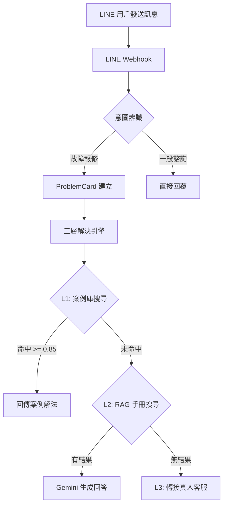
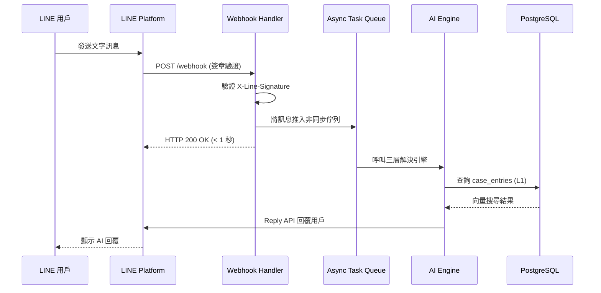
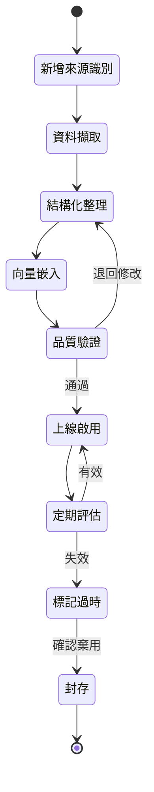
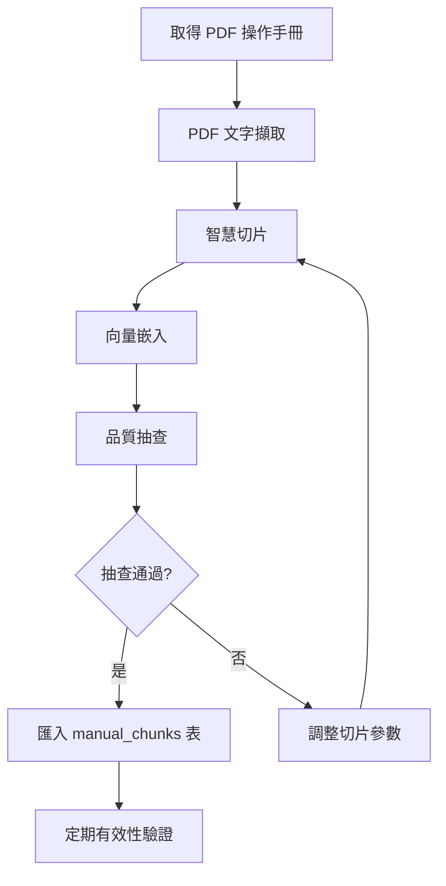
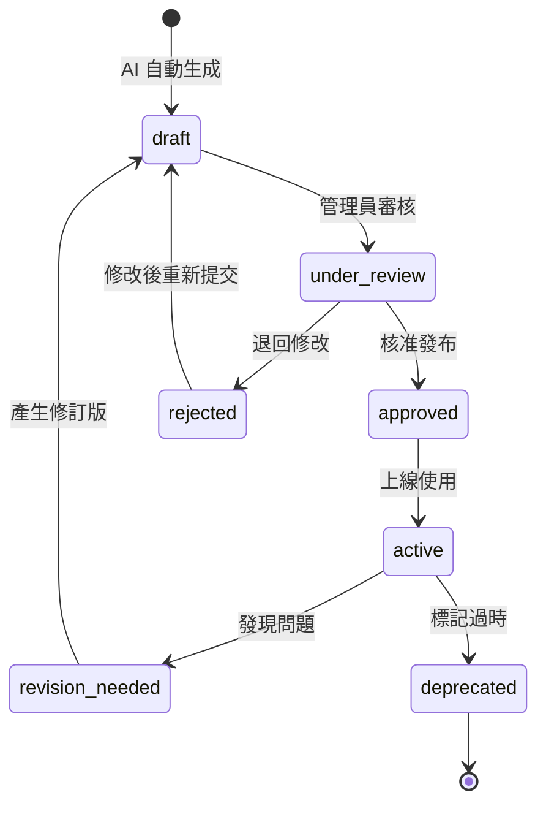
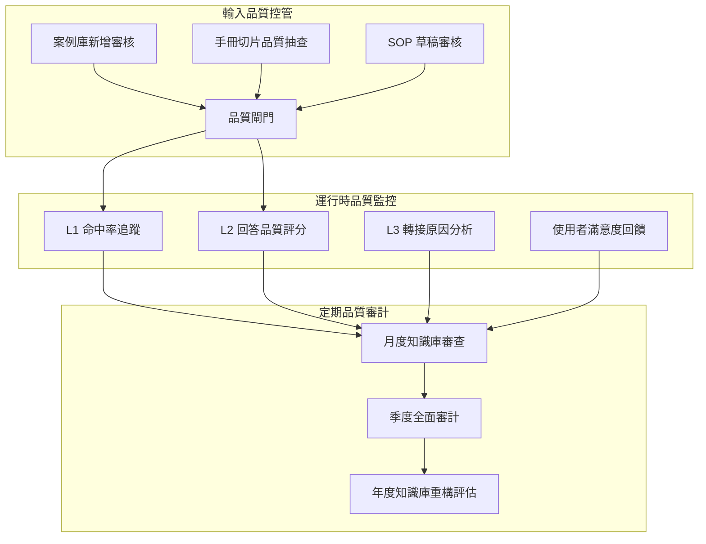

# 文檔與維護指南 - 電子鎖智能客服與派工平台

# Documentation and Maintenance Guide - Smart Lock AI Support & Service Dispatch SaaS Platform

---

**文件版本 (Document Version):** `v1.0`
**最後更新 (Last Updated):** `2026-02-25`
**主要作者 (Lead Author):** `開發團隊`
**審核者 (Reviewers):** `技術負責人, 核心開發團隊`
**狀態 (Status):** `草稿 (Draft)`

---

## 目錄 (Table of Contents)

- [第 1 部分：文檔總覽與分類](#第-1-部分文檔總覽與分類)
  - [1.1 文檔體系架構](#11-文檔體系架構)
  - [1.2 API 文檔](#12-api-文檔)
  - [1.3 技術架構文檔](#13-技術架構文檔)
  - [1.4 使用者文檔](#14-使用者文檔)
  - [1.5 開發者文檔](#15-開發者文檔)
  - [1.6 AI 知識庫文檔](#16-ai-知識庫文檔)
- [第 2 部分：文檔撰寫標準與規範](#第-2-部分文檔撰寫標準與規範)
  - [2.1 語言與用字規範](#21-語言與用字規範)
  - [2.2 結構與格式規範](#22-結構與格式規範)
  - [2.3 內容撰寫原則](#23-內容撰寫原則)
  - [2.4 視覺元素使用規範](#24-視覺元素使用規範)
- [第 3 部分：文檔即程式碼 (Documentation as Code)](#第-3-部分文檔即程式碼-documentation-as-code)
  - [3.1 文檔與程式碼共存策略](#31-文檔與程式碼共存策略)
  - [3.2 Mermaid 圖表規範](#32-mermaid-圖表規範)
  - [3.3 自動化文檔生成](#33-自動化文檔生成)
  - [3.4 文檔版本控制](#34-文檔版本控制)
- [第 4 部分：定期維護排程](#第-4-部分定期維護排程)
  - [4.1 每月審查清單](#41-每月審查清單)
  - [4.2 每季審計清單](#42-每季審計清單)
  - [4.3 版本發布時文檔更新](#43-版本發布時文檔更新)
- [第 5 部分：文檔品質指標](#第-5-部分文檔品質指標)
  - [5.1 關鍵績效指標 (KPI)](#51-關鍵績效指標-kpi)
  - [5.2 追蹤機制](#52-追蹤機制)
- [第 6 部分：工具與平台](#第-6-部分工具與平台)
  - [6.1 文檔託管與發布平台](#61-文檔託管與發布平台)
  - [6.2 圖表與視覺化工具](#62-圖表與視覺化工具)
  - [6.3 API 文檔工具](#63-api-文檔工具)
- [第 7 部分：文檔範本](#第-7-部分文檔範本)
  - [7.1 README 範本](#71-readme-範本)
  - [7.2 CHANGELOG 範本](#72-changelog-範本)
  - [7.3 ADR 範本](#73-adr-範本)
  - [7.4 API 端點文檔範本](#74-api-端點文檔範本)
  - [7.5 模組規格文檔範本](#75-模組規格文檔範本)
- [第 8 部分：團隊協作實踐](#第-8-部分團隊協作實踐)
  - [8.1 Code Review 中的文檔檢查](#81-code-review-中的文檔檢查)
  - [8.2 知識分享機制](#82-知識分享機制)
  - [8.3 文檔責任分配](#83-文檔責任分配)
- [第 9 部分：AI 知識庫維護](#第-9-部分ai-知識庫維護)
  - [9.1 案例庫 (case_entries) 生命週期](#91-案例庫-case_entries-生命週期)
  - [9.2 手冊切片 (manual_chunks) 維護](#92-手冊切片-manual_chunks-維護)
  - [9.3 SOP 草稿生命週期](#93-sop-草稿生命週期)
  - [9.4 知識品質保證流程](#94-知識品質保證流程)
  - [9.5 領域專家訪談管理](#95-領域專家訪談管理)

---

**目的**: 本文件為「電子鎖智能客服與派工 SaaS 平台」建立完整的文檔管理與維護框架，確保專案知識在整個軟體開發生命週期中得到妥善保存、持續更新與有效傳承。涵蓋技術文檔、使用者文檔、API 文檔及 AI 知識庫等四大面向的撰寫標準、維護流程與品質管控。

---

## 第 1 部分：文檔總覽與分類

*此部分定義本專案的完整文檔體系，明確每類文檔的職責、目標讀者與存放位置。*

### 1.1 文檔體系架構

本專案的文檔依性質與用途分為五大類別，各有明確的職責邊界與維護責任人：

```
電子鎖智能客服與派工平台 — 文檔體系
│
├── 設計與規劃文檔 (Design & Planning)
│   ├── docs/02_project_brief_and_prd.md          # PRD — 唯一事實來源 (SSOT)
│   ├── docs/03_behavior_driven_development.md    # BDD Gherkin 情境
│   ├── docs/05_architecture_and_design_document.md # C4 架構、DDD 設計
│   ├── docs/06_api_design_specification.md       # REST API 契約規範
│   ├── docs/08_project_structure_guide.md        # 目錄結構與分層規範
│   ├── docs/WBS_電子鎖智能平台.md                  # 工作分解結構
│   └── docs/adrs/                                # 架構決策記錄 (ADR-001 ~ ADR-005)
│
├── API 文檔 (API Documentation)
│   ├── FastAPI 自動生成 OpenAPI/Swagger (/docs)  # 即時互動式 API 文檔
│   └── docs/06_api_design_specification.md       # 手動維護的 API 設計規範
│
├── 開發者文檔 (Developer Documentation)
│   ├── README.md                                 # 專案介紹與快速入門
│   ├── CLAUDE.md                                 # AI 輔助開發指引
│   ├── CHANGELOG.md                              # 版本變更日誌
│   └── CONTRIBUTING.md                           # 貢獻指南
│
├── 使用者文檔 (User Documentation)
│   ├── 管理後台使用手冊                             # Admin Panel 操作指南
│   ├── 技師工作台使用手冊 (V2.0)                    # Technician Web App 操作指南
│   └── LINE Bot 使用說明                           # 消費者端操作引導
│
└── AI 知識庫文檔 (AI Knowledge Base)
    ├── RAG_data/產品知識_RAG.md                    # 產品知識（RAG 格式）
    ├── transcript/Transcribe_Outputs/             # 領域專家訪談逐字稿
    ├── SQL/Schema.sql 中的 case_entries           # 案例庫資料
    ├── SQL/Schema.sql 中的 manual_chunks          # 手冊切片資料
    └── SQL/Schema.sql 中的 sop_drafts             # SOP 草稿資料
```

### 1.2 API 文檔

本專案的 API 文檔採用**雙軌制**：靜態設計規範與動態自動生成文檔並行維護。

#### 1.2.1 FastAPI 自動生成文檔（主要參考）

FastAPI 框架基於程式碼中的 Pydantic Model 與 Router 定義，自動生成 OpenAPI 3.0 規範文檔：

| 端點 | 功能 | 說明 |
|:---|:---|:---|
| `/docs` | Swagger UI | 互動式 API 測試介面，支援即時發送請求 |
| `/redoc` | ReDoc | 美觀的唯讀 API 文檔，適合分享給外部消費者 |
| `/openapi.json` | OpenAPI JSON | 原始 OpenAPI 規範，可供前端 API Client 自動生成 |

**自動生成涵蓋範圍：**
- 所有 REST API 端點的路徑、方法、參數
- Request/Response Body 的 JSON Schema（源自 Pydantic v2 Model）
- 認證方式（JWT Bearer Token、LINE Webhook Signature）
- 錯誤回應格式與 HTTP 狀態碼
- 列舉值（Enum）與欄位驗證規則

#### 1.2.2 手動維護的 API 設計規範

`docs/06_api_design_specification.md` 記錄 API 的設計決策與通用約定，不隨程式碼自動更新，需人工維護：

- API 版本策略（URL path versioning: `/api/v1/`）
- 認證與授權流程（JWT 生命週期、LINE Signature 驗證邏輯）
- 通用 API 行為（cursor-based 分頁、排序、篩選語法）
- 錯誤碼定義（自訂業務錯誤碼對照表）
- Rate Limiting 策略（Redis-based 頻率限制規則）
- API 生命週期與棄用策略

#### 1.2.3 兩者的關係與維護原則

```
設計規範 (docs/06_api_design_specification.md)
    │
    │  「設計先行」：先寫規範，再寫程式
    │  程式碼必須符合規範中的通用約定
    ▼
程式碼實現 (backend/src/smart_lock/infrastructure/web/routers/)
    │
    │  FastAPI 自動反映實現細節
    ▼
自動生成文檔 (/docs, /redoc, /openapi.json)
    │
    │  若自動生成與設計規範有衝突，以程式碼（自動生成）為準
    │  同時回頭更新設計規範文件
    ▼
定期比對與同步（每月審查）
```

### 1.3 技術架構文檔

技術架構文檔記錄系統的宏觀設計決策，是開發團隊理解系統全貌的核心參考。

| 文件 | 路徑 | 職責 | 更新頻率 |
|:---|:---|:---|:---|
| 架構與設計文件 | `docs/05_architecture_and_design_document.md` | C4 四層架構圖、DDD 戰略設計、Clean Architecture 分層、部署視圖 | 架構變更時 |
| 架構決策記錄 | `docs/adrs/adr-*.md` | 記錄每個重大技術決策的背景、選項、決策理由與後果 | 新決策產生時 |
| 資料庫 Schema | `SQL/Schema.sql` | 完整的 PostgreSQL Schema（含 pgvector、觸發器、索引） | 資料模型變更時 |
| 專案結構指南 | `docs/08_project_structure_guide.md` | 目錄結構約定、Clean Architecture 分層規則、檔案命名慣例 | 結構調整時 |
| WBS 開發計畫 | `docs/WBS_電子鎖智能平台.md` | 工作分解結構、里程碑、時程規劃 | 計畫調整時 |

**現有 ADR 清單：**

| ADR 編號 | 標題 | 狀態 |
|:---|:---|:---|
| ADR-001 | 選擇 FastAPI 作為後端框架 | 已接受 |
| ADR-002 | 資料庫選型（PostgreSQL + pgvector） | 已接受 |
| ADR-003 | LLM 整合框架（LangChain + Gemini 3 Pro） | 已接受 |
| ADR-004 | LINE Bot 架構（非同步 Webhook 處理） | 已接受 |
| ADR-005 | 前端框架選型（Next.js 14+ for V2.0） | 已接受 |

### 1.4 使用者文檔

使用者文檔面向三類終端使用者，以操作導向撰寫，避免過多技術細節：

#### 管理後台使用手冊

- **目標讀者：** 甲方營運人員（HQ Admin）、客服主管
- **涵蓋範圍：**
  - 登入與帳號管理
  - 對話監控與介入
  - 知識庫管理（案例庫新增/編輯、SOP 審核、手冊上傳）
  - 報表查詢（對話統計、AI 解決率、客戶滿意度）
  - V2.0：派工監控、技師管理、帳務對帳
- **格式：** 步驟式操作指南，搭配截圖標註

#### 技師工作台使用手冊（V2.0）

- **目標讀者：** 簽約維修技師
- **涵蓋範圍：**
  - 帳號綁定與個人設定
  - 工單接收與狀態更新
  - 現場照片上傳與完工回報
  - 費用填報與帳務查詢
- **格式：** 簡潔的行動裝置友好格式

#### LINE Bot 使用說明

- **目標讀者：** 終端消費者（住戶）
- **涵蓋範圍：**
  - 加入好友與初始化
  - 問題描述與 AI 問診引導
  - 自助排除步驟的操作說明
  - 轉接真人客服的流程
  - V2.0：工單追蹤、技師到場通知
- **格式：** 嵌入 LINE Rich Menu 的圖文導覽，以及 Flex Message 中的操作提示

### 1.5 開發者文檔

開發者文檔協助團隊成員快速上手並遵循統一的開發規範：

| 文件 | 用途 | 說明 |
|:---|:---|:---|
| `README.md` | 專案首頁 | 專案簡介、技術棧、快速啟動、專案結構總覽 |
| `CLAUDE.md` | AI 輔助開發 | 提供 Claude Code 等 AI 工具的專案上下文與指引 |
| `CONTRIBUTING.md` | 貢獻指南 | 分支策略、Commit 規範、PR 流程、Code Review 檢查清單 |
| `CHANGELOG.md` | 變更日誌 | 依語意化版本記錄每次釋出的新增/修改/修復 |
| `.env.example` | 環境變數範本 | 列出所有必要的環境變數及說明，不含真實密鑰 |

### 1.6 AI 知識庫文檔

AI 知識庫是本專案的核心資產，直接影響三層解決引擎的品質：

| 資料類型 | 存放位置 | 用途 | 格式要求 |
|:---|:---|:---|:---|
| 產品知識 | `RAG_data/產品知識_RAG.md` | RAG 切片來源，涵蓋電子鎖構造、安裝、故障排除 | Markdown，以 `##` / `###` 分區，每區 200-500 字 |
| 領域訪談 | `transcript/Transcribe_Outputs/` | 資深技師知識擷取，分三類：產品知識、故障排除、系統流程 | 純文字逐字稿 |
| 案例庫 | 資料庫 `case_entries` 表 | L1 向量搜尋基礎，每筆含 768 維嵌入向量 | 結構化 JSON（症狀、原因、解法、品牌/型號） |
| 手冊切片 | 資料庫 `manual_chunks` 表 | L2 RAG 檢索基礎，源自 PDF 手冊自動切片 | 文字區塊 + 768 維嵌入向量 |
| SOP 草稿 | 資料庫 `sop_drafts` 表 | 自進化知識庫輸出，由 LLM 從成功案例自動生成 | 結構化步驟（標題、步驟清單、適用條件） |

---

## 第 2 部分：文檔撰寫標準與規範

*此部分建立統一的撰寫規範，確保所有文檔的風格一致、可讀性高、易於維護。*

### 2.1 語言與用字規範

本專案採取**雙語並行**策略：

| 範疇 | 語言 | 範例 |
|:---|:---|:---|
| 設計文檔正文 | 繁體中文 | 「本平台採用 Clean Architecture 分層」 |
| 程式碼識別符 | 英文 | `problem_card`, `case_entries`, `ThreeLayerResolver` |
| API 路徑 | 英文 lowercase kebab-case | `/api/v1/problem-cards` |
| JSON 欄位 | 英文 snake_case | `created_at`, `line_user_id` |
| 資料庫欄位 | 英文 snake_case | `manual_chunks.embedding` |
| Commit 訊息 | 英文（Conventional Commits） | `feat: add problem card creation endpoint` |
| 文件標題 | 中英並列 | `# 架構與設計文件 - Architecture and Design Document` |
| 領域術語 | 中文為主，括號標註英文 | 「問題卡 (ProblemCard)」 |

#### 領域通用語言表 (Ubiquitous Language)

所有文檔必須一致使用以下術語，不得自行替換或簡化：

| 中文術語 | 英文術語 | 定義 |
|:---|:---|:---|
| 問題卡 | ProblemCard | 結構化診斷卡：品牌、型號、地點、門況、網路、症狀 |
| 三層解決引擎 | Three-Layer Resolution Engine | L1 案例庫向量搜尋 → L2 PDF 手冊 RAG → L3 真人轉接 |
| 案例庫 | Case Entries | 歷史成功案例資料庫，支援 L1 向量相似度搜尋 |
| 手冊切片 | Manual Chunks | PDF 手冊切割後的文字區塊，含 768 維嵌入向量 |
| SOP 草稿 | SOP Draft | 由 AI 從成功案例自動生成的標準作業程序草稿 |
| 派工單 | Work Order | V2.0 技師派遣的工作指令 |
| 計價引擎 | Pricing Engine | V2.0 標準化報價計算系統 |
| 對帳系統 | Reconciliation System | V2.0 自動化財務核對系統 |

### 2.2 結構與格式規範

#### 文件標頭（所有正式文件必備）

```markdown
# [中文標題] - [英文標題]

---

**文件版本 (Document Version):** `v1.0`
**最後更新 (Last Updated):** `2026-02-25`
**主要作者 (Lead Author):** `[作者]`
**審核者 (Reviewers):** `[審核者清單]`
**狀態 (Status):** `草稿 (Draft) | 審查中 (Under Review) | 已批准 (Approved) | 已棄用 (Deprecated)`

---
```

#### Markdown 層級規範

```markdown
# 文件標題（每份文件僅一個）

## 第 N 部分：大章節標題（頂層分節）
### N.N 中章節標題（主要子節）
#### N.N.N 小章節標題（細項說明）

- 無序清單使用 `-` 開頭（非 `*`）
- 有序清單使用 `1.` 開頭（讓 Markdown 自動編號）
- 程式碼區塊使用三個反引號並標註語言
```

#### 表格格式

```markdown
| 欄位名稱 | 型態 | 說明 |
|:---|:---|:---|
| 靠左對齊 | 靠左對齊 | 靠左對齊 |
```

### 2.3 內容撰寫原則

#### 原則一：簡潔明確

- 使用主動語態：「系統驗證 JWT Token」而非「JWT Token 被系統驗證」
- 一段只講一件事，段落長度控制在 3-5 行以內
- 避免模糊用語：「適當地」「盡可能」應替換為具體量化描述

#### 原則二：範例驅動

所有技術文檔應附上可執行的程式碼範例：

```python
# 正確範例 — 附上完整可執行的程式碼
from smart_lock.domains.problem_card.entities import ProblemCard

card = ProblemCard(
    brand="Dormakaba",
    model="SL-3000",
    symptom="指紋無法辨識",
    door_condition="正常",
    network_status="Wi-Fi 連線中",
)
```

#### 原則三：保持時效性

- 所有文件標頭必須包含 `最後更新` 日期
- 引用其他文件時使用相對路徑連結，而非複製內容
- 過時內容標記為 `Deprecated`，不直接刪除

#### 原則四：面向讀者

- 每份文件開頭明確標示目標讀者
- 技術深度與讀者背景匹配（使用者文檔不寫程式碼，開發者文檔不寫操作步驟）
- 複雜概念先給概述，再展開細節

### 2.4 視覺元素使用規範

#### Mermaid 圖表

所有架構圖、流程圖、序列圖統一使用 Mermaid 語法，以實現「圖表即程式碼 (Diagrams as Code)」：



#### 截圖規範

- 截圖使用 PNG 格式，解析度不低於 72 DPI
- 存放路徑：`docs/images/[文件名稱]/[截圖描述].png`
- 敏感資訊（Token、密碼）必須遮蔽
- 截圖上標註紅色框線指示操作位置

#### 表格 vs. 清單的選擇

| 場景 | 使用表格 | 使用清單 |
|:---|:---|:---|
| 多筆結構化資料對比 | 是 | 否 |
| 步驟式操作流程 | 否 | 是（有序清單） |
| 屬性說明 | 是（3+ 欄位時） | 是（2 欄位以下） |
| 優缺點列舉 | 視情況 | 是 |

---

## 第 3 部分：文檔即程式碼 (Documentation as Code)

*此部分規範文檔如何與程式碼共存、版本控制、以及自動化生成策略。*

### 3.1 文檔與程式碼共存策略

所有文檔存放在 Git 倉庫中，與程式碼共同版本控制，享有完整的變更追蹤與分支管理能力。

#### 目錄結構

```
smart-lock-platform/
│
├── docs/                               # 設計與規劃文檔
│   ├── 02_project_brief_and_prd.md     #   PRD (SSOT)
│   ├── 03_behavior_driven_development.md #  BDD 情境
│   ├── 05_architecture_and_design_document.md # 架構設計
│   ├── 06_api_design_specification.md  #   API 設計規範
│   ├── 08_project_structure_guide.md   #   專案結構指南
│   ├── WBS_電子鎖智能平台.md            #   WBS 開發計畫
│   ├── adrs/                           #   架構決策記錄
│   │   ├── adr-001-backend-framework.md
│   │   ├── adr-002-database-selection.md
│   │   ├── adr-003-llm-integration-framework.md
│   │   ├── adr-004-line-bot-architecture.md
│   │   └── adr-005-frontend-framework-v2.md
│   └── images/                         #   文件中使用的圖片
│
├── RAG_data/                           # AI 知識庫來源資料
│   └── 產品知識_RAG.md                  #   產品知識（RAG 切片格式）
│
├── transcript/                         # 領域專家訪談
│   └── Transcribe_Outputs/             #   逐字稿分類歸檔
│       ├── 產品知識/                    #     電子鎖基礎、構造、安裝
│       ├── 故障排除與客服/              #     SOP、問診流程
│       └── 系統開發與內部流程討論/       #     功能需求、派工流程
│
├── SQL/                                # 資料庫定義
│   └── Schema.sql                      #   完整 PostgreSQL Schema
│
├── CLAUDE.md                           # AI 輔助開發指引
├── README.md                           # 專案首頁
├── CHANGELOG.md                        # 版本變更日誌
└── CONTRIBUTING.md                     # 貢獻指南
```

#### 文檔變更的 Git 工作流程

1. **文檔變更與程式碼變更遵循相同的分支策略**：從 `main` 建立 feature branch，完成後提交 Pull Request
2. **Commit 類型**：文檔變更使用 `docs:` 前綴
   ```
   docs: update API specification for problem-cards endpoint
   docs: add ADR-006 for caching strategy
   docs: fix broken links in architecture document
   ```
3. **Pull Request 審查**：文檔變更同樣需要至少一位審查者核可

### 3.2 Mermaid 圖表規範

本專案所有架構圖、流程圖、序列圖統一使用 Mermaid 語法，嵌入 Markdown 文件中：

#### 支援的圖表類型

| 圖表類型 | Mermaid 語法 | 使用場景 |
|:---|:---|:---|
| 流程圖 | `graph TD` / `graph LR` | 業務流程、資料流向 |
| 序列圖 | `sequenceDiagram` | API 呼叫流程、Webhook 處理 |
| 類別圖 | `classDiagram` | Domain Model、Entity 關係 |
| ER 圖 | `erDiagram` | 資料庫表關係 |
| 狀態圖 | `stateDiagram-v2` | 對話狀態機、工單狀態流轉 |
| 甘特圖 | `gantt` | 開發時程規劃 |

#### 範例：LINE Webhook 非同步處理序列圖



#### 圖表命名與維護規則

- 每張圖表上方加註說明用途（使用一行文字描述）
- 節點文字使用中文（面向業務人員）或中英對照
- 複雜圖表拆分為多張，各自聚焦一個面向
- 圖表變更時同步更新相關文字描述

### 3.3 自動化文檔生成

#### 3.3.1 FastAPI OpenAPI 文檔自動生成

FastAPI 從程式碼自動產生 API 文檔，開發者無需手動維護 API 端點清單：

```python
# backend/src/smart_lock/main.py
from fastapi import FastAPI

app = FastAPI(
    title="Smart Lock AI Support Platform API",
    description="電子鎖智能客服與派工平台 REST API",
    version="1.0.0",
    docs_url="/docs",           # Swagger UI
    redoc_url="/redoc",         # ReDoc
    openapi_url="/openapi.json" # OpenAPI JSON Schema
)
```

**Router 文檔化最佳實踐：**

```python
from fastapi import APIRouter, status
from pydantic import BaseModel, Field

router = APIRouter(prefix="/api/v1/problem-cards", tags=["ProblemCard"])

class ProblemCardCreate(BaseModel):
    """建立問題卡的請求 Schema。"""
    brand: str = Field(..., description="電子鎖品牌", example="Dormakaba")
    model: str = Field(..., description="電子鎖型號", example="SL-3000")
    symptom: str = Field(..., description="故障症狀描述", example="指紋無法辨識")

@router.post(
    "/",
    response_model=ProblemCardResponse,
    status_code=status.HTTP_201_CREATED,
    summary="建立問題卡",
    description="根據 AI 問診結果建立結構化問題卡 (ProblemCard)，用於後續三層解決引擎的輸入。",
)
async def create_problem_card(payload: ProblemCardCreate):
    ...
```

#### 3.3.2 Python Docstring 規範（Google Style）

所有 Python 模組、類別、函式必須撰寫 Google Style Docstring：

```python
def resolve_problem(problem_card: ProblemCard) -> ResolutionResult:
    """透過三層解決引擎處理問題卡。

    依序嘗試 L1 案例庫向量搜尋、L2 RAG 手冊搜尋、L3 真人轉接，
    於第一個命中的層級回傳解決方案。

    Args:
        problem_card: 已完成 AI 問診的結構化問題卡。

    Returns:
        ResolutionResult: 包含解決方案內容與命中層級。

    Raises:
        EmbeddingServiceError: 向量嵌入服務不可用。
        LLMTimeoutError: Gemini API 回應逾時（> 30 秒）。

    Example:
        >>> card = ProblemCard(brand="Dormakaba", symptom="密碼失靈")
        >>> result = await resolve_problem(card)
        >>> print(result.layer)  # "L1"
    """
```

#### 3.3.3 TypeScript JSDoc 規範（V2.0 前端）

Next.js 前端元件與函式使用 JSDoc 格式：

```typescript
/**
 * 工單卡片元件 — 顯示單筆派工單的摘要資訊。
 *
 * @param workOrder - 工單資料物件
 * @param onAccept - 技師接受工單時的回呼函式
 * @returns 工單卡片 React 元件
 *
 * @example
 * ```tsx
 * <WorkOrderCard workOrder={order} onAccept={handleAccept} />
 * ```
 */
export function WorkOrderCard({ workOrder, onAccept }: WorkOrderCardProps) {
  // ...
}
```

#### 3.3.4 GitHub Actions 自動化流程

```yaml
# .github/workflows/docs.yml
name: Documentation CI

on:
  push:
    branches: [main]
    paths:
      - 'docs/**'
      - 'backend/src/**'
      - 'SQL/**'

jobs:
  validate-docs:
    runs-on: ubuntu-latest
    steps:
      - uses: actions/checkout@v4

      - name: 檢查 Markdown 格式
        uses: DavidAnson/markdownlint-cli2-action@v16
        with:
          globs: 'docs/**/*.md'

      - name: 檢查文件內連結
        uses: gaurav-nelson/github-action-markdown-link-check@v1
        with:
          folder-path: 'docs/'

      - name: 匯出 OpenAPI Spec
        run: |
          cd backend
          poetry install --no-interaction
          python -c "
          import json
          from smart_lock.main import app
          spec = app.openapi()
          with open('../docs/api/openapi.json', 'w') as f:
              json.dump(spec, f, indent=2, ensure_ascii=False)
          "

      - name: 部署至 GitHub Pages
        uses: peaceiris/actions-gh-pages@v4
        with:
          github_token: ${{ secrets.GITHUB_TOKEN }}
          publish_dir: ./docs
```

### 3.4 文檔版本控制

#### 語意化版本規則

文檔版本遵循 Semantic Versioning（`MAJOR.MINOR`），與軟體版本獨立管理：

| 版本變更 | 說明 | 範例 |
|:---|:---|:---|
| MAJOR（主版本） | 文件結構大幅重組、內容根本性改寫 | `v1.0 → v2.0` |
| MINOR（次版本） | 新增章節、修訂內容、更新範例 | `v1.0 → v1.1` |

#### CHANGELOG 記錄規則

每份文件的版本變更記錄於文件末尾或獨立的 `CHANGELOG.md`：

```markdown
## 文件變更歷史

| 版本 | 日期 | 作者 | 變更說明 |
|:---|:---|:---|:---|
| v1.1 | 2026-03-15 | 開發團隊 | 新增 V2.0 派工 API 端點規範 |
| v1.0 | 2026-02-17 | 開發團隊 | 初版建立 |
```

---

## 第 4 部分：定期維護排程

*此部分定義文檔維護的週期性任務，確保文檔不會隨時間推移而過時失效。*

### 4.1 每月審查清單

每月第一個工作週進行一次文檔審查，由技術負責人主持：

**通用審查項目：**

- [ ] 確認所有文件的「最後更新」日期是否反映實際狀態
- [ ] 檢查文件間的交叉引用連結是否有效（無 404）
- [ ] 確認 `docs/06_api_design_specification.md` 與 FastAPI `/openapi.json` 是否一致
- [ ] 檢查 `CLAUDE.md` 中的專案上下文是否反映最新架構

**API 文檔審查：**

- [ ] 對比 FastAPI 自動生成的 `/openapi.json` 與手動維護的 API 規範
- [ ] 確認所有新增 API 端點都有完整的 Pydantic Schema 與 docstring
- [ ] 驗證錯誤碼定義是否涵蓋新增的業務場景

**AI 知識庫審查：**

- [ ] 檢查過去一個月新增的 `case_entries` 數量與品質
- [ ] 確認待審核的 `sop_drafts` 是否已處理
- [ ] 檢視 L1/L2 搜尋命中率報表，判斷知識庫是否需要補充

### 4.2 每季審計清單

每季末進行一次全面文檔審計，由技術負責人與架構師共同主持：

**架構文檔審計：**

- [ ] 審查 `docs/05_architecture_and_design_document.md` 中的 C4 圖是否反映現行架構
- [ ] 檢查是否有未記錄的架構決策需要補寫 ADR
- [ ] 確認 `docs/08_project_structure_guide.md` 中的目錄結構與實際程式碼一致
- [ ] 審查 `SQL/Schema.sql` 與 Alembic 遷移是否同步

**開發者文檔審計：**

- [ ] 驗證 `README.md` 中的快速啟動步驟可正常執行
- [ ] 檢查 `.env.example` 是否涵蓋所有新增的環境變數
- [ ] 確認 `CONTRIBUTING.md` 中的流程仍然適用

**知識庫全面審計：**

- [ ] 分析 `case_entries` 的嵌入向量品質（使用抽樣相似度測試）
- [ ] 檢查 `manual_chunks` 是否有過時內容（對照原始 PDF 版本）
- [ ] 評估已發布 SOP 的實際使用效果與準確率
- [ ] 審查 `RAG_data/產品知識_RAG.md` 是否需要更新（新產品/新型號）
- [ ] 確認 `transcript/` 中的訪談是否都已轉化為知識庫條目

**使用者文檔審計：**

- [ ] 更新管理後台使用手冊的截圖（若 UI 有變更）
- [ ] 確認 LINE Bot 的 Rich Menu 圖文導覽是否反映當前功能
- [ ] V2.0：更新技師工作台操作指南

### 4.3 版本發布時文檔更新

每次版本發布（Release）前，必須完成以下文檔更新：

| 階段 | 任務 | 負責人 |
|:---|:---|:---|
| 開發完成 | 更新 API docstring 與 Pydantic Schema 描述 | 開發者 |
| Code Review | 檢查新增/修改功能是否有對應文檔更新 | 審查者 |
| Pre-Release | 更新 `CHANGELOG.md`、各文件版本號 | 技術負責人 |
| Release | 確認 `/docs` 與 `/redoc` 端點內容正確 | QA |
| Post-Release | 更新使用者文檔（截圖、操作流程） | 產品人員 |

---

## 第 5 部分：文檔品質指標

*此部分定義可量化的指標，持續追蹤文檔的覆蓋率、準確性與使用效果。*

### 5.1 關鍵績效指標 (KPI)

#### 覆蓋率指標

| 指標 | 定義 | 目標值 |
|:---|:---|:---|
| API 文檔覆蓋率 | 已文檔化 API 端點數 / 總 API 端點數 | >= 100% |
| Docstring 覆蓋率 | 有 docstring 的公開函式數 / 公開函式總數 | >= 90% |
| ADR 覆蓋率 | 已記錄的架構決策數 / 實際架構決策數 | >= 100% |
| 知識庫覆蓋率 | 已錄入的品牌/型號組合數 / 實際支援的組合數 | >= 80% |

#### 時效性指標

| 指標 | 定義 | 目標值 |
|:---|:---|:---|
| 文檔新鮮度 | 距離上次更新的天數中位數 | <= 30 天 |
| 連結有效率 | 有效連結數 / 總連結數 | >= 99% |
| Schema 同步率 | `Schema.sql` 與實際資料庫結構一致的比例 | 100% |

#### AI 知識庫品質指標

| 指標 | 定義 | 目標值 |
|:---|:---|:---|
| L1 命中率 | L1 成功解決的問題數 / 進入三層引擎的問題總數 | >= 40% |
| L2 命中率 | L2 成功解決的問題數 / 進入 L2 的問題總數 | >= 60% |
| L3 轉接率 | 需要真人客服的問題數 / 問題總數 | <= 20% |
| SOP 審核通過率 | 管理員核准的 SOP 草稿數 / AI 生成的草稿總數 | >= 70% |
| 案例庫成長率 | 每月新增的 case_entries 數量 | 視業務量而定 |

### 5.2 追蹤機制

#### 自動化追蹤

```python
# 範例：Docstring 覆蓋率檢查腳本
# scripts/check_docstring_coverage.py

import ast
import sys
from pathlib import Path

def check_coverage(source_dir: str) -> dict:
    """掃描 Python 原始碼目錄，計算 docstring 覆蓋率。

    Args:
        source_dir: Python 原始碼根目錄路徑。

    Returns:
        包含 total_functions、documented_functions、coverage_pct 的字典。
    """
    total = 0
    documented = 0
    for py_file in Path(source_dir).rglob("*.py"):
        tree = ast.parse(py_file.read_text())
        for node in ast.walk(tree):
            if isinstance(node, (ast.FunctionDef, ast.AsyncFunctionDef)):
                if not node.name.startswith("_"):
                    total += 1
                    if ast.get_docstring(node):
                        documented += 1
    return {
        "total_functions": total,
        "documented_functions": documented,
        "coverage_pct": round(documented / total * 100, 1) if total else 0,
    }

if __name__ == "__main__":
    result = check_coverage("backend/src/smart_lock")
    print(f"Docstring 覆蓋率: {result['coverage_pct']}%")
    print(f"  已文檔化: {result['documented_functions']}/{result['total_functions']}")
    if result["coverage_pct"] < 90:
        sys.exit(1)
```

#### 手動追蹤（每月審查時更新）

| 日期 | API 覆蓋率 | Docstring 覆蓋率 | L1 命中率 | L3 轉接率 | 備註 |
|:---|:---|:---|:---|:---|:---|
| 2026-03 | - | - | - | - | 初始基線建立 |

---

## 第 6 部分：工具與平台

*此部分列出本專案使用的文檔相關工具，以及各工具的適用場景。*

### 6.1 文檔託管與發布平台

#### GitHub Repository（主要）

```
優勢：
- 文檔與程式碼統一版本控制
- Pull Request 審查機制適用於文檔變更
- Markdown 原生渲染，GitHub 上直接可讀
- 與 CI/CD 流程無縫整合

適用範疇：
- 設計文檔（docs/ 目錄）
- ADR 記錄
- README、CHANGELOG、CONTRIBUTING
- CLAUDE.md（AI 輔助開發指引）
```

#### GitHub Pages（選用）

```
優勢：
- 免費靜態網站託管
- 自動從 main 分支部署
- 支援自訂域名

適用範疇：
- 對外公開的 API 文檔
- 使用者操作手冊（產生靜態網頁版本）
- 專案簡介頁面
```

#### FastAPI 內建文檔端點（API 專用）

```
優勢：
- 零配置自動生成
- 即時反映程式碼變更
- Swagger UI 支援互動式 API 測試
- ReDoc 提供美觀的唯讀版本

端點：
- /docs     — Swagger UI（開發、測試用）
- /redoc    — ReDoc（分享、展示用）
- /openapi.json — 機器可讀的 OpenAPI 規範
```

### 6.2 圖表與視覺化工具

| 工具 | 用途 | 格式 | 使用場景 |
|:---|:---|:---|:---|
| **Mermaid** | 程式碼圖表 | 嵌入 Markdown | 架構圖、流程圖、序列圖、ER 圖（首選） |
| **Draw.io / diagrams.net** | 視覺化繪圖 | `.drawio` / `.svg` 匯出 | 複雜的部署視圖、Mermaid 無法表達的圖表 |
| **dbdiagram.io** | 資料庫 ER 圖 | 線上編輯 | 快速產生資料庫關係圖（輔助參考） |

#### Mermaid 為首選的理由

1. **版本控制友好**：純文字格式，差異比對清晰可見
2. **GitHub 原生支援**：Markdown 中的 Mermaid 區塊直接渲染
3. **維護成本低**：不需要額外工具，任何文字編輯器都能修改
4. **與「文檔即程式碼」理念一致**：圖表與文字共同存在於 Markdown 文件中

### 6.3 API 文檔工具

| 工具 | 角色 | 說明 |
|:---|:---|:---|
| **FastAPI + Pydantic** | 自動生成 | 從型別標註與 Schema 自動產生 OpenAPI 3.0 規範 |
| **Swagger UI** | 互動式文檔 | 內建於 FastAPI (`/docs`)，支援線上發送請求測試 |
| **ReDoc** | 靜態文檔 | 內建於 FastAPI (`/redoc`)，美觀的三欄式排版 |
| **openapi-generator** | Client 生成 | 從 OpenAPI JSON 自動生成前端 TypeScript API Client |

#### 前端 API Client 自動生成

```bash
# scripts/generate_api_client.sh
#!/bin/bash
# 從後端 OpenAPI 規範自動生成前端 TypeScript API Client

# 1. 匯出最新的 OpenAPI JSON
curl -s http://localhost:8000/openapi.json > /tmp/openapi.json

# 2. 使用 openapi-generator 生成 TypeScript Client
npx openapi-generator-cli generate \
  -i /tmp/openapi.json \
  -g typescript-fetch \
  -o frontend/src/lib/api-client/ \
  --additional-properties=supportsES6=true,typescriptThreePlus=true

echo "API Client 已更新至 frontend/src/lib/api-client/"
```

---

## 第 7 部分：文檔範本

*此部分提供標準化的文檔範本，確保團隊成員建立新文件時遵循一致格式。*

### 7.1 README 範本

```markdown
# Smart Lock AI Support & Service Dispatch SaaS Platform

電子鎖智能客服與派工平台 — AI 驅動的 LINE Bot 客服系統，整合技師派工與帳務管理。

## 技術棧

| 層級 | 技術 |
|:---|:---|
| 後端 | FastAPI (Python 3.11+), SQLAlchemy 2.0, Uvicorn |
| 前端 | Next.js 14+ (React, TypeScript) — V2.0 |
| 資料庫 | PostgreSQL 16 + pgvector 0.7+ |
| 快取 | Redis 7+ |
| AI/LLM | Google Gemini 3 Pro via LangChain 0.3.x |
| 嵌入模型 | Google text-embedding-004 (768 維向量) |
| LINE 整合 | line-bot-sdk-python 3+ |
| 部署 | Docker + Docker Compose |

## 快速啟動

### 前置條件

- Docker & Docker Compose
- Python 3.11+
- Node.js 18+ (V2.0)

### 啟動開發環境

```bash
# 1. 複製環境變數範本
cp .env.example .env

# 2. 編輯 .env，填入必要的 API Key 與 Channel Secret
vim .env

# 3. 啟動所有服務
docker compose up -d

# 4. 執行資料庫遷移
docker compose exec backend alembic upgrade head

# 5. 匯入種子資料
docker compose exec backend python scripts/seed_database.py
```

### 驗證

- API 文檔：http://localhost:8000/docs
- 健康檢查：http://localhost:8000/health

## 專案結構

詳見 [docs/08_project_structure_guide.md](docs/08_project_structure_guide.md)

## 核心文件

| 文件 | 說明 |
|:---|:---|
| [PRD](docs/02_project_brief_and_prd.md) | 產品需求文件（唯一事實來源） |
| [架構設計](docs/05_architecture_and_design_document.md) | C4 架構圖、DDD 設計 |
| [API 規範](docs/06_api_design_specification.md) | REST API 契約 |
| [BDD 情境](docs/03_behavior_driven_development.md) | Gherkin 測試情境 |

## 授權

[LICENSE](LICENSE)
```

### 7.2 CHANGELOG 範本

```markdown
# 變更日誌 (Changelog)

本專案所有重要變更都記錄在此文件中。
格式依據 [Keep a Changelog](https://keepachangelog.com/zh-TW/)，
版本號遵循 [Semantic Versioning](https://semver.org/lang/zh-TW/)。

## [Unreleased]

### 新增 (Added)
- 待記錄的新功能

### 變更 (Changed)
- 待記錄的現有功能修改

### 修復 (Fixed)
- 待記錄的錯誤修復

---

## [1.0.0] - 2026-MM-DD (V1.0 正式發布)

### 新增 (Added)
- LINE Bot AI 智能客服對話功能
- ProblemCard 結構化問題診斷
- 三層解決引擎（L1 案例庫向量搜尋 / L2 RAG 手冊搜尋 / L3 真人轉接）
- 自進化知識庫（AI 自動生成 SOP 草稿）
- 管理後台 V1.0（對話監控、知識庫管理、報表查詢）
- JWT + LINE Signature 雙重認證機制
- cursor-based 分頁與 Rate Limiting

### 技術決策 (Decisions)
- ADR-001: 選擇 FastAPI 作為後端框架
- ADR-002: 選擇 PostgreSQL + pgvector 作為資料庫
- ADR-003: 選擇 LangChain + Gemini 3 Pro 作為 LLM 整合框架
- ADR-004: LINE Bot 非同步 Webhook 架構
```

### 7.3 ADR 範本

```markdown
# ADR-NNN: [決策標題]

**狀態:** 提議 (Proposed) | 已接受 (Accepted) | 已棄用 (Deprecated) | 已取代 (Superseded by ADR-XXX)
**決策者:** [參與決策的人員/角色]
**日期:** YYYY-MM-DD

---

## 1. 背景與問題陳述

[描述導致此決策的技術/業務背景，以及需要解決的具體問題。]

## 2. 考量的選項

### 選項一: [名稱]

- **概述：** [簡要描述]
- **優點：**
  - [優點 1]
  - [優點 2]
- **缺點：**
  - [缺點 1]
  - [缺點 2]

### 選項二: [名稱]

- **概述：** [簡要描述]
- **優點：**
  - [優點 1]
- **缺點：**
  - [缺點 1]

## 3. 最終決策

**選擇：[選項名稱]**

### 決策理由

[詳細說明為何選擇此方案，以及它如何最佳解決問題陳述中的挑戰。]

## 4. 預期影響

### 正面影響
- [影響 1]

### 需要注意的風險
- [風險 1]

## 5. 相關文件

- [PRD 相關章節](../02_project_brief_and_prd.md)
- [架構設計相關章節](../05_architecture_and_design_document.md)
```

### 7.4 API 端點文檔範本

此範本用於補充 FastAPI 自動生成文檔無法涵蓋的業務邏輯說明：

```markdown
## POST /api/v1/problem-cards

### 概述

根據 AI 問診收集的結構化資訊，建立問題卡 (ProblemCard)。問題卡建立後自動觸發三層解決引擎。

### 業務規則

1. 同一對話 (`conversation_id`) 只能關聯一張問題卡（1:1 關係）
2. 必要欄位：`brand`、`model`、`symptom` 至少需填寫其一
3. `door_condition` 與 `network_status` 為選填，但填寫可提高 L1 命中率
4. 建立後狀態為 `diagnosing`，三層引擎處理完畢後更新為 `resolved` 或 `escalated`

### 認證

- **必要：** Bearer Token (JWT)
- **角色：** `system`（由 LINE Webhook 非同步流程自動呼叫）

### 請求範例

```json
{
  "conversation_id": "550e8400-e29b-41d4-a716-446655440000",
  "brand": "Dormakaba",
  "model": "SL-3000",
  "symptom": "指紋無法辨識，已重複註冊三次仍失敗",
  "door_condition": "正常",
  "network_status": "Wi-Fi 連線中",
  "location": "台北市大安區"
}
```

### 成功回應 (201 Created)

```json
{
  "id": "660e8400-e29b-41d4-a716-446655440000",
  "conversation_id": "550e8400-e29b-41d4-a716-446655440000",
  "status": "diagnosing",
  "brand": "Dormakaba",
  "model": "SL-3000",
  "symptom": "指紋無法辨識，已重複註冊三次仍失敗",
  "created_at": "2026-02-25T10:30:00Z"
}
```

### 錯誤回應

| HTTP 狀態碼 | 錯誤碼 | 說明 |
|:---|:---|:---|
| 400 | `INVALID_BRAND` | 不支援的電子鎖品牌 |
| 409 | `DUPLICATE_PROBLEM_CARD` | 該對話已有問題卡 |
| 422 | `VALIDATION_ERROR` | 請求欄位驗證失敗 |
```

### 7.5 模組規格文檔範本

```markdown
# 模組規格：[模組名稱]

## 1. 職責

[本模組在系統中承擔的職責，以 1-2 句話描述。]

## 2. 所屬 Bounded Context

[customer_service | knowledge_base | dispatch | accounting | user_management]

## 3. 目錄結構

```
backend/src/smart_lock/
├── domains/[module_name]/
│   ├── entities.py          # 領域實體
│   ├── value_objects.py     # 值物件
│   └── events.py            # 領域事件
├── application/[module_name]/
│   ├── use_cases.py         # 應用層用例
│   ├── dtos.py              # 資料傳輸物件
│   └── validators.py        # 業務驗證器
└── infrastructure/
    ├── repositories/[module_name]_repo.py  # 資料存取
    └── web/routers/[module_name].py        # API 路由
```

## 4. 核心 Use Cases

| Use Case | 觸發條件 | 輸出 |
|:---|:---|:---|
| [用例名稱] | [觸發事件或 API 呼叫] | [產出或副作用] |

## 5. 領域事件

| 事件 | 發布時機 | 消費者 |
|:---|:---|:---|
| [事件名稱] | [何時發布] | [哪些模組會處理此事件] |

## 6. 依賴關係

- **依賴的模組：** [列出此模組依賴的其他模組]
- **被依賴的模組：** [列出依賴此模組的其他模組]

## 7. 相關 BDD 情境

參見 `docs/03_behavior_driven_development.md` 中的：
- Feature: [相關 Feature 名稱]
```

---

## 第 8 部分：團隊協作實踐

*此部分建立以文檔為中心的團隊協作文化，將文檔維護融入日常開發流程。*

### 8.1 Code Review 中的文檔檢查

所有 Pull Request 的 Code Review 必須包含文檔面向的檢查。審查者應使用以下檢查清單：

#### PR 文檔檢查清單

**程式碼層級：**

- [ ] 所有新增的公開函式/類別是否都有 Google Style Docstring？
- [ ] Pydantic Model 的每個 `Field` 是否都有 `description` 與 `example`？
- [ ] Router 端點是否有 `summary` 與 `description` 參數？
- [ ] 複雜的業務邏輯是否有行內註解解釋「為什麼」（而非「做什麼」）？

**設計文檔層級：**

- [ ] 新增 API 端點是否已更新 `docs/06_api_design_specification.md`（若適用）？
- [ ] 資料庫 Schema 變更是否已同步至 `SQL/Schema.sql`？
- [ ] 重大技術決策是否已撰寫新的 ADR？
- [ ] 影響使用者操作的功能是否已更新使用者文檔？

**知識庫層級：**

- [ ] 新增的故障處理邏輯是否需要對應新的 `case_entries`？
- [ ] 對話流程變更是否需要更新 LLM Prompt 範本（`configs/prompts/`）？

### 8.2 知識分享機制

#### 每兩週技術分享會

- **頻率：** 每兩週一次，30 分鐘
- **形式：** 團隊成員輪流分享，內容記錄為文件
- **主題範疇：**
  - 新導入的技術或框架
  - 解決的困難技術問題
  - 架構決策的背景說明
  - AI 知識庫的新發現（新的電子鎖故障模式、新品牌/型號）
- **產出：** 分享內容形成 ADR 或知識庫條目

#### 領域專家對接會

- **頻率：** V1.0 開發期間每週一次、上線後每月一次
- **參與者：** 開發團隊 + 甲方資深技師
- **目的：**
  - 收集新的故障案例與排除經驗
  - 驗證 AI 回答的準確性
  - 識別知識庫的盲區（L3 高頻轉接主題）
- **產出：** 訪談逐字稿存入 `transcript/Transcribe_Outputs/`，整理後錄入 `case_entries`

#### 新人入職文檔路徑

新加入的開發者應依序閱讀以下文件，預計 4 小時內完成：

| 順序 | 文件 | 目標 | 預估時間 |
|:---|:---|:---|:---|
| 1 | `README.md` | 了解專案全貌與快速啟動 | 15 分鐘 |
| 2 | `docs/02_project_brief_and_prd.md` | 理解業務背景與使用者故事 | 45 分鐘 |
| 3 | `docs/05_architecture_and_design_document.md` | 掌握系統架構與技術決策 | 60 分鐘 |
| 4 | `docs/08_project_structure_guide.md` | 熟悉程式碼組織方式 | 30 分鐘 |
| 5 | `docs/06_api_design_specification.md` | 了解 API 契約與通用約定 | 30 分鐘 |
| 6 | `docs/03_behavior_driven_development.md` | 理解功能驗收標準 | 30 分鐘 |
| 7 | `CLAUDE.md` | 掌握 AI 輔助開發的上下文 | 10 分鐘 |
| 8 | `CONTRIBUTING.md` | 了解協作流程與規範 | 10 分鐘 |

### 8.3 文檔責任分配

#### RACI 矩陣

| 文檔類型 | 開發者 | 技術負責人 | 產品人員 | 領域專家（甲方） |
|:---|:---|:---|:---|:---|
| 程式碼 Docstring | **R** (負責) | **A** (審核) | I | - |
| API 設計規範 | R | **A** | I | - |
| 架構設計文件 | C | **R/A** | I | - |
| ADR | R | **A** | I | C |
| 使用者文檔 | C | A | **R** | C |
| AI 知識庫 | R | A | C | **R** (提供來源) |
| BDD 情境 | R | A | **R** (驗收) | C |
| CHANGELOG | R | **A** | I | - |

> R = Responsible（負責執行）, A = Accountable（最終負責）, C = Consulted（諮詢）, I = Informed（知會）

---

## 第 9 部分：AI 知識庫維護

*此部分專門針對本專案核心的 AI 知識資產，定義其完整的生命週期管理流程。知識庫的品質直接決定三層解決引擎的效能與客戶滿意度。*

### 9.1 案例庫 (case_entries) 生命週期

案例庫是三層引擎 L1 向量搜尋的基礎。每筆案例代表一個「已驗證的故障-解決方案配對」。

#### 生命週期流程



#### 新增案例的來源

| 來源 | 觸發條件 | 處理流程 |
|:---|:---|:---|
| L3 真人客服解決 | 客服成功解決一個 L1/L2 未命中的問題 | 客服回報 → 管理員審核 → 錄入案例庫 |
| 技師現場回報 (V2.0) | 技師完工回報中包含新的故障模式 | 自動提取 → 管理員審核 → 錄入案例庫 |
| 領域專家訪談 | 定期訪談資深技師取得專業知識 | 逐字稿整理 → 結構化 → 錄入案例庫 |
| SOP 草稿核准 | AI 生成的 SOP 草稿經管理員核准 | 自動轉化為案例庫條目 |
| 產品更新 | 新品牌/型號上市、韌體更新 | 手動建立基礎案例 |

#### 案例品質標準

每筆 `case_entry` 必須滿足以下品質標準方可上線：

```
必要欄位完整度檢查：
- [ ] symptom_description：故障症狀描述（100 字以上，包含具體現象）
- [ ] root_cause：根本原因分析（明確且可驗證）
- [ ] solution_steps：解決步驟（結構化的步驟清單，非流水帳）
- [ ] applicable_brands：適用品牌清單
- [ ] applicable_models：適用型號清單（若通用則標註 "all"）
- [ ] embedding：768 維向量嵌入（由系統自動生成）

品質評估：
- [ ] 解決方案已經過至少一次實際案例驗證
- [ ] 相似度測試：與現有案例的最大 cosine similarity < 0.95（避免重複）
- [ ] 語義測試：使用 3-5 個不同措辭的症狀描述，確認能正確命中
```

### 9.2 手冊切片 (manual_chunks) 維護

手冊切片是三層引擎 L2 RAG 搜尋的基礎。源自各品牌電子鎖的 PDF 操作手冊。

#### 手冊切片處理流程



#### 切片規範

| 參數 | 設定值 | 說明 |
|:---|:---|:---|
| 切片大小 | 200-500 字元 | 過小失去語境、過大降低檢索精度 |
| 重疊區域 | 50-100 字元 | 確保跨區段的語義連續性 |
| 切片邊界 | 段落/章節標題 | 優先在自然段落邊界切割 |
| 嵌入模型 | Google text-embedding-004 | 768 維向量 |
| 向量索引 | HNSW (m=16, ef_construction=64) | cosine similarity |

#### 維護觸發條件

| 事件 | 操作 |
|:---|:---|
| 取得新版本 PDF 手冊 | 重新執行完整切片流程，替換舊版切片 |
| 新增品牌/型號支援 | 取得對應手冊，執行切片流程 |
| 使用者反饋 L2 回答不準確 | 檢查對應切片的品質，必要時調整切片參數 |
| 每季審計 | 抽樣驗證切片內容是否與原始 PDF 一致 |

### 9.3 SOP 草稿生命週期

SOP 草稿是「自進化知識庫」的核心產物。當 L1/L2 成功解決問題後，系統自動分析對話記錄並生成 SOP 草稿。

#### 生命週期狀態圖



#### SOP 草稿審核標準

管理員審核 SOP 草稿時應檢查以下項目：

- [ ] **準確性：** 步驟描述是否與領域專家的實務經驗一致？
- [ ] **完整性：** 是否涵蓋所有必要步驟？是否有遺漏的安全注意事項？
- [ ] **可操作性：** 一般消費者是否能依照步驟自行操作？措辭是否過於專業？
- [ ] **適用範圍：** 標註的適用品牌/型號是否正確？是否有過度泛化的風險？
- [ ] **安全性：** 步驟中是否有可能導致人身傷害或設備損壞的操作？是否已標註警告？

#### SOP 自動生成觸發條件

```python
# 自進化知識庫的觸發邏輯（概念說明）

SOP_GENERATION_CRITERIA = {
    "min_similar_cases": 3,        # 同一故障模式至少有 3 個成功案例
    "min_success_rate": 0.8,       # 該解決方案的成功率 >= 80%
    "min_confidence_score": 0.85,  # LLM 信心分數 >= 0.85
    "cooldown_period_days": 7,     # 同一主題的 SOP 生成冷卻期為 7 天
}
```

### 9.4 知識品質保證流程

#### 整體品質保證架構



#### 品質問題的分級與處理

| 等級 | 定義 | 範例 | 處理時限 |
|:---|:---|:---|:---|
| P0 — 嚴重 | AI 回答可能導致人身安全或財產損害 | 建議消費者自行拆卸電子組件 | 立即下架，24 小時內修正 |
| P1 — 高 | AI 回答完全錯誤，可能導致設備損壞 | 錯誤的韌體更新步驟 | 48 小時內修正 |
| P2 — 中 | AI 回答不完整或有遺漏步驟 | 缺少「斷電重啟」步驟 | 1 週內修正 |
| P3 — 低 | AI 回答語意不清或格式不佳 | 專業術語未翻譯為白話 | 下次月度審查時處理 |

### 9.5 領域專家訪談管理

領域專家（甲方資深技師）的知識是本系統的核心資產來源。訪談管理流程如下：

#### 訪談分類

本專案的訪談逐字稿分為三大類，對應 `transcript/Transcribe_Outputs/` 下的目錄：

| 分類 | 目錄 | 內容範疇 | 已有訪談 |
|:---|:---|:---|:---|
| 產品知識 | `產品知識/` | 電子鎖構造、安裝評估、鎖栓測試 | 5 份 |
| 故障排除與客服 | `故障排除與客服/` | 客服問診 SOP、品牌排障、門扇問題 | 6 份 |
| 系統開發與流程 | `系統開發與內部流程討論/` | 功能需求、派工核銷流程、未來願景 | 4 份 |

#### 從訪談到知識庫的轉化流程

```
1. 錄音/錄影 → 逐字稿 (transcript/tool/main.py 自動轉錄)
   │
2. 逐字稿歸檔 → transcript/Transcribe_Outputs/[分類]/
   │
3. 知識擷取 → 從逐字稿中識別：
   │   ├── 新的故障模式 → 建立 case_entry
   │   ├── 新的排障步驟 → 更新 RAG_data/產品知識_RAG.md
   │   └── 新的品牌/型號資訊 → 更新種子資料 (data/seed/)
   │
4. 品質驗證 → 交叉比對已有知識庫，確認無矛盾
   │
5. 上線 → 更新向量嵌入，納入三層解決引擎
```

#### 訪談排程建議

| 階段 | 頻率 | 重點 |
|:---|:---|:---|
| V1.0 開發期（W1-W17） | 每週一次 | 建立初始知識庫，覆蓋主要品牌/型號/故障類型 |
| V1.0 上線初期（上線後 1-3 個月） | 每週一次 | 收集 L3 高頻問題，快速補充知識盲區 |
| V1.0 穩定期 | 每月一次 | 持續累積新案例，跟進產品更新 |
| V2.0 開發期（W18-W31） | 每兩週一次 | 聚焦派工流程、計價規則、帳務邏輯 |
| 長期運維 | 每月一次 | 維持知識時效性，納入新產品線 |

---

## 附錄

### 附錄 A：文件清單總覽

| 編號 | 文件 | 路徑 | 狀態 |
|:---|:---|:---|:---|
| 01 | 專案簡報與 PRD | `docs/02_project_brief_and_prd.md` | 已批准 |
| 02 | BDD 情境 | `docs/03_behavior_driven_development.md` | 活躍 |
| 03 | 架構與設計文件 | `docs/05_architecture_and_design_document.md` | 已批准 |
| 04 | API 設計規範 | `docs/06_api_design_specification.md` | 已批准 |
| 05 | 專案結構指南 | `docs/08_project_structure_guide.md` | 活躍 |
| 06 | WBS 開發計畫 | `docs/WBS_電子鎖智能平台.md` | 活躍 |
| 07 | ADR-001 後端框架 | `docs/adrs/adr-001-backend-framework.md` | 已接受 |
| 08 | ADR-002 資料庫選型 | `docs/adrs/adr-002-database-selection.md` | 已接受 |
| 09 | ADR-003 LLM 整合 | `docs/adrs/adr-003-llm-integration-framework.md` | 已接受 |
| 10 | ADR-004 LINE Bot 架構 | `docs/adrs/adr-004-line-bot-architecture.md` | 已接受 |
| 11 | ADR-005 前端框架 | `docs/adrs/adr-005-frontend-framework-v2.md` | 已接受 |
| 12 | 資料庫 Schema | `SQL/Schema.sql` | 活躍 (v1.1) |
| 13 | 產品知識 RAG | `RAG_data/產品知識_RAG.md` | 活躍 |
| 14 | AI 輔助開發指引 | `CLAUDE.md` | 活躍 |

### 附錄 B：相關工具版本

| 工具 | 最低版本 | 用途 |
|:---|:---|:---|
| Python | 3.11+ | 後端開發語言 |
| FastAPI | latest | 後端框架 + API 文檔自動生成 |
| Pydantic | v2 | 資料驗證與 Schema 定義 |
| PostgreSQL | 16 | 主資料庫 |
| pgvector | 0.7+ | 向量相似度搜尋擴展 |
| Node.js | 18+ | 前端開發環境 (V2.0) |
| Next.js | 14+ | 前端框架 (V2.0) |
| Docker | latest | 容器化部署 |
| markdownlint | latest | Markdown 格式檢查 |

---

## 文件變更歷史

| 版本 | 日期 | 作者 | 變更說明 |
|:---|:---|:---|:---|
| v1.0 | 2026-02-25 | 開發團隊 | 初版建立 — 完整文檔與維護指南 |
