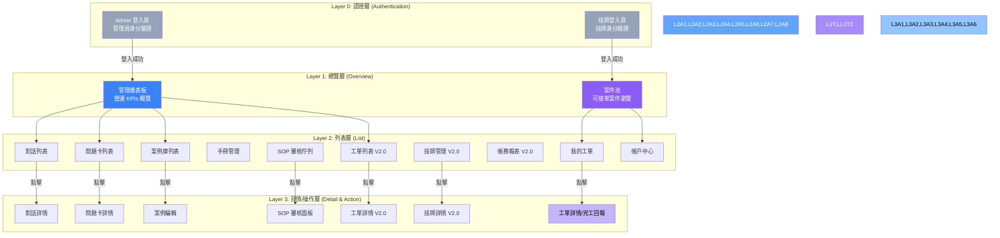
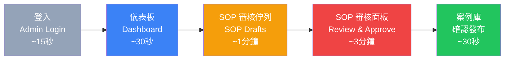
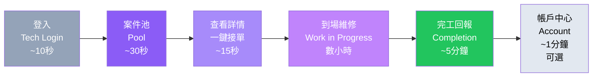
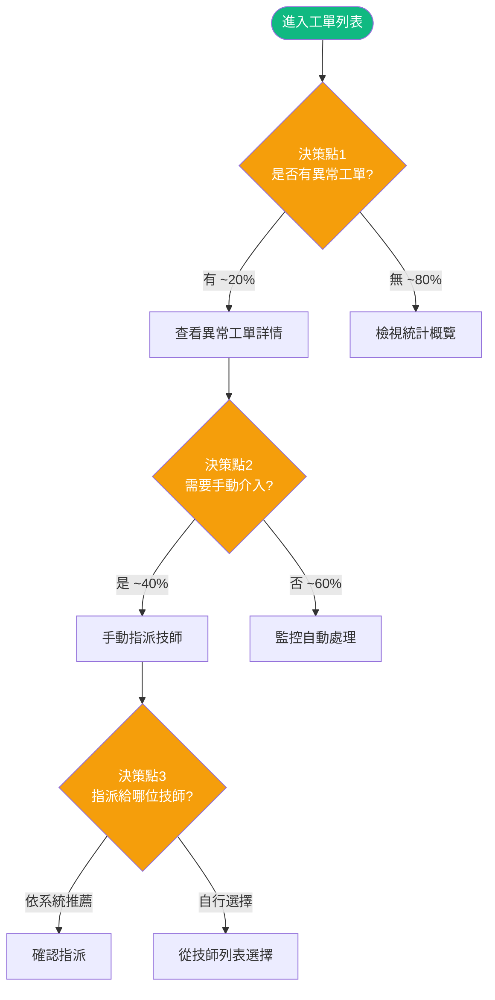
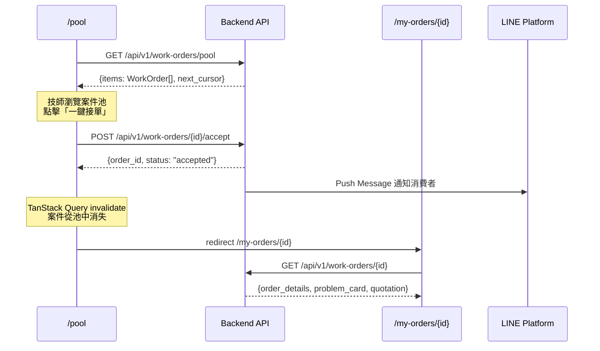
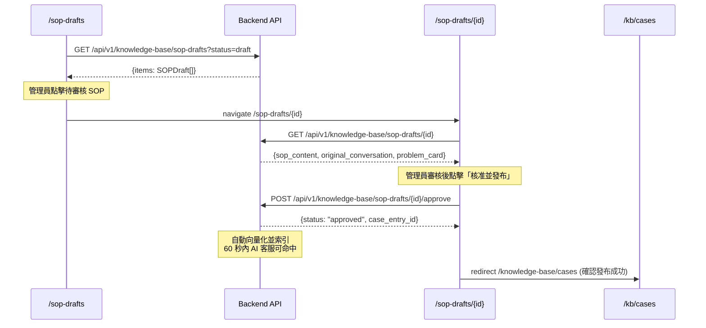

# 前端信息架構規範 (Frontend Information Architecture) - 電子鎖智能客服與派工平台

---

**文件版本 (Document Version):** `v1.0`
**最後更新 (Last Updated):** `2026-02-26`
**主要作者 (Lead Author):** `前端架構師, UX 設計師`
**審核者 (Reviewers):** `PM, 技術負責人, 後端技術負責人`
**狀態 (Status):** `草稿 (Draft)`
**相關文檔:** [`PRD`](../docs/02_project_brief_and_prd.md), [`Frontend Architecture`](../docs/12_frontend_architecture_specification.md), [`API Design`](../docs/06_api_design_specification.md), [`Architecture`](../docs/05_architecture_and_design_document.md)

---

## 目錄 (Table of Contents)

- [1. 文檔目的與範圍](#1-文檔目的與範圍)
- [2. 核心設計原則](#2-核心設計原則)
- [3. 資訊架構總覽](#3-資訊架構總覽)
- [4. 核心用戶旅程](#4-核心用戶旅程)
- [5. 網站地圖與導航結構](#5-網站地圖與導航結構)
- [6. 頁面詳細規格](#6-頁面詳細規格)
- [7. 組件連結與導航系統](#7-組件連結與導航系統)
- [8. 數據流與狀態管理](#8-數據流與狀態管理)
- [9. URL 結構與路由規範](#9-url-結構與路由規範)
- [10. 實施檢查清單與驗收標準](#10-實施檢查清單與驗收標準)
- [11. 附錄](#11-附錄)

---

## 1. 文檔目的與範圍

### 1.1 目的 (Purpose)

本文檔旨在提供「電子鎖智能客服與派工平台」前端的完整信息架構規範，作為前端開發、設計與測試的**單一事實來源 (SSOT)**。

**核心目標：**
- 定義 Admin Panel 與 Technician Web App 的完整用戶旅程與頁面職責
- 規範導航結構與 URL 設計，確保路由與後端 DDD Bounded Contexts 對齊
- 統一前端數據流與狀態管理策略（TanStack Query + Zustand + URL State）
- 提供可執行的實施檢查清單與頁面級驗收標準

### 1.2 適用範圍 (Scope)

| 適用範圍 | 說明 |
|:---|:---|
| **包含 (In Scope)** | - Admin Panel 所有頁面的信息架構（V1.0 + V2.0）<br/>- Technician Web App 所有頁面的信息架構（V2.0）<br/>- 用戶旅程與導航設計<br/>- URL 結構與路由規範<br/>- 頁面間數據傳遞與狀態策略<br/>- 頁面級 KPIs 與驗收標準 |
| **不包含 (Out of Scope)** | - LINE Bot 消費者端互動流程（透過 LINE Messaging API，無 Web UI）<br/>- 視覺設計細節（參考 UI/UX Spec）<br/>- 組件級別實現細節（參考 `docs/12_frontend_architecture_specification.md`）<br/>- 後端 API 實作（參考 `docs/06_api_design_specification.md`） |

### 1.3 角色與職責 (RACI)

| 角色 | 職責 | 責任類型 |
|:---|:---|:---|
| **PM** | 定義用戶需求與核心旅程、確認 KPIs 目標值 | R/A |
| **UX Designer** | 設計信息架構、導航流程、頁面佈局模型 | R/A |
| **Frontend Lead** | 審核技術可行性、路由設計、狀態管理策略 | A |
| **Frontend DEV** | 實現頁面與導航邏輯 | R |
| **Backend Lead** | 確認 API 端點與數據契約對齊 | C |
| **QA** | 驗證用戶流程與導航正確性 | C |

---

## 2. 核心設計原則

### 2.1 設計哲學

**核心價值主張：**
> 「讓管理員在最少操作步驟內掌控全局，讓技師在手機上一鍵完成接單與回報。」

**第一性原理推演：**
```
商業目標：降低客服成本、加速派工週轉
    ↓
用戶需求：管理員要快速監控與操作；技師要在手機上高效接單
    ↓
設計策略：Admin Panel 工具效率優先；Technician App Mobile-First 極簡流程
    ↓
架構決策：兩個獨立路由群組，共用組件庫，各自優化佈局
```

### 2.2 資訊架構原則

#### 2.2.1 簡化原則 (Simplification)

- **保留**：知識庫 CRUD、對話監控、工單全生命週期追蹤、技師接單/回報、帳務對帳
- **移除**：消費者評價系統（Phase 2）、多語言切換（Phase 2）、即時 GPS 追蹤
- **專注**：V1.0 專注 AI 客服管理閉環；V2.0 專注派工與帳務閉環

#### 2.2.2 認知負荷優化

基於 **Hick's Law** 和 **認知負荷理論**：
- **決策點數量**：Admin Panel 側邊欄一級導航控制在 8 項以內；Technician App 底部導航 3-4 項
- **每頁專注度**：每個頁面只有 1 個主要目標（如列表頁 → 瀏覽與篩選；詳情頁 → 查看與操作）
- **資訊分層**：列表頁展示摘要 → 點擊進入詳情 → 操作在詳情頁或 Modal 內完成

#### 2.2.3 架構模式

- [x] **層級化架構**：適合後台管理系統的多層導航
- [x] **中心輻射架構**：Technician App 以案件池為中心輻射至各功能

**選擇理由：**
- Admin Panel 功能模組多（知識庫、對話、派工、帳務），需要清晰的層級導航
- Technician App 功能聚焦（接單、回報、帳戶），以案件池為核心的輻射結構最直覺

---

## 3. 資訊架構總覽

### 3.1 系統層次結構



### 3.2 頁面總覽矩陣

#### Admin Panel 頁面

| # | 頁面路徑 | 頁面名稱 | 主要職責 | 用戶目標 | 導航深度 | 版本 |
|:--|:---------|:---------|:---------|:---------|:---------|:-----|
| A0 | `/login` | 管理員登入 | 身分驗證 | 安全登入系統 | Level 0 | V1.0 |
| A1 | `/dashboard` | 營運儀表板 | 展示營運 KPIs | 快速掌握系統全貌 | Level 1 | V1.0 |
| A2 | `/conversations` | 對話列表 | 瀏覽所有消費者對話 | 監控 AI 回答品質 | Level 2 | V1.0 |
| A3 | `/conversations/[id]` | 對話詳情 | 查看完整對話記錄 | 審視對話品質與問題處理過程 | Level 3 | V1.0 |
| A4 | `/problem-cards` | 問題卡列表 | 瀏覽所有 ProblemCard | 監控問題分布與診斷品質 | Level 2 | V1.0 |
| A5 | `/problem-cards/[id]` | 問題卡詳情 | 查看結構化問題描述 | 了解單一案件全貌 | Level 3 | V1.0 |
| A6 | `/knowledge-base/cases` | 案例庫 | 管理知識庫案例 | 維護 AI 知識基礎 | Level 2 | V1.0 |
| A7 | `/knowledge-base/cases/[id]` | 案例詳情/編輯 | 查看與編輯案例 | 新增/修改知識庫條目 | Level 3 | V1.0 |
| A8 | `/knowledge-base/manuals` | 手冊管理 | 管理產品手冊 PDF | 上傳與管理手冊 | Level 2 | V1.0 |
| A9 | `/knowledge-base/sop-drafts` | SOP 審核佇列 | 審核 AI 生成的 SOP | 確保知識品質 | Level 2 | V1.0 |
| A10 | `/knowledge-base/sop-drafts/[id]` | SOP 審核面板 | 審核單一 SOP 草稿 | 核准/退回/刪除 SOP | Level 3 | V1.0 |
| A11 | `/work-orders` | 工單列表 | 管理派工工單 | 監控派工全貌 | Level 2 | V2.0 |
| A12 | `/work-orders/[id]` | 工單詳情 | 查看工單全生命週期 | 追蹤單一案件進度 | Level 3 | V2.0 |
| A13 | `/technicians` | 技師管理 | 管理技師資料與技能 | 維護派工匹配依據 | Level 2 | V2.0 |
| A14 | `/technicians/[id]` | 技師詳情 | 查看技師完整資料 | 管理技師資訊與績效 | Level 3 | V2.0 |
| A15 | `/accounting` | 帳務管理 | 對帳、結算報表 | 完成月度結算 | Level 2 | V2.0 |
| A16 | `/settings` | 系統設定 | 管理帳號與系統配置 | 維護系統設定 | Level 2 | V1.0 |

#### Technician Web App 頁面

| # | 頁面路徑 | 頁面名稱 | 主要職責 | 用戶目標 | 導航深度 | 版本 |
|:--|:---------|:---------|:---------|:---------|:---------|:-----|
| T0 | `/tech-login` | 技師登入 | 身分驗證 | 安全登入 | Level 0 | V2.0 |
| T1 | `/pool` | 案件池 | 瀏覽可接案件 | 發現並選擇工作機會 | Level 1 | V2.0 |
| T2 | `/my-orders` | 我的工單 | 瀏覽已接案件 | 管理進行中的工作 | Level 2 | V2.0 |
| T3 | `/my-orders/[id]` | 工單詳情/完工回報 | 查看詳情與提交回報 | 查看工作內容/提交完工 | Level 3 | V2.0 |
| T4 | `/account` | 帳戶中心 | 收入統計與歷史 | 掌握財務狀況 | Level 2 | V2.0 |

**總計：** Admin Panel 17 頁 + Technician App 5 頁 = **22 頁**

---

## 4. 核心用戶旅程

### 4.1 管理員核心旅程：知識庫管理閉環 (V1.0)



### 4.2 管理員核心旅程：派工監控 (V2.0)


### 4.3 技師核心旅程：接單到完工 (V2.0)



### 4.4 用戶旅程映射表

#### 管理員旅程 - 知識庫管理

| 階段 | 頁面 | 用戶心理狀態 | 設計目標 | 主要 CTA | 預期停留時間 |
|:-----|:-----|:-------------|:---------|:--------|:-------------|
| **概覽** | 儀表板 | 需要全局概覽 | 一眼看到關鍵指標 | 「查看 SOP 待審核」 | 30 秒 |
| **篩選** | SOP 審核佇列 | 需要找到待處理項目 | 快速定位待審核 SOP | 「開始審核」 | 1 分鐘 |
| **審核** | SOP 審核面板 | 認真評估品質 | 對照原始對話確認 SOP 品質 | 「核准」/「退回」 | 3 分鐘 |
| **確認** | 案例庫 | 確認知識已更新 | 確認 SOP 已發布至知識庫 | 「返回儀表板」 | 30 秒 |

#### 技師旅程 - 接單到完工

| 階段 | 頁面 | 用戶心理狀態 | 設計目標 | 主要 CTA | 預期停留時間 |
|:-----|:-----|:-------------|:---------|:--------|:-------------|
| **發現** | 案件池 | 尋找工作機會 | 快速瀏覽匹配案件 | 「查看詳情」 | 30 秒 |
| **決策** | 案件詳情 | 評估是否接單 | 展示關鍵資訊輔助決策 | 「一鍵接單」 | 15 秒 |
| **執行** | 工單詳情 | 前往現場維修 | 展示客戶地址與問題摘要 | 「開始維修」 | - |
| **回報** | 完工回報 | 記錄完成結果 | 簡化回報流程 | 「提交完工報告」 | 5 分鐘 |
| **確認** | 帳戶中心 | 確認收入 | 展示本次收入明細 | 「返回案件池」 | 1 分鐘 |

### 4.5 決策點分析

**管理員在工單管理中的 3 個主要決策點：**



**總決策點：** 3 個

---

## 5. 網站地圖與導航結構

### 5.1 完整網站地圖

```
Smart Lock Platform (/)
│
├─ (auth) 認證路由群組 ── 無側邊欄佈局
│  ├─ 0. /login                              [管理員登入]
│  └─ 1. /forgot-password                    [忘記密碼]
│
├─ (dashboard) Admin Panel 路由群組 ── 側邊欄 + 頂部導航佈局
│  ├─ 2. /dashboard                          [營運儀表板]
│  │  ├─ #conversations-stats (錨點：對話統計卡片)
│  │  ├─ #problem-distribution (錨點：問題類別分布圖)
│  │  ├─ #daily-trend (錨點：每日對話量趨勢)
│  │  └─ → /conversations, /problem-cards, /knowledge-base/sop-drafts (快捷入口)
│  │
│  ├─ 3. /conversations                      [對話列表]
│  │  ├─ Query: ?status={active|resolved|escalated}&cursor={cursor}
│  │  └─ → /conversations/{id} (點擊查看)
│  │
│  ├─ 4. /conversations/{id}                 [對話詳情]
│  │  ├─ #timeline (錨點：對話時間軸)
│  │  ├─ #problem-card (錨點：關聯問題卡)
│  │  └─ ← /conversations (返回列表)
│  │
│  ├─ 5. /problem-cards                      [問題卡列表]
│  │  ├─ Query: ?status={open|in_progress|resolved|escalated}&brand={brand}&cursor={cursor}
│  │  └─ → /problem-cards/{id} (點擊查看)
│  │
│  ├─ 6. /problem-cards/{id}                 [問題卡詳情]
│  │  ├─ → /conversations/{conv_id} (查看關聯對話)
│  │  ├─ → /work-orders/{wo_id} (查看關聯工單, V2.0)
│  │  └─ ← /problem-cards (返回列表)
│  │
│  ├─ 7. /knowledge-base/cases               [案例庫列表]
│  │  ├─ Query: ?brand={brand}&verified={true|false}&cursor={cursor}
│  │  ├─ → /knowledge-base/cases/new (新增案例)
│  │  └─ → /knowledge-base/cases/{id} (編輯案例)
│  │
│  ├─ 8. /knowledge-base/cases/{id}          [案例詳情/編輯]
│  │  └─ ← /knowledge-base/cases (返回列表)
│  │
│  ├─ 9. /knowledge-base/manuals             [手冊管理]
│  │  ├─ Query: ?brand={brand}&cursor={cursor}
│  │  └─ [上傳 PDF 功能]
│  │
│  ├─ 10. /knowledge-base/sop-drafts         [SOP 審核佇列]
│  │  ├─ Query: ?status={draft|approved|rejected}&cursor={cursor}
│  │  └─ → /knowledge-base/sop-drafts/{id} (審核)
│  │
│  ├─ 11. /knowledge-base/sop-drafts/{id}    [SOP 審核面板]
│  │  ├─ #sop-content (錨點：SOP 內容)
│  │  ├─ #original-conversation (錨點：原始對話記錄)
│  │  └─ ← /knowledge-base/sop-drafts (返回佇列)
│  │
│  ├─ 12. /work-orders                       [工單列表] (V2.0)
│  │  ├─ Query: ?status={pending|assigned|in_progress|completed}&cursor={cursor}
│  │  └─ → /work-orders/{id} (查看詳情)
│  │
│  ├─ 13. /work-orders/{id}                  [工單詳情] (V2.0)
│  │  ├─ #timeline (錨點：狀態時間軸)
│  │  ├─ #problem-card (錨點：問題卡)
│  │  ├─ #quotation (錨點：報價明細)
│  │  ├─ #completion-report (錨點：完工報告)
│  │  ├─ → /problem-cards/{pc_id} (查看問題卡)
│  │  ├─ → /technicians/{tech_id} (查看技師)
│  │  ├─ [手動指派 Modal]
│  │  └─ ← /work-orders (返回列表)
│  │
│  ├─ 14. /technicians                       [技師管理] (V2.0)
│  │  ├─ Query: ?status={active|inactive}&brand={brand}&cursor={cursor}
│  │  └─ → /technicians/{id} (查看詳情)
│  │
│  ├─ 15. /technicians/{id}                  [技師詳情] (V2.0)
│  │  ├─ #profile (錨點：基本資料)
│  │  ├─ #skills (錨點：技能認證)
│  │  ├─ #history (錨點：歷史工單)
│  │  ├─ #performance (錨點：績效統計)
│  │  └─ ← /technicians (返回列表)
│  │
│  ├─ 16. /accounting                        [帳務管理] (V2.0)
│  │  ├─ #monthly-report (錨點：月度結算報表)
│  │  ├─ #pending-review (錨點：待審核墊付)
│  │  ├─ #vouchers (錨點：記帳憑證)
│  │  └─ [匯出 Excel/PDF 功能]
│  │
│  └─ 17. /settings                          [系統設定]
│     ├─ #profile (錨點：個人資料)
│     ├─ #security (錨點：安全設定)
│     ├─ #pricing-rules (錨點：報價規則, V2.0)
│     └─ #surcharge-rules (錨點：加價規則, V2.0)
│
└─ (technician) 技師工作台路由群組 ── Mobile-First 底部導航佈局
   ├─ 18. /tech-login                        [技師登入]
   │
   ├─ 19. /pool                              [案件池]
   │  ├─ Query: ?sort_by={distance|reward|urgency}
   │  └─ → [案件詳情 Modal / 一鍵接單]
   │
   ├─ 20. /my-orders                         [我的工單]
   │  ├─ Query: ?status={accepted|in_progress|completed}
   │  └─ → /my-orders/{id} (點擊查看)
   │
   ├─ 21. /my-orders/{id}                    [工單詳情 / 完工回報]
   │  ├─ #info (錨點：案件資訊)
   │  ├─ #completion-form (錨點：完工回報表單)
   │  └─ ← /my-orders (返回列表)
   │
   └─ 22. /account                           [帳戶中心]
      ├─ #summary (錨點：本月收入摘要)
      ├─ #history (錨點：歷史明細)
      └─ [匯出 PDF 功能]
```

### 5.2 導航連結矩陣

#### Admin Panel 核心頁面連結

| 來源 \ 目標 | Dashboard | Conversations | Conv Detail | Problem Cards | PC Detail | KB Cases | SOP Drafts | Work Orders | Technicians | Accounting |
|:---|:---:|:---:|:---:|:---:|:---:|:---:|:---:|:---:|:---:|:---:|
| **Dashboard** | - | ✅ 側邊欄 | ❌ | ✅ 側邊欄 | ❌ | ✅ 側邊欄 | ✅ 快捷卡片 | ✅ 側邊欄 | ❌ | ❌ |
| **Conversations** | ✅ 側邊欄 | - | ✅ 點擊行 | ❌ | ❌ | ❌ | ❌ | ❌ | ❌ | ❌ |
| **Conv Detail** | ❌ | ✅ 返回 | - | ❌ | ✅ 連結 | ❌ | ❌ | ⚠️ 連結 | ❌ | ❌ |
| **Problem Cards** | ✅ 側邊欄 | ❌ | ❌ | - | ✅ 點擊行 | ❌ | ❌ | ❌ | ❌ | ❌ |
| **PC Detail** | ❌ | ✅ 連結 | ❌ | ✅ 返回 | - | ❌ | ❌ | ⚠️ 連結 | ❌ | ❌ |
| **Work Orders** | ✅ 側邊欄 | ❌ | ❌ | ❌ | ❌ | ❌ | ❌ | - | ❌ | ❌ |
| **WO Detail** | ❌ | ❌ | ❌ | ✅ 連結 | ❌ | ❌ | ❌ | ✅ 返回 | ✅ 連結 | ❌ |

**圖例：**
- ✅ 直接可達
- ⚠️ 條件可達（V2.0 工單連結僅在有工單時顯示）
- ❌ 不存在直接連結

#### Technician App 連結

| 來源 \ 目標 | Pool | My Orders | Order Detail | Account |
|:---|:---:|:---:|:---:|:---:|
| **Pool** | - | ✅ 底部導航 | ⚠️ 接單後 | ✅ 底部導航 |
| **My Orders** | ✅ 底部導航 | - | ✅ 點擊行 | ✅ 底部導航 |
| **Order Detail** | ❌ | ✅ 返回 | - | ❌ |
| **Account** | ✅ 底部導航 | ✅ 底部導航 | ❌ | - |

---

## 6. 頁面詳細規格

### 6.1 管理員登入頁 (Admin Login)

#### 基本信息

| 屬性 | 值 |
|:-----|:---|
| **路徑** | `/login` |
| **頁面類型** | 認證頁（無側邊欄佈局） |
| **導航深度** | Level 0 |

#### 職責與目標

| 項目 | 內容 |
|:-----|:-----|
| **主要任務** | 管理員身分驗證 |
| **用戶目標** | 安全登入系統 |
| **轉換目標** | 登入成功率 >= 95% |

#### 關鍵組件結構

```html
<page-structure>
  <!-- 1. 品牌標識 -->
  <header class="auth-header">
    <logo>Smart Lock 平台 Logo</logo>
    <title>管理後台</title>
  </header>

  <!-- 2. 登入表單 -->
  <section class="login-form">
    <form-group>
      <label>電子郵件</label>
      <input type="email" required />
    </form-group>
    <form-group>
      <label>密碼</label>
      <input type="password" required />
    </form-group>
    <button class="btn-primary">登入</button>
    <link href="/forgot-password">忘記密碼？</link>
  </section>
</page-structure>
```

#### 導航出口

```javascript
{
  primary: '/dashboard',        // 登入成功
  forgot: '/forgot-password'    // 忘記密碼
}
```

#### 驗收標準

- [ ] 支援 email + password 登入
- [ ] 登入失敗顯示友善錯誤訊息
- [ ] 連續 5 次失敗鎖定帳號 15 分鐘
- [ ] JWT Token 存於 httpOnly Cookie
- [ ] 登入成功導向 `/dashboard`

---

### 6.2 營運儀表板 (Dashboard)

#### 基本信息

| 屬性 | 值 |
|:-----|:---|
| **路徑** | `/dashboard` |
| **頁面類型** | 儀表板頁 |
| **導航深度** | Level 1 |

#### 職責與目標

| 項目 | 內容 |
|:-----|:-----|
| **主要任務** | 展示 AI 客服營運關鍵指標 (V1.0)；展示派工系統即時狀態 (V2.0) |
| **用戶目標** | 快速掌握系統運行狀態與服務品質 |
| **轉換目標** | 管理員在 30 秒內識別需要關注的異常 |

#### 關鍵組件結構

```html
<page-structure>
  <!-- 1. 統計卡片列 (V1.0) -->
  <section class="stats-cards">
    <card>今日對話數</card>
    <card>自助解決率</card>
    <card>平均回應時間</card>
    <card>待審核 SOP 數</card>
  </section>

  <!-- 2. 統計卡片列 (V2.0 新增) -->
  <section class="dispatch-stats-cards">
    <card>今日待派案件</card>
    <card>已派案件</card>
    <card>完成案件</card>
    <card>平均派工到完工時間</card>
  </section>

  <!-- 3. 圖表區域 -->
  <section class="charts-grid">
    <chart type="pie">問題類別分布</chart>
    <chart type="line">每日對話量趨勢 (近30天)</chart>
    <chart type="bar">各品牌報修數量排行</chart>
  </section>

  <!-- 4. 異常告警列 (V2.0) -->
  <section class="alerts">
    <alert-list>超過 2 小時未接單案件</alert-list>
  </section>

  <!-- 5. 技師分布地圖 (V2.0) -->
  <section class="technician-map">
    <google-map>技師位置 + 案件位置</google-map>
  </section>
</page-structure>
```

#### 導航出口

```javascript
{
  conversations: '/conversations',
  problemCards: '/problem-cards',
  sopDrafts: '/knowledge-base/sop-drafts',
  workOrders: '/work-orders',       // V2.0
  alerts: '/work-orders?status=pending&overdue=true'  // V2.0
}
```

#### 關鍵指標 (KPIs)

| 指標 | 目標值 | 衡量方式 |
|:-----|:-------|:---------|
| **頁面載入時間** | < 2 秒 | Lighthouse LCP |
| **數據更新頻率** | 每 60 秒 | TanStack Query refetchInterval |
| **管理員識別異常時間** | < 30 秒 | 用戶測試 |

#### 驗收標準

- [ ] 統計卡片正確顯示今日數據（PRD US-017）
- [ ] 圓餅圖正確顯示問題類別分布
- [ ] 折線圖正確顯示近 30 天對話量趨勢
- [ ] 品牌排行正確顯示各品牌報修數量
- [ ] 資料每 60 秒自動更新或支援手動刷新
- [ ] V2.0: 地圖正確顯示技師分布（Google Maps API）
- [ ] V2.0: 超過 2 小時未接單案件標紅告警

---

### 6.3 對話列表頁 (Conversations)

#### 基本信息

| 屬性 | 值 |
|:-----|:---|
| **路徑** | `/conversations` |
| **URL 參數** | `status` (active/resolved/escalated, 可選), `cursor` (可選), `sort_by` (可選) |
| **頁面類型** | 數據列表頁 |
| **導航深度** | Level 2 |

#### 職責與目標

| 項目 | 內容 |
|:-----|:-----|
| **主要任務** | 展示所有消費者與 AI 客服的對話記錄 |
| **用戶目標** | 監控 AI 回答品質、發現改善機會 |
| **轉換目標** | 管理員在 1 分鐘內找到目標對話 |

#### 關鍵組件結構

```html
<page-structure>
  <!-- 1. 頁面標題與操作列 -->
  <header class="page-header">
    <title>對話記錄</title>
    <actions>
      <button>匯出 CSV</button>
    </actions>
  </header>

  <!-- 2. 篩選列 -->
  <section class="filters">
    <select name="status">狀態篩選</select>
    <date-picker>日期範圍</date-picker>
    <search-input>搜尋消費者</search-input>
  </section>

  <!-- 3. 數據表格 -->
  <section class="data-table">
    <table columns="時間, LINE 用戶, 狀態, 訊息數, 解決途徑, 操作">
      <!-- DataTable + cursor-based pagination -->
    </table>
  </section>
</page-structure>
```

#### 導航出口

```javascript
{
  detail: '/conversations/{id}',  // 點擊行
  export: '觸發 CSV 下載'
}
```

#### 驗收標準

- [ ] 列表按時間倒序排列（PRD US-016）
- [ ] 支援按日期、狀態、消費者篩選
- [ ] 每筆對話標示解決途徑（案例庫命中/RAG/人工/未解決）
- [ ] 支援匯出對話記錄 (CSV)
- [ ] Cursor-based 分頁正常運作，單頁 20 筆
- [ ] Server Component 渲染，首屏 < 2 秒

---

### 6.4 對話詳情頁 (Conversation Detail)

#### 基本信息

| 屬性 | 值 |
|:-----|:---|
| **路徑** | `/conversations/[id]` |
| **頁面類型** | 詳情頁 |
| **導航深度** | Level 3 |

#### 關鍵組件結構

```html
<page-structure>
  <!-- 1. 麵包屑與返回 -->
  <nav class="breadcrumb">
    對話記錄 > 對話 #{id}
  </nav>

  <!-- 2. 對話時間軸 -->
  <section class="conversation-timeline">
    <ConversationTimeline messages={messages} />
    <!-- 含文字、圖片、AI 回覆標記、ProblemCard 展示 -->
  </section>

  <!-- 3. 側邊面板：問題卡摘要 -->
  <aside class="problem-card-panel">
    <ProblemCardViewer card={problemCard} />
    <link href="/problem-cards/{pc_id}">查看完整問題卡</link>
  </aside>

  <!-- 4. 對話元資訊 -->
  <section class="metadata">
    <item>解決途徑: {resolution_level}</item>
    <item>總訊息數: {message_count}</item>
    <item>開始時間: {started_at}</item>
    <item>解決時間: {resolved_at}</item>
  </section>
</page-structure>
```

#### 導航出口

```javascript
{
  back: '/conversations',
  problemCard: '/problem-cards/{problem_card_id}',
  workOrder: '/work-orders/{work_order_id}'  // V2.0, 若有關聯工單
}
```

#### 驗收標準

- [ ] 完整顯示對話內容（文字、圖片、ProblemCard）
- [ ] 訊息時間軸清晰標示 user/assistant 角色
- [ ] 圖片可點擊放大查看
- [ ] 側邊面板顯示關聯問題卡摘要
- [ ] 頁面載入 < 2 秒

---

### 6.5 案例庫列表頁 (Knowledge Base Cases)

#### 基本信息

| 屬性 | 值 |
|:-----|:---|
| **路徑** | `/knowledge-base/cases` |
| **URL 參數** | `brand` (可選), `verified` (true/false, 可選), `cursor` (可選) |
| **頁面類型** | CRUD 列表頁 |
| **導航深度** | Level 2 |

#### 關鍵組件結構

```html
<page-structure>
  <!-- 1. 頁面標題與操作 -->
  <header class="page-header">
    <title>案例庫</title>
    <actions>
      <button variant="primary">新增案例</button>
      <button variant="outline">匯入 CSV</button>
    </actions>
  </header>

  <!-- 2. 篩選 -->
  <section class="filters">
    <select name="brand">品牌篩選</select>
    <select name="verified">驗證狀態</select>
    <search-input>搜尋關鍵字</search-input>
  </section>

  <!-- 3. 案例表格 -->
  <section class="data-table">
    <table columns="標題, 品牌, 型號, 標籤, 驗證狀態, 建立時間, 操作">
      <!-- 支援行內編輯、刪除 -->
    </table>
  </section>
</page-structure>
```

#### 驗收標準

- [ ] 支援新增/編輯/刪除案例（PRD US-015）
- [ ] 支援按品牌、型號分類管理
- [ ] 支援匯入歷史案例 (CSV)
- [ ] 新增案例後系統自動計算 Embedding
- [ ] 刪除前彈出確認對話框

---

### 6.6 SOP 審核面板 (SOP Review Panel)

#### 基本信息

| 屬性 | 值 |
|:-----|:---|
| **路徑** | `/knowledge-base/sop-drafts/[id]` |
| **頁面類型** | 審核操作頁 |
| **導航深度** | Level 3 |

#### 關鍵組件結構

```html
<page-structure>
  <!-- 1. 麵包屑 -->
  <nav class="breadcrumb">
    知識庫 > SOP 審核 > #{id}
  </nav>

  <!-- 2. 雙欄佈局 -->
  <section class="review-layout two-column">
    <!-- 左欄：SOP 內容 -->
    <div class="sop-content">
      <h2>SOP 草稿內容</h2>
      <field>適用條件: {applicable_conditions}</field>
      <field>問題描述: {problem_description}</field>
      <field>解決步驟: {solution_steps}</field>
      <field>注意事項: {precautions}</field>
    </div>

    <!-- 右欄：原始對話 -->
    <div class="original-conversation">
      <h2>原始對話記錄</h2>
      <ConversationTimeline messages={original_messages} />
      <ProblemCardViewer card={original_problem_card} />
    </div>
  </section>

  <!-- 3. 審核操作 -->
  <section class="review-actions">
    <button variant="success">核准並發布</button>
    <button variant="warning">退回修改</button>
    <button variant="danger">刪除</button>
    <textarea placeholder="審核意見（選填）" />
  </section>
</page-structure>
```

#### 導航出口

```javascript
{
  back: '/knowledge-base/sop-drafts',
  approve: '/knowledge-base/cases',  // 核准後導向案例庫確認
}
```

#### 驗收標準

- [ ] 左右雙欄對照顯示 SOP 內容與原始對話（PRD US-013）
- [ ] 「核准」後 SOP 自動向量化並索引至案例庫，60 秒內生效（PRD US-014）
- [ ] 「退回」需填寫退回原因
- [ ] 「刪除」彈出確認對話框
- [ ] 審核操作有 Optimistic UI 即時反饋

---

### 6.7 工單列表頁 (Work Orders) - V2.0

#### 基本信息

| 屬性 | 值 |
|:-----|:---|
| **路徑** | `/work-orders` |
| **URL 參數** | `status` (pending/assigned/in_progress/completed, 可選), `cursor` (可選) |
| **頁面類型** | 看板/列表頁 |
| **導航深度** | Level 2 |

#### 關鍵組件結構

```html
<page-structure>
  <!-- 1. 頁面標題 -->
  <header class="page-header">
    <title>派工管理</title>
    <toggle>看板視圖 / 列表視圖</toggle>
  </header>

  <!-- 2. 看板視圖 (預設) -->
  <section class="kanban-view">
    <WorkOrderKanban>
      <column status="pending">待派工</column>
      <column status="assigned">已派工</column>
      <column status="in_progress">維修中</column>
      <column status="completed">已完成</column>
    </WorkOrderKanban>
  </section>

  <!-- 3. 列表視圖 (備選) -->
  <section class="list-view" hidden>
    <table columns="案件編號, 品牌型號, 區域, 技師, 狀態, 報價, 建立時間">
    </table>
  </section>
</page-structure>
```

#### 驗收標準

- [ ] 看板四欄拖放切換工單狀態
- [ ] 支援列表/看板視圖切換
- [ ] 異常案件（超過 2 小時未接單）標紅（PRD US-034）
- [ ] 支援按狀態篩選
- [ ] 案件搜尋支援：案件編號、消費者電話、技師姓名、地址關鍵字（PRD US-035）

---

### 6.8 工單詳情頁 (Work Order Detail) - V2.0

#### 基本信息

| 屬性 | 值 |
|:-----|:---|
| **路徑** | `/work-orders/[id]` |
| **頁面類型** | 詳情頁（含狀態時間軸） |
| **導航深度** | Level 3 |

#### 關鍵組件結構

```html
<page-structure>
  <!-- 1. 麵包屑與狀態 Badge -->
  <header>
    <breadcrumb>派工管理 > 工單 #{id}</breadcrumb>
    <badge variant="status">{current_status}</badge>
  </header>

  <!-- 2. 狀態時間軸 -->
  <section class="timeline">
    <timeline-node>報修 → AI 診斷 → 派工 → 接單 → 到場 → 完工 → 結算</timeline-node>
    <!-- 每個節點記錄：時間、操作者、備註 (PRD US-035) -->
  </section>

  <!-- 3. 關聯問題卡 -->
  <section class="problem-card">
    <ProblemCardViewer card={problem_card} />
  </section>

  <!-- 4. 報價明細 -->
  <section class="quotation">
    <QuotationBuilder quotation={quotation} readonly />
  </section>

  <!-- 5. 技師資訊 -->
  <section class="technician-info">
    <avatar /><name /><phone /><rating />
    <link href="/technicians/{tech_id}">查看技師詳情</link>
  </section>

  <!-- 6. 完工報告 (已完工時顯示) -->
  <section class="completion-report">
    <photos>維修前/後照片</photos>
    <materials>使用材料清單</materials>
    <hours>實際工時</hours>
    <advance-payment>墊付金額</advance-payment>
  </section>

  <!-- 7. 操作區 -->
  <section class="actions">
    <button variant="primary">手動指派技師</button>
    <button variant="outline">取消工單</button>
  </section>
</page-structure>
```

#### 驗收標準

- [ ] 完整狀態時間軸，每個節點含時間、操作者、備註（PRD US-035）
- [ ] 可查看關聯問題卡與報價明細
- [ ] 「手動指派」彈出技師選擇 Modal，顯示符合條件的技師列表（PRD US-026）
- [ ] 已完工案件顯示完工報告（照片、材料、工時）
- [ ] 頁面載入 < 2 秒

---

### 6.9 技師登入頁 (Tech Login)

#### 基本信息

| 屬性 | 值 |
|:-----|:---|
| **路徑** | `/tech-login` |
| **頁面類型** | 認證頁（Mobile-First） |
| **導航深度** | Level 0 |

#### 關鍵組件結構

```html
<page-structure>
  <header class="auth-header">
    <logo>Smart Lock 技師工作台</logo>
  </header>

  <section class="login-form">
    <form-group>
      <label>手機號碼</label>
      <input type="tel" required />
    </form-group>
    <form-group>
      <label>密碼</label>
      <input type="password" required />
    </form-group>
    <button class="btn-primary w-full h-12 text-lg">登入</button>
  </section>
</page-structure>
```

#### 驗收標準

- [ ] 支援手機號碼 + 密碼登入
- [ ] 登入按鈕尺寸 >= 44x44px（觸控友善）
- [ ] 登入成功導向 `/pool`
- [ ] Mobile-First 佈局，適配 375px 以上螢幕

---

### 6.10 案件池頁 (Case Pool) - V2.0

#### 基本信息

| 屬性 | 值 |
|:-----|:---|
| **路徑** | `/pool` |
| **URL 參數** | `sort_by` (distance/reward/urgency, 可選) |
| **頁面類型** | 即時更新列表頁（Mobile-First） |
| **導航深度** | Level 1 |

#### 職責與目標

| 項目 | 內容 |
|:-----|:-----|
| **主要任務** | 展示符合技師技能與區域的待派案件 |
| **用戶目標** | 快速找到適合自己的案件並接單 |
| **轉換目標** | 接單響應時間 < 30 秒 |

#### 關鍵組件結構

```html
<page-structure>
  <!-- 1. 頁面標題與排序 -->
  <header class="sticky-header">
    <title>可接案件</title>
    <sort-selector>距離 / 報酬 / 緊急程度</sort-selector>
  </header>

  <!-- 2. 案件卡片列表（無限滾動） -->
  <section class="card-list infinite-scroll">
    <CasePoolCard v-for="order in orders">
      <district>{order.district}</district>
      <brand-model>{order.brand} {order.model}</brand-model>
      <problem-summary>{order.problem_summary}</problem-summary>
      <urgency-badge>{order.urgency}</urgency-badge>
      <reward class="text-xl font-bold">${order.estimated_reward}</reward>
      <button class="w-full h-12 text-lg font-semibold">一鍵接單</button>
    </CasePoolCard>
  </section>

  <!-- 3. 底部導航 -->
  <nav class="bottom-nav">
    <tab active>案件池</tab>
    <tab>我的工單</tab>
    <tab>帳戶</tab>
  </nav>
</page-structure>
```

#### 導航出口

```javascript
{
  accept: '/my-orders/{id}',    // 接單成功後
  myOrders: '/my-orders',       // 底部導航
  account: '/account'           // 底部導航
}
```

#### 關鍵指標 (KPIs)

| 指標 | 目標值 | 衡量方式 |
|:-----|:-------|:---------|
| **案件池刷新頻率** | 每 15 秒 | TanStack Query refetchInterval |
| **接單響應時間** | < 30 秒 | 從查看到接單的操作時間 |
| **首屏載入** | < 2.5 秒 | Lighthouse LCP (4G) |

#### 驗收標準

- [ ] 僅顯示符合技師「服務區域」與「品牌技能」的案件（PRD US-021）
- [ ] 每筆案件顯示：地址區域、品牌型號、問題摘要、緊急程度、預估報酬
- [ ] 案件池每 15 秒自動刷新（TanStack Query refetchInterval）
- [ ] 支援按距離、報酬、緊急程度排序
- [ ] 一鍵接單，接單後案件從池中移除（PRD US-022）
- [ ] 接單後消費者自動收到 LINE 通知
- [ ] 無限滾動分頁，使用 useInfiniteQuery + cursor-based pagination
- [ ] 觸控友善：接單按鈕 >= 44x44px

---

### 6.11 工單詳情/完工回報 (Order Detail / Completion) - V2.0

#### 基本信息

| 屬性 | 值 |
|:-----|:---|
| **路徑** | `/my-orders/[id]` |
| **頁面類型** | 詳情 + 表單頁（Mobile-First） |
| **導航深度** | Level 3 |

#### 關鍵組件結構

```html
<page-structure>
  <!-- 1. 案件資訊摘要 -->
  <section class="order-info">
    <badge>{status}</badge>
    <address>{client_address}</address>
    <brand-model>{brand} {model}</brand-model>
    <problem-summary>{problem_summary}</problem-summary>
    <quotation-summary>{estimated_price}</quotation-summary>
  </section>

  <!-- 2. 狀態操作按鈕（根據當前狀態顯示） -->
  <section class="status-actions">
    <!-- status=accepted → 顯示「開始維修」 -->
    <button class="h-12 w-full">開始維修</button>
    <!-- status=in_progress → 顯示「完工回報」區塊 -->
  </section>

  <!-- 3. 完工回報表單 (status=in_progress 時顯示) -->
  <section class="completion-form">
    <CompletionReportForm>
      <photo-upload label="維修前照片" required min="1" />
      <photo-upload label="維修後照片" required min="1" />
      <textarea label="施工內容" required minLength="10" />
      <materials-list label="使用材料" />
      <number-input label="實際工時" />
      <number-input label="墊付金額" />
      <photo-upload label="墊付發票照片" />
      <button class="h-12 w-full" variant="success">提交完工報告</button>
    </CompletionReportForm>
  </section>
</page-structure>
```

#### 驗收標準

- [ ] 完工報告含維修前/後照片（必填）、施工內容、材料清單、工時（PRD US-023）
- [ ] 照片上傳支援壓縮，單張 < 5MB
- [ ] 提交後案件狀態變更為「待確認」
- [ ] 消費者自動收到 LINE 通知（完工摘要與費用明細）
- [ ] 表單驗證使用 React Hook Form + Zod Schema
- [ ] 所有按鈕觸控友善 (>= 44x44px)

---

### 6.12 帳戶中心 (Account) - V2.0

#### 基本信息

| 屬性 | 值 |
|:-----|:---|
| **路徑** | `/account` |
| **頁面類型** | 統計摘要頁（Mobile-First） |
| **導航深度** | Level 2 |

#### 關鍵組件結構

```html
<page-structure>
  <!-- 1. 本月收入摘要 -->
  <section class="income-summary">
    <card>本月已完成案件: {count}</card>
    <card>本月累計收入: ${total_income}</card>
    <card>待結算金額: ${pending_amount}</card>
    <card>已結算金額: ${settled_amount}</card>
  </section>

  <!-- 2. 月份切換與歷史明細 -->
  <section class="history">
    <month-selector>{year}-{month}</month-selector>
    <order-list>
      <order-item v-for="order in history">
        <date /><brand-model /><amount /><status-badge />
      </order-item>
    </order-list>
  </section>

  <!-- 3. 匯出 -->
  <section class="export">
    <button>匯出收入摘要 (PDF)</button>
  </section>
</page-structure>
```

#### 驗收標準

- [ ] 顯示本月已完成案件數、累計收入、待結算、已結算金額（PRD US-024）
- [ ] 歷史案件列表支援按月份篩選
- [ ] 每筆案件可查看完整費用明細
- [ ] 收入摘要支援匯出 PDF

---

## 7. 組件連結與導航系統

### 7.1 數據傳遞鏈 - 技師接單流程



### 7.2 數據傳遞鏈 - SOP 審核發布流程



### 7.3 導航系統實現

#### Admin Panel 側邊欄導航

```typescript
// lib/config/navigation.ts
export const adminNavigation = [
  {
    label: '儀表板',
    icon: 'LayoutDashboard',
    href: '/dashboard',
    version: 'v1',
  },
  {
    label: '對話管理',
    icon: 'MessageSquare',
    href: '/conversations',
    version: 'v1',
  },
  {
    label: '問題卡',
    icon: 'ClipboardList',
    href: '/problem-cards',
    version: 'v1',
  },
  {
    label: '知識庫',
    icon: 'BookOpen',
    href: '/knowledge-base',
    version: 'v1',
    children: [
      { label: '案例庫', href: '/knowledge-base/cases' },
      { label: '手冊管理', href: '/knowledge-base/manuals' },
      { label: 'SOP 審核', href: '/knowledge-base/sop-drafts', badge: 'pending_count' },
    ],
  },
  {
    label: '派工管理',
    icon: 'Truck',
    href: '/work-orders',
    version: 'v2',
  },
  {
    label: '技師管理',
    icon: 'Users',
    href: '/technicians',
    version: 'v2',
  },
  {
    label: '帳務管理',
    icon: 'Receipt',
    href: '/accounting',
    version: 'v2',
  },
  {
    label: '系統設定',
    icon: 'Settings',
    href: '/settings',
    version: 'v1',
  },
];
```

#### Technician App 底部導航

```typescript
// lib/config/tech-navigation.ts
export const techNavigation = [
  { label: '案件池', icon: 'Inbox', href: '/pool' },
  { label: '我的工單', icon: 'Clipboard', href: '/my-orders' },
  { label: '帳戶', icon: 'User', href: '/account' },
];
```

---

## 8. 數據流與狀態管理

### 8.1 數據流向圖

```mermaid
graph TB
    subgraph "Frontend - Admin Panel"
        AD[Dashboard]
        AC[Conversations]
        AK[Knowledge Base]
        AW[Work Orders V2.0]
        AT[Accounting V2.0]
        LS1[Zustand UI Store]
        URL1[URL Params]
    end

    subgraph "Frontend - Technician App"
        TP[Case Pool]
        TM[My Orders]
        TA[Account]
        LS2[Zustand UI Store]
    end

    subgraph "Backend API (/api/v1)"
        E1[GET /conversations]
        E2[GET /knowledge-base/cases]
        E3[GET /work-orders/pool]
        E4[POST /work-orders/{id}/accept]
        E5[GET /accounting/reports]
    end

    subgraph "Data Stores"
        PG["PostgreSQL + pgvector"]
        RD[Redis Cache]
    end

    AD -->|TanStack Query 60s| E1
    AC -->|TanStack Query 5min| E1
    AK -->|TanStack Query 5min| E2
    AW -->|TanStack Query 30s| E3
    AT -->|TanStack Query 5min| E5

    TP -->|TanStack Query 15s| E3
    TM -->|TanStack Query 30s| E3
    TA -->|TanStack Query 5min| E5

    TP -->|Mutation| E4

    E1 -->|Read| PG
    E2 -->|Read| PG
    E3 -->|Read| PG
    E4 -->|Write| PG
    E5 -->|Read| PG

    E1 -->|Cache| RD

    style AD,AC,AK,AW,AT fill:#3b82f6,color:#fff
    style TP,TM,TA fill:#8b5cf6,color:#fff
    style E1,E2,E3,E4,E5 fill:#22c55e,color:#fff
    style PG,RD fill:#f59e0b,color:#fff
```

### 8.2 TanStack Query 刷新策略

| 數據類型 | staleTime | refetchInterval | 頁面 | 說明 |
|:---------|:----------|:---------------|:-----|:-----|
| 儀表板統計 | 30 秒 | 60 秒 | Dashboard | PRD 要求每 5 分鐘更新，實際提升至 60 秒 |
| 對話列表 | 5 分鐘 | - | Conversations | 手動刷新為主 |
| 知識庫案例 | 5 分鐘 | - | KB Cases | 低頻變動 |
| 案件池 | 15 秒 | 15 秒 | Pool (技師端) | 即時性要求高 |
| 工單列表 | 30 秒 | 30 秒 | Work Orders | 狀態頻繁變動 |
| 帳務報表 | 5 分鐘 | - | Accounting | 低頻查詢 |

### 8.3 狀態持久化策略

```typescript
// 狀態持久化對應表
const stateStrategy = {
  // 認證狀態 → httpOnly Cookie (由 Next.js Middleware 管理)
  auth: 'httpOnly Cookie',

  // UI 偏好 → localStorage (Zustand persist)
  uiPreferences: {
    storage: 'localStorage',
    key: 'smartlock-ui-preferences',
    includes: ['sidebarCollapsed', 'theme', 'tablePageSize'],
  },

  // 篩選狀態 → URL Params (Next.js useSearchParams)
  filters: 'URL searchParams',

  // 表單草稿 → React Hook Form (記憶體，不持久化)
  formDraft: 'memory',

  // 伺服器數據 → TanStack Query Cache (記憶體，自動重驗證)
  serverData: 'TanStack Query Cache',
};
```

---

## 9. URL 結構與路由規範

### 9.1 完整 URL 清單

```
站點根目錄: https://app.smartlock-saas.com/

認證頁面:
├── /login                                    [管理員登入]
├── /forgot-password                          [忘記密碼]
└── /tech-login                               [技師登入]

Admin Panel 核心頁面:
├── /dashboard                                [營運儀表板]
├── /conversations                            [對話列表]
│   └── /conversations/{id}                   [對話詳情] *id=UUID
├── /problem-cards                            [問題卡列表]
│   └── /problem-cards/{id}                   [問題卡詳情] *id=UUID
├── /knowledge-base/cases                     [案例庫列表]
│   ├── /knowledge-base/cases/new             [新增案例]
│   └── /knowledge-base/cases/{id}            [案例詳情/編輯] *id=UUID
├── /knowledge-base/manuals                   [手冊管理]
├── /knowledge-base/sop-drafts                [SOP 審核佇列]
│   └── /knowledge-base/sop-drafts/{id}       [SOP 審核面板] *id=UUID
├── /work-orders                              [工單列表] (V2.0)
│   └── /work-orders/{id}                     [工單詳情] (V2.0) *id=UUID
├── /technicians                              [技師管理] (V2.0)
│   └── /technicians/{id}                     [技師詳情] (V2.0) *id=UUID
├── /accounting                               [帳務管理] (V2.0)
└── /settings                                 [系統設定]

Technician Web App 頁面:
├── /pool                                     [案件池]
├── /my-orders                                [我的工單]
│   └── /my-orders/{id}                       [工單詳情/完工回報] *id=UUID
└── /account                                  [帳戶中心]

API 端點 (前端呼叫):
├── POST   /api/v1/auth/login                 [管理員登入]
├── POST   /api/v1/auth/refresh               [Token 刷新]
├── POST   /api/v1/technicians/login          [技師登入]
├── GET    /api/v1/conversations               [對話列表]
├── GET    /api/v1/conversations/{id}          [對話詳情]
├── GET    /api/v1/conversations/{id}/messages [對話訊息]
├── GET    /api/v1/problem-cards               [問題卡列表]
├── GET    /api/v1/problem-cards/{id}          [問題卡詳情]
├── GET    /api/v1/knowledge-base/cases        [案例庫列表]
├── POST   /api/v1/knowledge-base/cases        [新增案例]
├── PUT    /api/v1/knowledge-base/cases/{id}   [更新案例]
├── DELETE /api/v1/knowledge-base/cases/{id}   [刪除案例]
├── POST   /api/v1/knowledge-base/manuals      [上傳手冊 PDF]
├── GET    /api/v1/knowledge-base/sop-drafts   [SOP 列表]
├── POST   /api/v1/knowledge-base/sop-drafts/{id}/approve  [核准 SOP]
├── POST   /api/v1/knowledge-base/sop-drafts/{id}/reject   [退回 SOP]
├── GET    /api/v1/work-orders                 [工單列表] (V2.0)
├── GET    /api/v1/work-orders/pool            [案件池] (V2.0)
├── POST   /api/v1/work-orders/{id}/accept     [接單] (V2.0)
├── POST   /api/v1/work-orders/{id}/complete   [完工回報] (V2.0)
├── GET    /api/v1/technicians                 [技師列表] (V2.0)
├── GET    /api/v1/technicians/me              [技師自身資料] (V2.0)
└── GET    /api/v1/accounting/reports          [帳務報表] (V2.0)
```

### 9.2 URL 查詢參數規範

所有列表頁面共用以下查詢參數模式：

| 參數名 | 類型 | 說明 | 範例 |
|:-------|:-----|:-----|:-----|
| `cursor` | string | Cursor-based 分頁游標 | `?cursor=eyJpZCI6MTAwfQ==` |
| `limit` | integer | 每頁筆數，預設 20 | `?limit=50` |
| `sort_by` | string | 排序欄位，前綴 `-` 為降序 | `?sort_by=-created_at` |
| `status` | string | 狀態篩選 | `?status=active` |

### 9.3 URL 驗證與錯誤處理

```typescript
// middleware.ts - Next.js Middleware 統一處理路由守衛
import { NextRequest, NextResponse } from 'next/server';

export function middleware(request: NextRequest) {
  const { pathname } = request.nextUrl;

  // 認證檢查
  const token = request.cookies.get('access_token');

  // Admin Panel 路由守衛
  if (pathname.startsWith('/dashboard') ||
      pathname.startsWith('/conversations') ||
      pathname.startsWith('/problem-cards') ||
      pathname.startsWith('/knowledge-base') ||
      pathname.startsWith('/work-orders') ||
      pathname.startsWith('/technicians') ||
      pathname.startsWith('/accounting') ||
      pathname.startsWith('/settings')) {
    if (!token) {
      return NextResponse.redirect(new URL('/login', request.url));
    }
  }

  // Technician App 路由守衛
  if (pathname.startsWith('/pool') ||
      pathname.startsWith('/my-orders') ||
      pathname.startsWith('/account')) {
    if (!token) {
      return NextResponse.redirect(new URL('/tech-login', request.url));
    }
  }

  return NextResponse.next();
}

export const config = {
  matcher: [
    '/dashboard/:path*',
    '/conversations/:path*',
    '/problem-cards/:path*',
    '/knowledge-base/:path*',
    '/work-orders/:path*',
    '/technicians/:path*',
    '/accounting/:path*',
    '/settings/:path*',
    '/pool/:path*',
    '/my-orders/:path*',
    '/account/:path*',
  ],
};
```

---

## 10. 實施檢查清單與驗收標準

### 10.1 開發階段檢查清單

#### Phase 1: V1.0 Admin Panel 核心頁面 (W3-W7)

| 任務 | 負責人 | 狀態 | 驗收標準 |
|:-----|:-------|:-----|:---------|
| **登入頁** | Frontend DEV | ⬜ | - [ ] JWT 認證正常<br/>- [ ] 錯誤提示友善 |
| **儀表板** | Frontend DEV | ⬜ | - [ ] 4 張統計卡片<br/>- [ ] 3 張圖表<br/>- [ ] 自動刷新 |
| **對話列表 + 詳情** | Frontend DEV | ⬜ | - [ ] 篩選正常<br/>- [ ] 時間軸顯示<br/>- [ ] 圖片可放大 |
| **問題卡列表 + 詳情** | Frontend DEV | ⬜ | - [ ] 篩選正常<br/>- [ ] 結構化展示 |
| **案例庫 CRUD** | Frontend DEV | ⬜ | - [ ] 新增/編輯/刪除<br/>- [ ] CSV 匯入<br/>- [ ] 品牌篩選 |
| **手冊管理** | Frontend DEV | ⬜ | - [ ] PDF 上傳<br/>- [ ] 處理進度顯示 |
| **SOP 審核** | Frontend DEV | ⬜ | - [ ] 雙欄對照<br/>- [ ] 核准/退回/刪除 |

#### Phase 2: V2.0 派工與技師端 (W20-W29)

| 任務 | 負責人 | 狀態 | 驗收標準 |
|:-----|:-------|:-----|:---------|
| **工單看板 + 詳情** | Frontend DEV | ⬜ | - [ ] 四欄看板<br/>- [ ] 狀態時間軸<br/>- [ ] 手動指派 |
| **技師管理** | Frontend DEV | ⬜ | - [ ] CRUD<br/>- [ ] 技能管理<br/>- [ ] 區域設定 |
| **帳務管理** | Frontend DEV | ⬜ | - [ ] 月度報表<br/>- [ ] 墊付審核<br/>- [ ] Excel 匯出 |
| **技師登入** | Frontend DEV | ⬜ | - [ ] 手機號登入<br/>- [ ] Mobile-First |
| **案件池** | Frontend DEV | ⬜ | - [ ] 15 秒刷新<br/>- [ ] 一鍵接單<br/>- [ ] 無限滾動 |
| **工單詳情/完工回報** | Frontend DEV | ⬜ | - [ ] 照片上傳<br/>- [ ] 表單驗證<br/>- [ ] 材料清單 |
| **帳戶中心** | Frontend DEV | ⬜ | - [ ] 收入摘要<br/>- [ ] 月份篩選<br/>- [ ] PDF 匯出 |

### 10.2 質量檢查清單

#### 用戶體驗 (UX)

- [ ] Admin Panel 核心流程（登入 → 儀表板 → SOP 審核 → 發布）可在 5 分鐘內完成
- [ ] Technician App 核心流程（登入 → 瀏覽案件池 → 接單 → 完工回報）操作直覺
- [ ] 所有導航路徑清晰無歧義
- [ ] 無死鏈或 404 錯誤
- [ ] 錯誤提示友好且可操作
- [ ] 載入狀態明確可見（Skeleton Loading）
- [ ] 技師端 Mobile-First 體驗流暢

#### 技術規範 (Technical)

- [ ] 所有 URL 符合 RESTful 命名規範
- [ ] Cursor-based 分頁邏輯正確
- [ ] JWT Token 存於 httpOnly Cookie，不存於 localStorage
- [ ] URL 篩選狀態可分享（書籤友好）
- [ ] API 調用錯誤處理完善（401 自動 refresh → 失敗重導登入）
- [ ] 無 Console 錯誤或警告
- [ ] TypeScript 嚴格模式，無 any 類型

#### 性能指標 (Performance)

- [ ] Admin Panel LCP < 2.0 秒（桌面）
- [ ] Technician App LCP < 2.5 秒（4G 行動）
- [ ] INP < 100ms
- [ ] CLS < 0.1
- [ ] 首屏 JS < 100 KB (gzipped)
- [ ] Lighthouse Performance >= 90（Admin 桌面）/ >= 85（技師行動）

#### SEO 與無障礙性 (A11y)

- [ ] 所有頁面有準確的 `<title>`（Next.js metadata API）
- [ ] 圖片有 alt 屬性
- [ ] 語義化 HTML
- [ ] 鍵盤導航支持
- [ ] WCAG 2.1 AA 合規（文本對比度 >= 4.5:1）
- [ ] 工單狀態同時使用顏色 + 文字標籤（不以顏色為唯一區分）

### 10.3 測試矩陣

| 測試類型 | 測試範圍 | 工具 | 負責人 | 完成標準 |
|:---------|:---------|:-----|:-------|:---------|
| **單元測試** | API hooks、工具函數、驗證 Schema | Jest + RTL | DEV | 覆蓋率 > 80% |
| **組件測試** | 業務功能元件 | Jest + RTL | DEV | 核心元件全覆蓋 |
| **E2E 測試** | 核心用戶流程 | Playwright | QA | 登入 → 審核 → 接單 → 完工 |
| **性能測試** | 頁面載入與交互 | Lighthouse CI | DEV | 所有指標達標 |
| **無障礙測試** | WCAG 2.1 AA | axe DevTools | QA | 無嚴重問題 |
| **響應式測試** | Mobile / Tablet / Desktop | Chrome DevTools | QA | 三種尺寸正常 |

### 10.4 上線前最終檢查 (Go/No-Go)

#### 準入條件

- [ ] 所有 P0 頁面已完成並測試通過
- [ ] 無阻斷性 Bug
- [ ] 效能指標達標（LCP < 2s Admin / < 2.5s Technician）
- [ ] JWT 認證與角色守衛驗證通過
- [ ] API 錯誤處理完善

#### 角色簽核 (RACI)

| 角色 | 責任 | 簽核狀態 | 日期 |
|:-----|:-----|:---------|:-----|
| **PM** | 確認產品需求滿足 (37 User Stories) | ⬜ | |
| **Frontend Lead** | 確認技術實現品質 | ⬜ | |
| **Backend Lead** | 確認 API 契約對齊 | ⬜ | |
| **QA Lead** | 確認測試覆蓋與結果 | ⬜ | |

---

## 11. 附錄

### 11.1 術語表

| 術語 | 英文 | 定義 |
|:-----|:-----|:-----|
| **信息架構** | Information Architecture (IA) | 組織、結構化和標記內容的藝術與科學 |
| **ProblemCard** | Problem Card | 一次客服對話的結構化問題描述卡 |
| **三層解決引擎** | Three-Layer Resolution Engine | L1 案例庫向量搜尋 → L2 RAG → L3 人工轉接 |
| **案件池** | Case Pool | 技師端可接案件的即時更新列表 |
| **SOP 草稿** | SOP Draft | AI 從成功對話中自動生成的標準作業程序草稿 |
| **Cursor-based 分頁** | Cursor-based Pagination | 使用游標而非偏移量的分頁方式，效能更穩定 |
| **Optimistic UI** | Optimistic UI | 先更新 UI 再等待 API 確認的互動模式 |
| **Bounded Context** | 限界上下文 | DDD 中按業務領域劃分的模組邊界 |

### 11.2 相關文檔連結

| 文檔類型 | 檔名 | 路徑 |
|:---------|:-----|:-----|
| **PRD** | 02_project_brief_and_prd.md | `docs/02_project_brief_and_prd.md` |
| **架構設計** | 05_architecture_and_design_document.md | `docs/05_architecture_and_design_document.md` |
| **API 設計規範** | 06_api_design_specification.md | `docs/06_api_design_specification.md` |
| **前端架構規範** | 12_frontend_architecture_specification.md | `docs/12_frontend_architecture_specification.md` |
| **BDD 情境** | 03_behavior_driven_development.md | `docs/03_behavior_driven_development.md` |
| **專案結構指南** | 08_project_structure_guide.md | `docs/08_project_structure_guide.md` |

### 11.3 變更記錄

| 日期 | 版本 | 作者 | 變更摘要 |
|:-----|:-----|:-----|:---------|
| 2026-02-26 | v1.0 | 前端架構師 | 初版發布：涵蓋 V1.0 Admin Panel + V2.0 Technician App 完整 IA |

### 11.4 審核記錄

| 角色 | 姓名 | 日期 | 簽名/狀態 |
|:-----|:-----|:-----|:---------|
| **PM** | | | ⬜ |
| **Frontend Lead** | | | ⬜ |
| **UX Designer** | | | ⬜ |
| **Backend Lead** | | | ⬜ |
