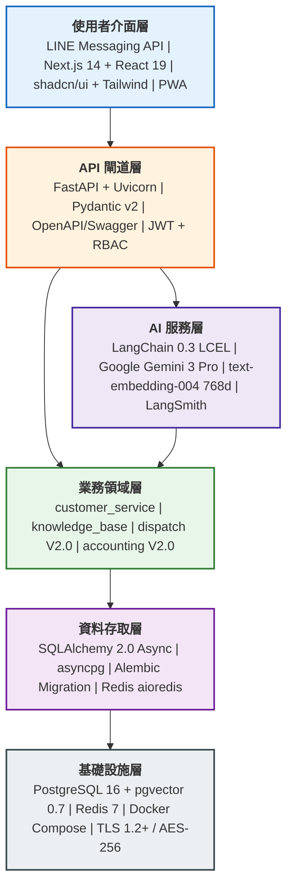
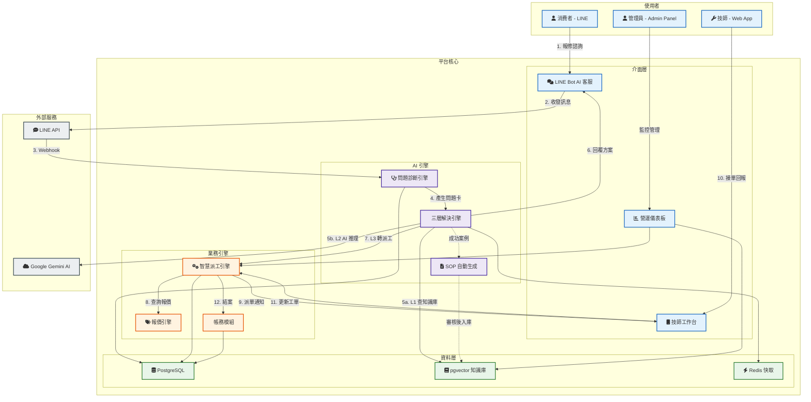

# 系統架構總覽 - 電子鎖智能客服與派工平台

---

## 1. 系統分層堆疊圖

由上至下六層，上層依賴下層，每層標註具體技術選型。

---

## 2. 系統架構圖 - 資訊流

從消費者發起問題到結案的完整資訊流動路徑，涵蓋三類使用者、平台核心與外部系統。

---

## 3. 功能模組清單與服務列表

### V1.0 - AI 智能客服系統

| 模組 | 服務 | 職責 | 關鍵技術 |
| :--- | :--- | :--- | :--- |
| **LINE Bot 接入** | Webhook Handler | 接收 LINE Webhook、驗證簽章、路由事件 | FastAPI, line-bot-sdk-python 3 |
| **對話管理** | ConversationService | 對話狀態機 (Idle→Collecting→Resolving→Resolved)、多輪上下文、Session 超時 30min | Redis, 狀態機模式 |
| **問題診斷** | ProblemCardService | 從自然語言提取結構化問題卡 (品牌/型號/症狀/位置)、AI 輔助欄位推斷、缺失欄位追問 | LangChain, Gemini 3 Pro |
| **三層解決引擎** | ResolutionService | L1: pgvector 語意搜尋 (相似度≥0.85) → L2: RAG + Gemini 推理 → L3: 轉人工/建工單 | LangChain LCEL, pgvector HNSW |
| **知識庫管理** | KnowledgeBaseService | 案例 CRUD、PDF 手冊上傳→分段→Embedding、向量搜尋、增量更新 | PyMuPDF, text-embedding-004 |
| **SOP 自動生成** | SOPGeneratorService | 監聽成功解決事件→分析對話→AI 草擬 SOP→提交審核佇列 | LangChain, 事件驅動 |
| **LLM 閘道** | LLMGateway | 統一 LLM 呼叫入口、Prompt 模板管理、Token 追蹤、Retry/Fallback | LangChain, Google AI SDK |
| **管理後台** | Admin Panel | 知識庫審核、對話紀錄查詢、系統監控、SOP 上架管理 | FastAPI + Jinja2/HTMX (V1.0) |

### V2.0 - 派工與帳務系統

| 模組 | 服務 | 職責 | 關鍵技術 |
| :--- | :--- | :--- | :--- |
| **智慧派工** | DispatchService | 技師匹配 (技能×地區×評分×可用時段)、工單生命週期 (Created→Assigned→InProgress→Completed)、推播通知 | 匹配演算法, WebSocket |
| **報價引擎** | PricingService | 計價規則 (品牌×鎖型×難度)、自動報價生成、客戶確認流程 | 規則引擎模式 |
| **帳務結算** | AccountingService | 對帳作業、發票/請款單生成、技師佣金計算、統計報表 | PostgreSQL 交易 |
| **技師工作台** | Technician Web App | 可接案件列表、一鍵接單、進度回報、導航整合、個人帳務 | Next.js 14 + PWA |
| **增強管理後台** | Enhanced Admin Panel | 派工監控、技師管理、帳務審核、營運儀表板 | Next.js 14 + shadcn/ui |

### 跨模組共用服務

| 服務 | 職責 |
| :--- | :--- |
| **UserManagement** | LINE 用戶綁定、技師/管理員帳號、JWT 認證、RBAC 權限 (admin/technician/user) |
| **NotificationService** | LINE Push Message、Web Push (技師端)、系統內通知 |
| **ObservabilityStack** | 結構化日誌 (JSON)、LangSmith LLM 追蹤、Health Check API |

---
